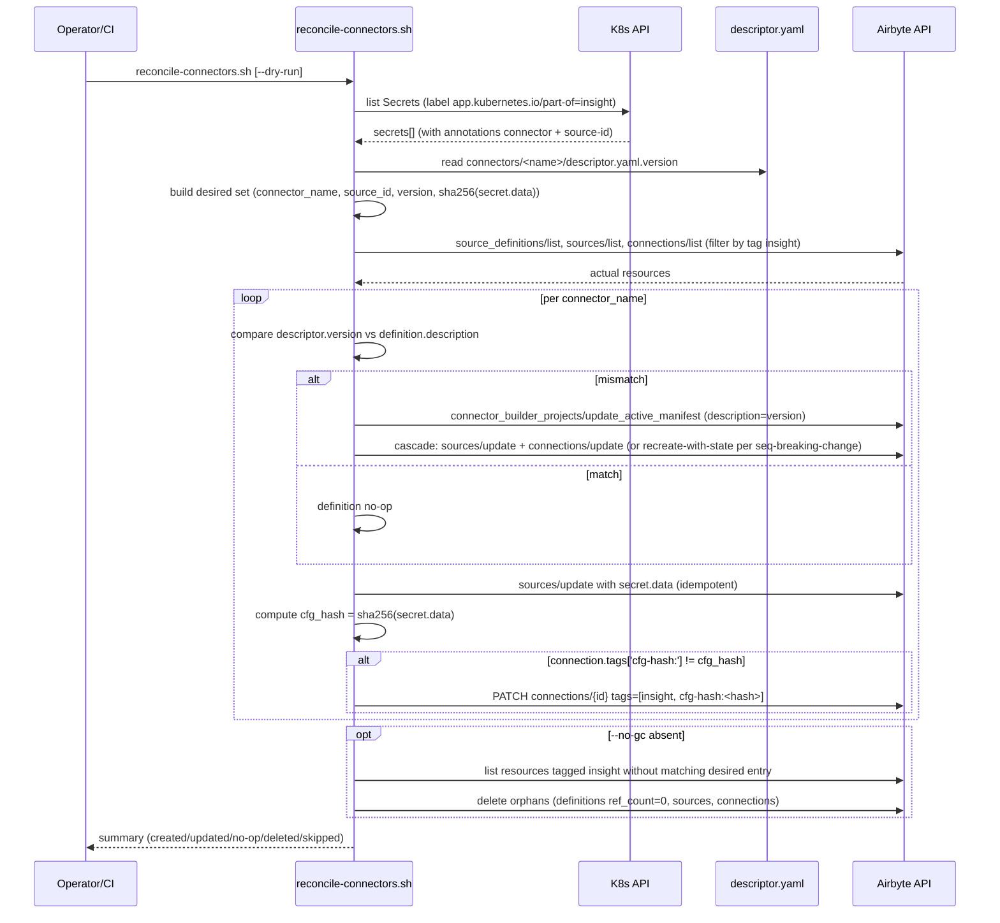
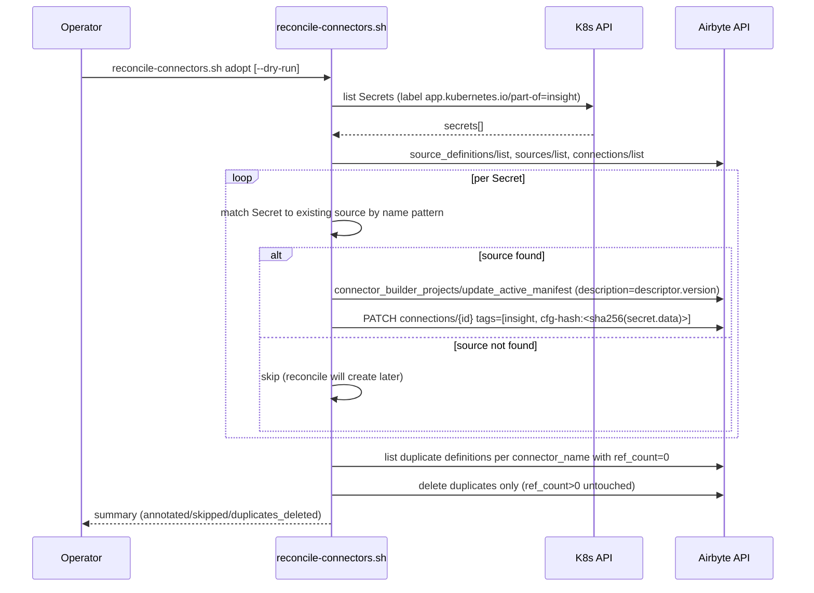
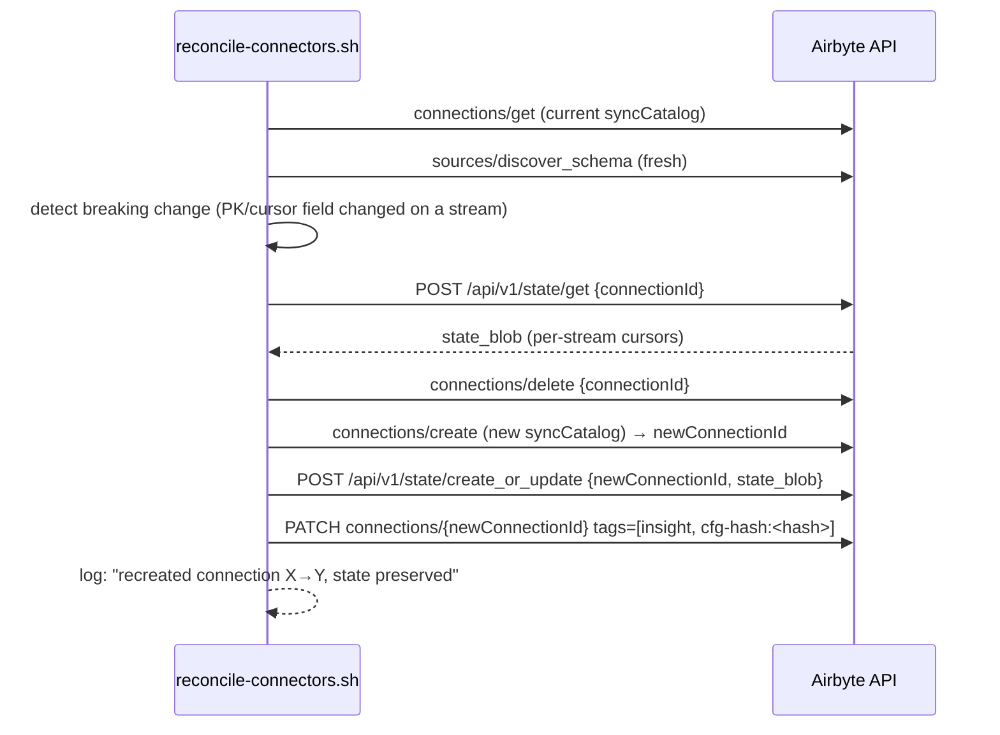

# Technical Design — Airbyte Toolkit


<!-- toc -->

- [1. Architecture Overview](#1-architecture-overview)
  - [1.1 Architectural Vision](#11-architectural-vision)
  - [1.2 Architecture Drivers](#12-architecture-drivers)
  - [1.3 Architecture Layers](#13-architecture-layers)
- [2. Principles & Constraints](#2-principles--constraints)
  - [2.1 Design Principles](#21-design-principles)
  - [2.2 Constraints](#22-constraints)
- [3. Technical Architecture](#3-technical-architecture)
  - [3.1 Domain Model](#31-domain-model)
  - [3.2 Component Model](#32-component-model)
  - [3.3 API Contracts](#33-api-contracts)
  - [3.4 Internal Dependencies](#34-internal-dependencies)
  - [3.5 External Dependencies](#35-external-dependencies)
  - [3.6 Interactions & Sequences](#36-interactions--sequences)
  - [3.7 Database schemas & tables](#37-database-schemas--tables)
  - [3.8 Deployment Topology](#38-deployment-topology)
  - [3.9 Reconciliation Model](#39-reconciliation-model)
  - [3.10 Adoption (one-shot)](#310-adoption-one-shot)
  - [3.11 Naming Convention](#311-naming-convention)
  - [3.12 Secret Validation](#312-secret-validation)
- [4. Additional context](#4-additional-context)
  - [Migration from old scripts](#migration-from-old-scripts)
  - [State library API](#state-library-api)
- [5. Traceability](#5-traceability)

<!-- /toc -->

- [ ] `p3` - **ID**: `cpt-insightspec-design-airbyte-toolkit`
## 1. Architecture Overview

### 1.1 Architectural Vision

Airbyte Toolkit is a self-contained module within `src/ingestion/airbyte-toolkit/` that owns all Airbyte API interactions and resource state. It exposes shell scripts as the public interface and stores state in a single hierarchical YAML file.

The design prioritizes deterministic state access: every Airbyte resource ID is reachable via a fixed YAML path known at call time, with no string concatenation, prefix matching, or naming convention translation. The module auto-detects its runtime environment (host vs in-cluster) and resolves API endpoints and credentials accordingly.

All operations are idempotent. Creating a resource that already exists in state updates it; deleting a resource not found in Airbyte cleans the stale state entry. This makes the toolkit safe to call repeatedly from CI/CD or manual recovery flows.

### 1.2 Architecture Drivers

#### Functional Drivers

| Requirement | Design Response |
|-------------|------------------|
| `cpt-insightspec-fr-single-state` | One file at `airbyte-toolkit/state.yaml`, all scripts read/write it |
| `cpt-insightspec-fr-hierarchical-state` | YAML tree with separate levels for connector name and source-id |
| `cpt-insightspec-fr-tenant-key` | Tenant key stored as-is from config filename |
| `cpt-insightspec-fr-idempotent` | All commands use create-or-update pattern with state-tracked IDs |
| `cpt-insightspec-fr-register-definitions` | `register.sh` writes to `definitions.{connector}.id` |
| `cpt-insightspec-fr-create-connections` | `connect.sh` writes to `tenants.{tenant}.connectors.{connector}.{source_id}` |
| `cpt-insightspec-fr-version-driven-reconcile` | `descriptor.yaml.version` ↔ `definition.declarativeManifest.description` (nocode) or `dockerImageTag` (CDK); reconcile-engine compares, republishes only on mismatch |
| `cpt-insightspec-fr-adopt-legacy-resources` | `adopt-pass` annotates description + `connection.tags` on existing resources without recreate; ref-count-zero duplicate definitions deleted |
| `cpt-insightspec-fr-orphan-gc` | reconcile-engine sweeps Airbyte by `insight` membership tag; deletes resources without matching K8s Secret unless `--no-gc` |
| `cpt-insightspec-fr-state-preserved-on-breaking-change` | breaking schema change → `state_export → delete → create → state_import` via `/api/v1/state/{get,create_or_update}`; non-breaking → `connections/update` |
| `cpt-insightspec-fr-secret-validation` | `secret-validator` (read-only) checks K8s Secret schema vs `secrets/connectors/*.yaml.example` and OnePasswordItem CR ↔ child Secret label/annotation drift |
| `cpt-insightspec-fr-cli-surface` | single `reconcile-connectors.sh [adopt\|reconcile] [--dry-run] [--connector <name>] [--no-gc]` entrypoint; legacy scripts removed |

#### ADR References

| ADR | Subject | Drives |
|-----|---------|--------|
| `cpt-insightspec-adr-version-driven-reconcile` | descriptor.yaml.version is the single reconcile driver | §3.2 reconcile-engine, §3.9 Reconciliation Model |
| `cpt-insightspec-adr-adoption-of-existing-resources` | tag-based adoption preserves sync state on legacy clusters | §3.2 adopt-pass, §3.10 Adoption |
| `cpt-insightspec-adr-credential-rotation-no-env` | sources/update on cfg-hash mismatch (not env-vars / SecretPersistence) | §3.2 reconcile-engine, §3.12 Secret Validation |
| `cpt-insightspec-adr-cluster-config-via-configmap` | tenant_id from ConfigMap `insight-config` (or env override) | §3.2 secret-discovery, §3.11 Naming Convention |

#### NFR Allocation

| NFR ID | NFR Summary | Allocated To | Design Response | Verification Approach |
|--------|-------------|--------------|-----------------|----------------------|
| `cpt-insightspec-nfr-dual-runtime` | Host and in-cluster execution | `lib/env.sh` | Auto-detect via service account token presence; set API URL and auth accordingly | Manual test on host + in-cluster job |

### 1.3 Architecture Layers

```
src/ingestion/airbyte-toolkit/
├── state.yaml          ← single state file (gitignored)
├── lib/
│   ├── state.sh        ← state read/write library
│   └── env.sh          ← environment resolution (API URL, JWT, workspace)
├── register.sh         ← register source definitions
├── connect.sh          ← create sources + connections per tenant
├── sync-state.sh       ← rebuild state from Airbyte API
└── cleanup.sh          ← delete resources by state
```

- [ ] `p3` - **ID**: `cpt-insightspec-tech-toolkit-layout`

| Layer | Responsibility | Technology |
|-------|---------------|------------|
| CLI | User-facing scripts, argument parsing | Bash |
| Library | State I/O, environment resolution, API helpers | Bash + Python (inline) |
| State | Persistent storage of Airbyte resource IDs | YAML file + K8s ConfigMap |
| External | Airbyte REST API, K8s API | HTTP/JSON, kubectl |

## 2. Principles & Constraints

### 2.1 Design Principles

#### Deterministic access paths

- [ ] `p2` - **ID**: `cpt-insightspec-principle-deterministic-paths`

Every resource ID in the state file is accessed via a path that can be constructed from the operation's input parameters alone. No searching, no iteration, no pattern matching.

#### No string concatenation for keys

- [ ] `p2` - **ID**: `cpt-insightspec-principle-no-concat`

Composite identity (connector + source-id, connector + tenant) is expressed as nested YAML levels, never as concatenated strings. `bamboohr.bamboohr-main` is two map levels, not `bamboohr-bamboohr-main` as one key.

#### State as source of truth

- [ ] `p2` - **ID**: `cpt-insightspec-principle-state-truth`

Scripts identify Airbyte resources by UUID from state — never by name. If the UUID returns 404 from Airbyte, the stale entry is removed and the resource is recreated.

### 2.2 Constraints

#### Single workspace

- [ ] `p2` - **ID**: `cpt-insightspec-constraint-single-workspace`

The toolkit assumes one Airbyte workspace per cluster (the default workspace created by the Helm chart). Multi-workspace support is not planned.

#### Shared destination

- [ ] `p2` - **ID**: `cpt-insightspec-constraint-shared-dest`

All connections use a single shared ClickHouse destination. Per-connector Bronze databases are controlled via `namespaceFormat` on the connection, not via separate destinations.

## 3. Technical Architecture

### 3.1 Domain Model

**Core Entities**:

| Entity | Description | Identity |
|--------|-------------|----------|
| Definition | Registered connector type in Airbyte | `definitions.{connector}.id` |
| Source | Configured connector instance with credentials | `tenants.{tenant}.connectors.{connector}.{source_id}.source_id` |
| Connection | Source-to-destination link with stream selection | `tenants.{tenant}.connectors.{connector}.{source_id}.connection_id` |
| Destination | Shared ClickHouse target | `destinations.{name}.id` |

**Relationships**:
- Definition 1→N Source: each source references a definition
- Source 1→1 Connection: each source has exactly one connection
- Connection N→1 Destination: all connections share one destination

### 3.2 Component Model

#### State Manager

- [ ] `p2` - **ID**: `cpt-insightspec-component-state-manager`

##### Why this component exists

Provides atomic read/write access to the state file. All other components use it instead of accessing the file directly.

##### Responsibility scope

- Read/write individual values by YAML path.
- Read entire state for iteration.
- Persist to file and (optionally) K8s ConfigMap.
- Initialize empty state file if missing.

##### Responsibility boundaries

- Does NOT interact with Airbyte API.
- Does NOT validate that IDs exist in Airbyte.

##### Related components (by ID)

None — State Manager is a leaf dependency used by all other components.

#### Environment Resolver

- [ ] `p2` - **ID**: `cpt-insightspec-component-env-resolver`

##### Why this component exists

Centralizes runtime detection and credential resolution. Eliminates duplicated env resolution across scripts.

##### Responsibility scope

- Detect host vs in-cluster runtime.
- Read Airbyte auth secrets from K8s.
- Mint JWT token for API access.
- Resolve workspace ID.
- Export: `AIRBYTE_API`, `AIRBYTE_TOKEN`, `WORKSPACE_ID`.

##### Responsibility boundaries

- Does NOT manage state.
- Does NOT create Airbyte resources.

##### Related components (by ID)

- `cpt-insightspec-component-state-manager` — depends on (reads `workspace_id` from state for caching)

#### Definition Registrar

- [ ] `p2` - **ID**: `cpt-insightspec-component-registrar`

##### Why this component exists

Registers connector manifests as Airbyte source definitions.

##### Responsibility scope

- Read `connector.yaml` manifests from `connectors/` directory.
- Create or update Airbyte source definitions via API.
- Store `definition_id` in state via State Manager.

##### Responsibility boundaries

- Does NOT create sources or connections.
- Does NOT read tenant configs.

##### Related components (by ID)

- `cpt-insightspec-component-state-manager` — depends on (writes definition IDs)
- `cpt-insightspec-component-env-resolver` — depends on (API credentials)

#### Connection Manager

- [ ] `p2` - **ID**: `cpt-insightspec-component-connection-mgr`

##### Why this component exists

Creates and updates sources, destinations, and connections for a tenant.

##### Responsibility scope

- Read tenant config (`connections/{tenant}.yaml`).
- Discover K8s Secrets for connector credentials.
- Create/update shared ClickHouse destination.
- Create/update sources (one per connector + source-id).
- Discover schema from source.
- Create/update connections with stream selection.
- Store all IDs in state via State Manager.
- Create Bronze databases in ClickHouse.

##### Responsibility boundaries

- Does NOT register definitions (assumes they exist in state).
- Does NOT manage Argo workflows.

##### Related components (by ID)

- `cpt-insightspec-component-state-manager` — depends on (reads definitions, writes sources/connections)
- `cpt-insightspec-component-env-resolver` — depends on (API credentials)
- `cpt-insightspec-component-registrar` — depends on (definition IDs must exist)

#### Reconcile Engine

- [ ] `p1` - **ID**: `cpt-insightspec-component-reconcile-engine`

##### Why this component exists

Drives Airbyte resources (definitions, sources, connections) into the desired state declared by `connectors/*/descriptor.yaml` + K8s Secrets, idempotently and without losing accumulated sync state. Replaces the create-or-update logic previously scattered across `register.sh` and `connect.sh`.

##### Responsibility scope

- Owns the diff & apply loop across three layers (definition / source / connection).
- Decides when to republish a definition: only when `descriptor.yaml.version` ≠ `definition.declarativeManifest.description` (nocode) or `dockerImageTag` (CDK).
- Performs idempotent `sources/update` per Secret (`sources` are append-tolerant; connection state is preserved).
- Decides when to recreate a connection: only on breaking syncCatalog drift; uses `cpt-insightspec-seq-breaking-change-recreate-with-state` to preserve cursors via `/api/v1/state/{get,create_or_update}`.
- Drives orphan GC by `insight` membership tag (skipped under `--no-gc`).
- Reports per-connector outcome: `created` | `updated` | `no-op` | `recreated` | `deleted` | `skipped`.

##### Responsibility boundaries

- Does NOT author connector manifests (`connectors/*/connector.yaml` is owned by connector authors).
- Does NOT manage Argo workflows.
- Does NOT modify K8s Secrets.
- Does NOT keep parallel local state — Airbyte is the source of truth post-refactor (no more `state.yaml` / `airbyte-state` ConfigMap).

##### Related components (by ID)

- `cpt-insightspec-component-secret-discovery` — depends on (input desired state)
- `cpt-insightspec-component-env-resolver` — depends on (API credentials)
- `cpt-insightspec-component-adopt-pass` — runs before reconcile on legacy clusters

#### Secret Discovery

- [ ] `p2` - **ID**: `cpt-insightspec-component-secret-discovery`

##### Why this component exists

Computes the desired state from K8s Secrets and `descriptor.yaml` files. The reconcile engine consumes its output.

##### Responsibility scope

- Lists Secrets in `data` namespace with label `app.kubernetes.io/part-of=insight`.
- Reads annotations `insight.cyberfabric.com/connector` and `insight.cyberfabric.com/source-id`; pairs each Secret with `connectors/<connector>/descriptor.yaml`.
- Computes `cfg_hash = sha256(canonical(secret.data))` per Secret.
- Resolves `tenant_id` from ConfigMap `insight-config` (or env `INSIGHT_TENANT_ID`).
- On missing/invalid metadata: WARN + skip (per connector, never abort).

##### Responsibility boundaries

- Does NOT decode 1Password vault items (operator's job).
- Does NOT apply changes — pure read.
- Does NOT validate Secret schema against `connection_specification` — that is `secret-validator`'s job.

##### Related components (by ID)

- `cpt-insightspec-component-reconcile-engine` — consumer
- `cpt-insightspec-component-adopt-pass` — same input source

#### Adopt Pass

- [ ] `p2` - **ID**: `cpt-insightspec-component-adopt-pass`

##### Why this component exists

Migrates legacy clusters whose Airbyte resources lack the post-refactor metadata (no description on definitions, no tags on connections), without recreating any source or connection — preserving all accumulated sync state.

##### Responsibility scope

- For each Secret matched to an existing source by name pattern: patch `definition.declarativeManifest.description` to descriptor version, patch `connection.tags` to `[insight, cfg-hash:<sha256(secret.data)>]`.
- Identify duplicate definitions per connector name and delete only those with `ref_count == 0`.
- Idempotent: running twice is a no-op on the already-annotated set.
- Operates under `--dry-run` to preview changes before any state-changing call.

##### Responsibility boundaries

- Does NOT create new sources or connections (reconcile mode does that).
- Does NOT delete resources whose Secret is missing — that is reconcile's GC sweep.
- Does NOT push credentials via `sources/update` — only metadata patches.

##### Related components (by ID)

- `cpt-insightspec-component-secret-discovery` — input
- `cpt-insightspec-component-reconcile-engine` — runs after adopt on legacy clusters

#### Secret Validator

- [ ] `p2` - **ID**: `cpt-insightspec-component-secret-validator`

##### Why this component exists

Detects drift between the cluster's K8s Secrets and what `secrets/connectors/*.yaml.example` declares as the canonical schema, and surfaces label/annotation drift between OnePasswordItem CRs and their child Secrets — 1Password operator copies labels but NOT custom annotations, so misconfigured items can silently fall out of discovery.

##### Responsibility scope

- Reads each `secrets/connectors/*.yaml.example` to learn required `stringData` keys and required labels/annotations.
- Reads each Secret in `data` namespace; reads OnePasswordItem CRs in `data` namespace.
- Compares per connector: required `stringData` keys, required labels, required annotations, OnePasswordItem CR ↔ child Secret label/annotation parity.
- Pure read — no `kubectl apply`, `kubectl patch`, or `kubectl annotate` calls.
- Exit codes: `0` if no errors, `1` if errors, `2` reserved for environmental failures.

##### Responsibility boundaries

- Does NOT modify any cluster object.
- Does NOT validate connector behavior or live API access.
- Does NOT compare Secret values (avoids credential leakage in output).

##### Related components (by ID)

- `cpt-insightspec-component-secret-discovery` — same Secret enumeration; validator runs first in `run-init.sh`

### 3.3 API Contracts

- [ ] `p2` - **ID**: `cpt-insightspec-interface-state-yaml`

- **Contracts**: `cpt-insightspec-contract-airbyte-api`
- **Technology**: YAML file (state format)

**State file schema** (`airbyte-toolkit/state.yaml`):

```yaml
workspace_id: "<uuid>"

destinations:
  clickhouse:
    id: "<uuid>"

definitions:
  m365:
    id: "<uuid>"
  zoom:
    id: "<uuid>"
  bamboohr:
    id: "<uuid>"

tenants:
  example-tenant:                     # matches connections/example-tenant.yaml filename
    connectors:
      m365:                           # connector name from descriptor.yaml
        m365-main:                    # source-id from K8s Secret annotation
          source_id: "<uuid>"
          connection_id: "<uuid>"
      zoom:
        zoom-main:
          source_id: "<uuid>"
          connection_id: "<uuid>"
      bamboohr:
        bamboohr-main:
          source_id: "<uuid>"
          connection_id: "<uuid>"
```

**Access paths** (all deterministic, no search):

| What | Path | Inputs |
|------|------|--------|
| Workspace | `workspace_id` | none |
| Destination | `destinations.clickhouse.id` | none |
| Definition | `definitions.{connector}.id` | connector name |
| Source | `tenants.{tenant}.connectors.{connector}.{source_id}.source_id` | tenant, connector, source_id |
| Connection | `tenants.{tenant}.connectors.{connector}.{source_id}.connection_id` | tenant, connector, source_id |
| All connections for tenant | `tenants.{tenant}.connectors` | tenant |

### 3.4 Internal Dependencies

| Dependency Module | Interface Used | Purpose |
|-------------------|----------------|----------|
| `connectors/*/descriptor.yaml` | File read | Connector name, schedule, streams config |
| `connectors/*/connector.yaml` | File read | Airbyte manifest for definition registration |
| `connections/*.yaml` | File read | Tenant config (tenant_id) |

### 3.5 External Dependencies

#### Airbyte API

| Dependency Module | Interface Used | Purpose |
|-------------------|---------------|---------|
| Airbyte Server | REST API (`/api/v1/*`) | CRUD for definitions, sources, destinations, connections |

#### Kubernetes API

| Dependency Module | Interface Used | Purpose |
|-------------------|---------------|---------|
| K8s Secrets | `kubectl get secret` | Read Airbyte auth credentials, connector credentials, ClickHouse password |
| K8s ConfigMap | `kubectl create configmap` | Persist state in-cluster |

#### ClickHouse

| Dependency Module | Interface Used | Purpose |
|-------------------|---------------|---------|
| ClickHouse | `kubectl exec clickhouse-client` | Create Bronze databases (`CREATE DATABASE IF NOT EXISTS`) |

### 3.6 Interactions & Sequences

#### Register connector definitions

**ID**: `cpt-insightspec-seq-register`

**Use cases**: `cpt-insightspec-usecase-new-connector`

**Actors**: `cpt-insightspec-actor-platform-engineer`

```
Engineer -> register.sh: register.sh m365
register.sh -> env.sh: source (resolve API, token)
register.sh -> connectors/: read connector.yaml
register.sh -> Airbyte API: POST /source_definitions/create (or update)
Airbyte API --> register.sh: definition_id
register.sh -> state.sh: write definitions.m365.id
```

#### Create connections for tenant

**ID**: `cpt-insightspec-seq-connect`

**Use cases**: `cpt-insightspec-usecase-new-connector`

**Actors**: `cpt-insightspec-actor-platform-engineer`

```
Engineer -> connect.sh: connect.sh example-tenant
connect.sh -> env.sh: source (resolve API, token)
connect.sh -> state.sh: read definitions (verify registered)
connect.sh -> K8s API: discover Secrets by label
connect.sh -> ClickHouse: CREATE DATABASE IF NOT EXISTS bronze_{connector}
connect.sh -> Airbyte API: create/update destination
connect.sh -> state.sh: write destinations.clickhouse.id
  for each connector+source_id:
    connect.sh -> Airbyte API: create/update source
    connect.sh -> Airbyte API: discover schema
    connect.sh -> Airbyte API: create/update connection
    connect.sh -> state.sh: write tenants.{tenant}.connectors.{connector}.{source_id}
```

#### Default reconcile

**ID**: `cpt-insightspec-seq-reconcile-default`

**Actors**: `cpt-insightspec-actor-platform-engineer`, `cpt-insightspec-actor-airbyte-api`, `cpt-insightspec-actor-k8s-api`

Default invocation `reconcile-connectors.sh` (no subcommand). Drives Airbyte to descriptor + Secret state.



#### Adopt one-shot

**ID**: `cpt-insightspec-seq-adopt-one-shot`

**Actors**: `cpt-insightspec-actor-platform-engineer`, `cpt-insightspec-actor-airbyte-api`

Pre-migration pass that annotates existing Airbyte resources without creating, deleting, or recreating sources/connections — preserves all sync state.



#### Breaking-change recreate with state preservation

**ID**: `cpt-insightspec-seq-breaking-change-recreate-with-state`

**Actors**: `cpt-insightspec-actor-platform-engineer`, `cpt-insightspec-actor-airbyte-api`

When a connection's syncCatalog drift is breaking (changed PK or cursor field on a stream), recreate the connection while preserving Airbyte sync state via export/import.



### 3.7 Database schemas & tables

Not applicable. The toolkit manages Airbyte resources, not database schemas. Bronze databases are created as empty databases; table creation is handled by Airbyte sync.

### 3.8 Deployment Topology

The toolkit is not deployed as a service. It is a set of scripts invoked from:
- **Host**: during `init.sh`, manual operations, CI/CD.
- **In-cluster**: K8s Job running the toolbox image (future, currently host-only after refactor).

State persistence:
- **Host**: `airbyte-toolkit/state.yaml` (local file).
- **In-cluster**: K8s ConfigMap `airbyte-state` in namespace `data` (synced on write).

> **Note (post-refactor)**: with the reconcile engine in place, both `state.yaml` and the `airbyte-state` ConfigMap are removed. Airbyte itself becomes the authoritative store via `definition.declarativeManifest.description` (version anchor) and `connection.tags` (membership + config hash). See §3.9 Reconciliation Model.

### 3.9 Reconciliation Model

The reconciliation model defines the relationship between desired state (on disk + K8s) and actual state (in Airbyte). It is implemented by `cpt-insightspec-component-reconcile-engine` (orchestrator) consuming desired state from `cpt-insightspec-component-secret-discovery` (input).

**Three layers, three triggers**:

| Layer | Desired anchor | Actual anchor | Trigger to act |
|---|---|---|---|
| Definition | `descriptor.yaml.version` | `definition.declarativeManifest.description` (nocode) / `dockerImageTag` (CDK) | mismatch → republish |
| Source | K8s Secret existence + `descriptor.yaml` exists | source named `{connector}-{source_id}-{tenant}` | absent → create; present → idempotent `sources/update` |
| Connection | source exists + (catalog from `discover_schema`) | `connection.tags['cfg-hash:']` + `connection.syncCatalog` | hash mismatch → tag patch + `sources/update`; catalog non-breaking → `connections/update`; catalog breaking → recreate-with-state |

**Decision rule for "no-op"**: when all three layers' desired anchors equal their actual anchors, the engine emits `no-op` and makes no Airbyte API calls beyond list/get.

Drives PRD requirements `cpt-insightspec-fr-version-driven-reconcile`, `cpt-insightspec-fr-orphan-gc`, `cpt-insightspec-fr-state-preserved-on-breaking-change`, `cpt-insightspec-fr-cli-surface`. Related ADRs are listed in §1.2 Architecture Drivers.

See sequence `cpt-insightspec-seq-reconcile-default` in §3.6 for the end-to-end flow.

### 3.10 Adoption (one-shot)

Adoption is a **migration-only** mode for clusters that pre-date this refactor. It is implemented by `cpt-insightspec-component-adopt-pass`. The intent: bring legacy Airbyte resources into the post-refactor metadata convention (description on definitions, tags on connections) **without** recreating any source or connection — sync state is preserved by construction.

**Out-of-scope for adopt**: creating new sources or connections, deleting Secret-less resources, pushing credentials via `sources/update`. Those are reconcile's responsibilities.

**Idempotent and re-runnable**: running adopt twice is a no-op on the already-annotated set. Safe to re-run after partial failures.

Drives PRD requirement `cpt-insightspec-fr-adopt-legacy-resources`. The related ADR is listed in §1.2 Architecture Drivers.

See sequence `cpt-insightspec-seq-adopt-one-shot` in §3.6 for the flow.

### 3.11 Naming Convention

The reconcile engine identifies resources by deterministic conventions, not by string parsing. Three anchors carry post-refactor semantics:

| Where | What | Format / Value | Purpose |
|---|---|---|---|
| `connectors/<name>/descriptor.yaml` | `version` field | semver-like string (baseline `2026.05.04`) | Single human-edited driver of reconcile decisions |
| Airbyte `definition.declarativeManifest.description` (nocode) | mirrors descriptor version | string equal to descriptor `version` | Marks "what version is currently published" |
| Airbyte `definition.dockerImageTag` (CDK) | mirrors descriptor version | tag including version | Marks current published image for CDK connectors |
| Airbyte `connection.tags` | membership + config hash | `["insight", "cfg-hash:<sha256(secret.data)>"]` | Membership marker + per-instance config drift detector |
| K8s Secret label | membership | `app.kubernetes.io/part-of=insight` | Discovery filter |
| K8s Secret annotations | identity | `insight.cyberfabric.com/connector=<name>`, `insight.cyberfabric.com/source-id=<id>` | Pair Secret with `connectors/<name>/descriptor.yaml` and Airbyte source name |
| Airbyte `source.name` | composed | `{connector_name}-{source_id}-{tenant_id}` | Stable lookup pattern (e.g., `bamboohr-bamboohr-main-virtuozzo`) |
| Airbyte `connection.name` | composed | `{connector_name}-{source_id}-to-clickhouse-{tenant_id}` | Stable lookup pattern (e.g., `bamboohr-bamboohr-main-to-clickhouse-virtuozzo`) |
| Airbyte `connection.namespaceFormat` | bronze database | `bronze_{connector_name_underscored}` | Per-connector ClickHouse Bronze database |

> **Tenant resolution**: `tenant_id` comes from cluster-level `ConfigMap insight-config` (data field `tenant_id`) or env var `INSIGHT_TENANT_ID` as fallback. Per-tenant `connections/<tenant>.yaml` files are removed (Decision #6).

### 3.12 Secret Validation

The secret validator (`cpt-insightspec-component-secret-validator`) is a **read-only** check run independently of reconcile. Its job: catch the most common cluster-side configuration mistakes before they become silent runtime failures.

**What it checks** (per connector that has a `secrets/connectors/*.yaml.example`):

| Check | Where | Error level |
|---|---|---|
| Required `stringData` keys present | K8s Secret | ERROR |
| Required labels present | K8s Secret | ERROR |
| Required annotations present | K8s Secret | ERROR |
| OnePasswordItem CR ↔ child Secret label/annotation parity | both | WARN (not fatal) |

The annotation-parity warning exists because the 1Password operator copies labels onto child Secrets but **not** custom annotations. Without this check, a connector can drop out of `cpt-insightspec-component-secret-discovery`'s discovery query when its CR diverges from its Secret.

**Exit codes**: `0` clean, `1` at least one ERROR, `2` environmental failure (kubeconfig / namespace missing).

Drives PRD requirement `cpt-insightspec-fr-secret-validation`. The related ADR is listed in §1.2 Architecture Drivers.

`run-init.sh` runs the validator first (before reconcile/adopt) so credential issues fail fast rather than silently disabling discovery.

## 4. Additional context

### Migration from old scripts

Old scripts to delete after toolkit is operational:

| Old script | Replaced by |
|------------|-------------|
| `scripts/airbyte-state.sh` | `airbyte-toolkit/lib/state.sh` |
| `scripts/sync-airbyte-state.sh` | `airbyte-toolkit/sync-state.sh` |
| `scripts/resolve-airbyte-env.sh` | `airbyte-toolkit/lib/env.sh` |
| `scripts/upload-manifests.sh` | `airbyte-toolkit/register.sh` |
| `scripts/apply-connections.sh` | `airbyte-toolkit/connect.sh` |

State files to delete:
- `connections/.airbyte-state.yaml`
- `connections/.state/` directory

Consumers to update:

| Consumer | Change |
|----------|--------|
| `run-sync.sh` | Read `tenants.{tenant}.connectors.{connector}.{source_id}.connection_id` from `airbyte-toolkit/state.yaml` |
| `sync-flows.sh` | Iterate `tenants.{tenant}.connectors` from `airbyte-toolkit/state.yaml` |
| `run-init.sh` | Call toolkit scripts instead of old scripts |
| `update-connectors.sh` | Call `airbyte-toolkit/register.sh` |
| `update-connections.sh` | Call `airbyte-toolkit/connect.sh` |
| `cleanup.sh` | Delete `airbyte-toolkit/state.yaml` instead of old files |
| `.gitignore` | Update paths |
| `.dockerignore` | Update paths |
| `README.md` | Update documentation |
| Connector SKILL.md | Update references |

### State library API

`lib/state.sh` exposes these functions when sourced:

| Function | Arguments | Description |
|----------|-----------|-------------|
| `state_get <path>` | Dot-separated YAML path | Returns value at path (empty string if missing) |
| `state_set <path> <value>` | Dot-separated YAML path, value | Sets value at path, creates intermediate maps |
| `state_delete <path>` | Dot-separated YAML path | Removes key at path |
| `state_list <path>` | Dot-separated YAML path to a map | Returns keys of the map |
| `state_dump` | none | Returns full state YAML |

All write operations persist to file and (if in-cluster) to ConfigMap atomically.

## 5. Traceability

- **PRD**: [PRD.md](./PRD.md)
- **ADRs**: [ADR/](./ADR/)
