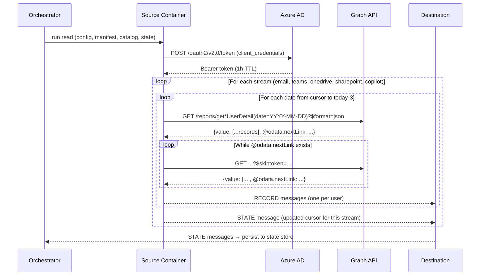

# DESIGN — Microsoft 365 Connector

- [ ] `p3` - **ID**: `cpt-insightspec-design-m365-connector`

<!-- toc -->

- [1. Architecture Overview](#1-architecture-overview)
  - [1.1 Architectural Vision](#11-architectural-vision)
  - [1.2 Architecture Drivers](#12-architecture-drivers)
  - [1.3 Architecture Layers](#13-architecture-layers)
- [2. Principles & Constraints](#2-principles--constraints)
  - [2.1 Design Principles](#21-design-principles)
  - [2.2 Constraints](#22-constraints)
- [3. Technical Architecture](#3-technical-architecture)
  - [3.1 Domain Model](#31-domain-model)
  - [3.2 Component Model](#32-component-model)
  - [3.3 API Contracts](#33-api-contracts)
  - [3.4 Internal Dependencies](#34-internal-dependencies)
  - [3.5 External Dependencies](#35-external-dependencies)
  - [3.6 Interactions & Sequences](#36-interactions--sequences)
  - [3.7 Database schemas & tables](#37-database-schemas--tables)
  - [3.8 Deployment Topology](#38-deployment-topology)
- [4. Additional context](#4-additional-context)
  - [Identity Resolution Strategy](#identity-resolution-strategy)
  - [Silver / Gold Mappings](#silver--gold-mappings)
  - [Incremental Sync Window](#incremental-sync-window)
  - [Open Questions](#open-questions)
- [5. Traceability](#5-traceability)

<!-- /toc -->

## 1. Architecture Overview

### 1.1 Architectural Vision

The Microsoft 365 Connector extracts per-user daily activity data from five Microsoft Graph API Report endpoints (Email, Teams, OneDrive, SharePoint, Copilot) and delivers it to the Bronze layer of the Insight platform. The connector is implemented as an Airbyte declarative manifest — a YAML file that defines all streams, authentication, pagination, incremental sync, and schema without code.

Each activity stream maps to one Graph API Report endpoint and produces one Bronze table. All streams share the same architecture pattern: OAuth2 client credentials authentication, date-parameterized endpoint, OData pagination, datetime-based incremental cursor on `reportRefreshDate`, and a composite primary key (`userPrincipalName + reportRefreshDate`).

A sixth stream (`collection_runs`) captures connector execution metadata for operational monitoring.

### 1.2 Architecture Drivers

**PRD**: [PRD.md](./PRD.md)

#### Functional Drivers

| Requirement | Design Response |
|-------------|-----------------|
| `cpt-insightspec-fr-m365-email-activity` | Stream `email_activity` → `getEmailActivityUserDetail` endpoint |
| `cpt-insightspec-fr-m365-teams-activity` | Stream `teams_activity` → `getTeamsUserActivityUserDetail` endpoint |
| `cpt-insightspec-fr-m365-onedrive-activity` | Stream `onedrive_activity` → `getOneDriveActivityUserDetail` endpoint |
| `cpt-insightspec-fr-m365-sharepoint-activity` | Stream `sharepoint_activity` → `getSharePointActivityUserDetail` endpoint |
| `cpt-insightspec-fr-m365-copilot-usage` | Stream `copilot_usage` → `getMicrosoft365CopilotUsageUserDetail` endpoint |
| `cpt-insightspec-fr-m365-collection-runs` | Stream `collection_runs` — connector execution log |
| `cpt-insightspec-fr-m365-deduplication` | Composite key `unique_key` = `lower(userPrincipalName + '-' + reportRefreshDate)` |
| `cpt-insightspec-fr-m365-identity-key` | `userPrincipalName` present in all activity streams |
| `cpt-insightspec-fr-m365-retention-guard` | Incremental cursor lookback window: 27 days back to 3 days ago |

#### NFR Allocation

| NFR ID | NFR Summary | Allocated To | Design Response | Verification Approach |
|--------|-------------|--------------|-----------------|----------------------|
| `cpt-insightspec-nfr-m365-freshness` | Data in Bronze ≤ 24h after API availability | Orchestrator scheduling | Daily scheduled run; cursor starts from last sync date | Compare `reportRefreshDate` in Bronze with current date minus API lag |
| `cpt-insightspec-nfr-m365-completeness` | 100% user extraction per stream per date | Pagination + deduplication | OData cursor pagination exhausts all pages; `append_dedup` ensures no loss | Compare record count with Graph API `$count` response |

### 1.3 Architecture Layers

- [ ] `p3` - **ID**: `cpt-insightspec-tech-m365-connector`

| Layer | Responsibility | Technology |
|-------|---------------|------------|
| Source API | Microsoft Graph API Report endpoints | REST / JSON / OData |
| Authentication | OAuth2 client credentials → Bearer token | Azure AD token endpoint |
| Connector | Stream definitions, pagination, incremental sync | Airbyte declarative manifest (YAML) |
| Execution | Container runtime for source and destination | Airbyte Declarative Connector framework |
| Bronze | Raw data storage with source-native schema | Destination connector (PostgreSQL / ClickHouse) |

## 2. Principles & Constraints

### 2.1 Design Principles

#### One Stream per Endpoint

- [ ] `p2` - **ID**: `cpt-insightspec-principle-m365-one-stream-per-endpoint`

Each Microsoft Graph API Report endpoint maps to exactly one stream. This preserves the API's data model without transformation and keeps each stream independently configurable (enable/disable, sync mode).

#### Source-Native Schema

- [ ] `p2` - **ID**: `cpt-insightspec-principle-m365-source-native-schema`

Bronze tables preserve the original Graph API field names in camelCase without renaming or restructuring. The only added field is the computed `unique_key` for deduplication. Transformation to unified schemas happens in the Silver layer.

### 2.2 Constraints

#### Data Retention Window

- [ ] `p1` - **ID**: `cpt-insightspec-constraint-m365-retention-window`

In per-date mode, the Microsoft Graph API returns activity data for dates within the **last 30 days** only. Requests for dates older than 30 days return an error. Records outside this window are permanently unavailable. The connector must run at minimum every 7 days to maintain a safety margin. The default lookback in the manifest is 27 days back to 3 days ago — this ensures maximum coverage within the 30-day window while respecting the 2–3 day report data lag.

In per-period mode (D7, D30, D90, D180), aggregated data is available for longer windows but at lower granularity (one row per user per period, not per day). The connector does not use this mode.

#### API Rate Limiting

- [ ] `p2` - **ID**: `cpt-insightspec-constraint-m365-rate-limiting`

Microsoft Graph API enforces throttling at approximately 5 requests per second for report endpoints. The connector must handle HTTP 429 responses with retry and backoff.

#### Report Data Lag

- [ ] `p2` - **ID**: `cpt-insightspec-constraint-m365-data-lag`

Graph API reports are typically available with a 2–3 day lag. Data for today and yesterday is generally not available. The manifest sets `end_datetime` to `day_delta(-3)` to avoid requesting unavailable dates.

#### Copilot License Requirement

- [ ] `p2` - **ID**: `cpt-insightspec-constraint-m365-copilot-license`

The `copilot_usage` stream requires a Microsoft 365 Copilot license on the tenant. If the license is not present, the `discover` operation will not return this stream.

## 3. Technical Architecture

### 3.1 Domain Model

| Entity | Description |
|--------|-------------|
| `ActivityRecord` | One user's activity on one date for one product area. Key: `unique_key` = `lower(userPrincipalName + '-' + reportRefreshDate)`. |
| `UserPrincipalName` | Corporate email / UPN. Identity key across all streams. Resolved to `person_id` in Silver. |
| `ReportRefreshDate` | The date for which activity is reported. Cursor field for incremental sync. |
| `CollectionRun` | One execution of the connector. Records timing, status, per-stream record counts. |

**Relationships**:

- `ActivityRecord` ← keyed by → `UserPrincipalName` + `ReportRefreshDate`
- `ActivityRecord` ← extracted from → Microsoft Graph API endpoint
- `ActivityRecord` ← part of → `CollectionRun`
- `UserPrincipalName` → resolved to `person_id` by Identity Manager (Silver)

### 3.2 Component Model

The M365 connector is a single declarative manifest that defines five activity streams and one monitoring stream. There are no custom code components.

#### M365 Connector Manifest

- [ ] `p2` - **ID**: `cpt-insightspec-component-m365-manifest`

##### Why this component exists

Defines the complete M365 connector as a YAML declarative manifest executed by the Airbyte Declarative Connector framework. No code required.

##### Responsibility scope

Defines all 6 streams with: Graph API endpoint paths, OAuth2 authentication, OData cursor pagination, `DatetimeBasedCursor` incremental sync on `reportRefreshDate`, `AddFields` transformation for `unique_key`, and inline JSON schemas.

##### Responsibility boundaries

Does not handle orchestration, scheduling, or state storage. Does not perform Silver/Gold transformations. Does not handle destination-specific configuration.

##### Related components (by ID)

- `cpt-insightspec-component-source-runner` (from Airbyte Declarative Connector framework) — executes this manifest

### 3.3 API Contracts

#### Microsoft Graph API Report Endpoints

- [ ] `p2` - **ID**: `cpt-insightspec-interface-m365-graph-endpoints`

- **Contracts**: `cpt-insightspec-contract-m365-graph-api`
- **Technology**: REST / JSON / OData

| Stream | Endpoint | API Version |
|--------|----------|-------------|
| `email_activity` | `GET /beta/reports/getEmailActivityUserDetail(date={YYYY-MM-DD})` | beta |
| `teams_activity` | `GET /beta/reports/getTeamsUserActivityUserDetail(date={YYYY-MM-DD})` | beta |
| `onedrive_activity` | `GET /beta/reports/getOneDriveActivityUserDetail(date={YYYY-MM-DD})` | beta |
| `sharepoint_activity` | `GET /beta/reports/getSharePointActivityUserDetail(date={YYYY-MM-DD})` | beta |
| `copilot_usage` | `GET /beta/reports/getMicrosoft365CopilotUsageUserDetail(date={YYYY-MM-DD})` | beta |

**Request modes**: Each endpoint supports two modes:

| Mode | URL pattern | Granularity | Data availability |
|------|-------------|-------------|-------------------|
| **Per-date** (recommended) | `get*UserDetail(date=YYYY-MM-DD)` | Per-user, per-day | Last 30 days |
| Per-period | `get*UserDetail(period='D7'\|'D30'\|'D90'\|'D180')` | Per-user, aggregated over period | D7–D180 rolling window |

The connector uses the **per-date mode** — this is the most granular option and the recommended approach for daily-resolution analytics. One request per date per stream, paginated across all users.

**Common request pattern**:

- Base URL: `https://graph.microsoft.com/`
- Request parameter: `$format=application/json` (required to get JSON instead of CSV)
- Response: JSON object with `value` array containing activity records and optional `@odata.nextLink` for pagination
- Pagination: OData cursor via `$skiptoken` parameter extracted from `@odata.nextLink`

**Authentication**:

OAuth2 client credentials flow:

1. POST to `https://login.microsoftonline.com/{tenant_id}/oauth2/v2.0/token`
2. Body: `grant_type=client_credentials`, `scope=https://graph.microsoft.com/.default`, `client_id`, `client_secret`
3. Response: Bearer token in `access_token` field
4. Token lifetime: 1 hour (`expiration_duration: PT1H` in manifest)

**Required Azure AD permissions**: `Reports.Read.All` (application-level)

#### Source Config Schema

- [ ] `p2` - **ID**: `cpt-insightspec-interface-m365-source-config`

The source config (credentials) for the M365 connector:

```json
{
  "tenant_id": "Azure AD tenant ID (GUID)",
  "client_id": "Azure AD application client ID (GUID)",
  "client_secret": "Azure AD application client secret"
}
```

All three fields are required. `client_secret` is marked `airbyte_secret: true` — it is never logged or displayed.

> **Note**: The Azure AD application registration UI shows both **Client secret** (the value) and **Client secret ID** (a GUID identifying the secret). The connector requires the **Client secret value**, not the Client secret ID. The secret value is displayed only once at creation time — copy it immediately.

### 3.4 Internal Dependencies

| Component | Depends On | Interface |
|-----------|------------|-----------|
| M365 Manifest | Airbyte Declarative Connector framework | Executed by `source-declarative-manifest` image |
| Silver pipeline | M365 Bronze tables | Reads `userPrincipalName`, `reportRefreshDate`, activity fields |
| Identity Manager | `userPrincipalName` field | Resolves UPN → canonical `person_id` |

### 3.5 External Dependencies

#### Microsoft Graph API

| Dependency | Purpose | Notes |
|------------|---------|-------|
| `graph.microsoft.com` | Activity report endpoints | Rate-limited; requires OAuth2 token |
| `login.microsoftonline.com` | Token endpoint for OAuth2 client credentials | Token lifetime: 1h |

#### Docker Hub Images

| Image | Purpose |
|-------|---------|
| `airbyte/source-declarative-manifest` | Executes the M365 manifest |
| `airbyte/destination-postgres` (or other) | Writes to Bronze layer |

### 3.6 Interactions & Sequences

#### Incremental Sync Run

**ID**: `cpt-insightspec-seq-m365-sync`

**Use cases**: `cpt-insightspec-usecase-m365-daily-sync`

**Actors**: `cpt-insightspec-actor-m365-operator`



**Description**: The connector authenticates once per run, then iterates through each enabled stream and each date in the sync window. For each date, it paginates through all users and emits RECORD messages. After each stream completes, it emits a STATE message with the updated cursor.

### 3.7 Database schemas & tables

Bronze tables are created by the destination container. All tables share the same identity key (`userPrincipalName`) and cursor field (`reportRefreshDate`).

#### Table: `email_activity`

| Column | Type | Description |
|--------|------|-------------|
| `unique_key` | String | PK: `lower(userPrincipalName + '-' + reportRefreshDate)` |
| `userPrincipalName` | String | User email (UPN) — identity key |
| `reportRefreshDate` | String | Report date (cursor field) |
| `reportPeriod` | String | Report period duration |
| `displayName` | String | User display name |
| `isDeleted` | Boolean | Whether the account is deleted |
| `assignedProducts` | Array | M365 licenses assigned |
| `sendCount` | Number | Emails sent |
| `receiveCount` | Number | Emails received |
| `readCount` | Number | Emails read |
| `meetingCreatedCount` | Number | Meetings created via email |
| `meetingInteractedCount` | Number | Meeting interactions via email |
| `lastActivityDate` | String | Last email activity |

#### Table: `teams_activity`

| Column | Type | Description |
|--------|------|-------------|
| `unique_key` | String | PK |
| `userPrincipalName` | String | Identity key |
| `userId` | String | Microsoft internal user ID |
| `reportRefreshDate` | String | Cursor field |
| `reportPeriod` | String | Report period |
| `tenantDisplayName` | String | M365 tenant name |
| `isDeleted` | Boolean | Account deleted |
| `isLicensed` | Boolean | Teams license |
| `isExternal` | Boolean | External guest |
| `hasOtherAction` | Boolean | Other Teams actions |
| `assignedProducts` | Array | Licenses |
| `teamChatMessageCount` | Number | Team/group chat messages |
| `privateChatMessageCount` | Number | Private (1:1) chat messages |
| `postMessages` | Number | Channel posts |
| `replyMessages` | Number | Channel replies |
| `callCount` | Number | Calls |
| `meetingCount` | Number | Total meetings |
| `meetingsAttendedCount` | Number | Meetings attended |
| `meetingsOrganizedCount` | Number | Meetings organized |
| `adHocMeetingsAttendedCount` | Number | Ad-hoc meetings attended |
| `adHocMeetingsOrganizedCount` | Number | Ad-hoc meetings organized |
| `scheduledOneTimeMeetingsAttendedCount` | Number | One-time scheduled meetings attended |
| `scheduledOneTimeMeetingsOrganizedCount` | Number | One-time scheduled meetings organized |
| `scheduledRecurringMeetingsAttendedCount` | Number | Recurring meetings attended |
| `scheduledRecurringMeetingsOrganizedCount` | Number | Recurring meetings organized |
| `audioDuration` | String | Audio call duration |
| `videoDuration` | String | Video duration |
| `screenShareDuration` | String | Screen sharing duration |
| `urgentMessages` | Number | Urgent priority messages |
| `sharedChannelTenantDisplayNames` | String | Shared channel tenant names |
| `lastActivityDate` | String | Last Teams activity |

**Note**: Total chat messages = `teamChatMessageCount + privateChatMessageCount`. `postMessages` and `replyMessages` are channel activity — exclude from message counts.

#### Table: `onedrive_activity`

| Column | Type | Description |
|--------|------|-------------|
| `unique_key` | String | PK |
| `userPrincipalName` | String | Identity key |
| `reportRefreshDate` | String | Cursor field |
| `reportPeriod` | String | Report period |
| `isDeleted` | Boolean | Account deleted |
| `assignedProducts` | Array | Licenses |
| `viewedOrEditedFileCount` | Number | Files viewed or edited |
| `syncedFileCount` | Number | Files synced |
| `sharedInternallyFileCount` | Number | Files shared internally |
| `sharedExternallyFileCount` | Number | Files shared externally |
| `lastActivityDate` | String | Last OneDrive activity |

#### Table: `sharepoint_activity`

| Column | Type | Description |
|--------|------|-------------|
| `unique_key` | String | PK |
| `userPrincipalName` | String | Identity key |
| `reportRefreshDate` | String | Cursor field |
| `reportPeriod` | String | Report period |
| `isDeleted` | Boolean | Account deleted |
| `assignedProducts` | Array | Licenses |
| `viewedOrEditedFileCount` | Number | Files viewed or edited |
| `visitedPageCount` | Number | Pages visited |
| `syncedFileCount` | Number | Files synced |
| `sharedInternallyFileCount` | Number | Files shared internally |
| `sharedExternallyFileCount` | Number | Files shared externally |
| `lastActivityDate` | String | Last SharePoint activity |

#### Table: `copilot_usage`

| Column | Type | Description |
|--------|------|-------------|
| `unique_key` | String | PK |
| `userPrincipalName` | String | Identity key |
| `reportRefreshDate` | String | Cursor field |
| `reportPeriod` | String | Report period |
| `displayName` | String | User display name |
| `isDeleted` | Boolean | Account deleted |
| `assignedProducts` | Array | Licenses |
| `lastActivityDate` | String | Most recent Copilot activity across all apps |
| `copilotChatLastActivityDate` | String | Last Copilot Chat activity |
| `teamsLastActivityDate` | String | Last Teams Copilot activity |
| `wordLastActivityDate` | String | Last Word Copilot activity |
| `excelLastActivityDate` | String | Last Excel Copilot activity |
| `powerPointLastActivityDate` | String | Last PowerPoint Copilot activity |
| `oneNoteLastActivityDate` | String | Last OneNote Copilot activity |
| `outlookLastActivityDate` | String | Last Outlook Copilot activity |
| `loopLastActivityDate` | String | Last Loop Copilot activity |
| `teamsActionCount` | Number | Teams Copilot actions |
| `wordActionCount` | Number | Word Copilot actions |
| `excelActionCount` | Number | Excel Copilot actions |
| `powerPointActionCount` | Number | PowerPoint Copilot actions |
| `oneNoteActionCount` | Number | OneNote Copilot actions |
| `outlookActionCount` | Number | Outlook Copilot actions |
| `loopActionCount` | Number | Loop Copilot actions |

**Note**: Schema proposed from Graph API naming conventions. Field names must be verified against the live endpoint before enabling. Total Copilot actions = sum of all `*ActionCount` fields.

#### Table: `collection_runs`

| Column | Type | Description |
|--------|------|-------------|
| `run_id` | String | Unique run identifier |
| `started_at` | DateTime | Run start time |
| `completed_at` | DateTime | Run end time |
| `status` | String | `running` / `completed` / `failed` |
| `email_records_collected` | Number | Rows for `email_activity` |
| `teams_records_collected` | Number | Rows for `teams_activity` |
| `onedrive_records_collected` | Number | Rows for `onedrive_activity` |
| `sharepoint_records_collected` | Number | Rows for `sharepoint_activity` |
| `copilot_records_collected` | Number | Rows for `copilot_usage` (0 until enabled) |
| `api_calls` | Number | Total API calls made |
| `errors` | Number | Errors encountered |
| `settings` | String | Collection configuration |

Monitoring table — not an analytics source.

### 3.8 Deployment Topology

- [ ] `p3` - **ID**: `cpt-insightspec-topology-m365-connector`

The M365 connector is deployed as a connection in the Airbyte Declarative Connector framework. No additional infrastructure is required beyond what the framework provides.

```
Connection: m365-{tenant_name}
├── Source image: airbyte/source-declarative-manifest
├── Manifest: connectors/ms365/ms365.yaml
├── Source config: {tenant_id, client_id, client_secret}
├── Configured catalog: 5 activity streams + collection_runs
├── Destination image: airbyte/destination-postgres (or other)
├── Destination config: {host, port, database, schema, credentials}
└── State: per-stream reportRefreshDate cursor positions
```

## 4. Additional context

### Identity Resolution Strategy

`userPrincipalName` (UPN) is the identity key across all M365 activity streams. The UPN is typically the user's corporate email address (e.g., `jane.doe@company.com`), making it a reliable cross-system anchor.

The Identity Manager resolves `userPrincipalName` → canonical `person_id` in Silver step 2. The Teams stream also includes `userId` (Microsoft internal GUID) — this is available for fallback but `userPrincipalName` takes precedence for cross-system resolution.

### Silver / Gold Mappings

| Bronze table | Silver target | Status |
|-------------|--------------|--------|
| `email_activity` | `class_communication_metrics` | Mapped |
| `teams_activity` | `class_communication_metrics` | Mapped |
| `onedrive_activity` | *(unmapped)* | Available — no unified stream defined |
| `sharepoint_activity` | *(unmapped)* | Available — no unified stream defined |
| `copilot_usage` | `class_ai_tool_usage` (planned) | Planned — maps alongside Claude Team and ChatGPT Team |

### Incremental Sync Window

The manifest defines a sync window from 27 days ago to 3 days ago:
- `start_datetime`: `day_delta(-27)` — maximum lookback within the 30-day API window
- `end_datetime`: `day_delta(-3)` — accounts for the 2–3 day report data lag

On first run (empty state), the connector extracts the full 27-day window. On subsequent runs, the cursor starts from the last `reportRefreshDate` in state.

### Open Questions

**OQ-M365-1: Copilot endpoint schema** — The `getMicrosoft365CopilotUsageUserDetail` endpoint requires a Copilot license. Field names in the `copilot_usage` schema are proposed from Graph API naming conventions. The live endpoint must be queried to verify the exact field names before enabling this stream.

**OQ-M365-2: OneDrive and SharePoint Silver mapping** — Both streams are collected but not yet mapped to a Silver table. If a `class_file_storage` or similar Silver stream is defined, both tables would feed it. Decision pending on whether file-storage metrics are in scope for Silver.

## 5. Traceability

- **PRD**: [PRD.md](./PRD.md)
- **ADRs**: [ADR/](./ADR/)
- **Collaboration domain**: [docs/components/connectors/collaboration/README.md](../../README.md)
