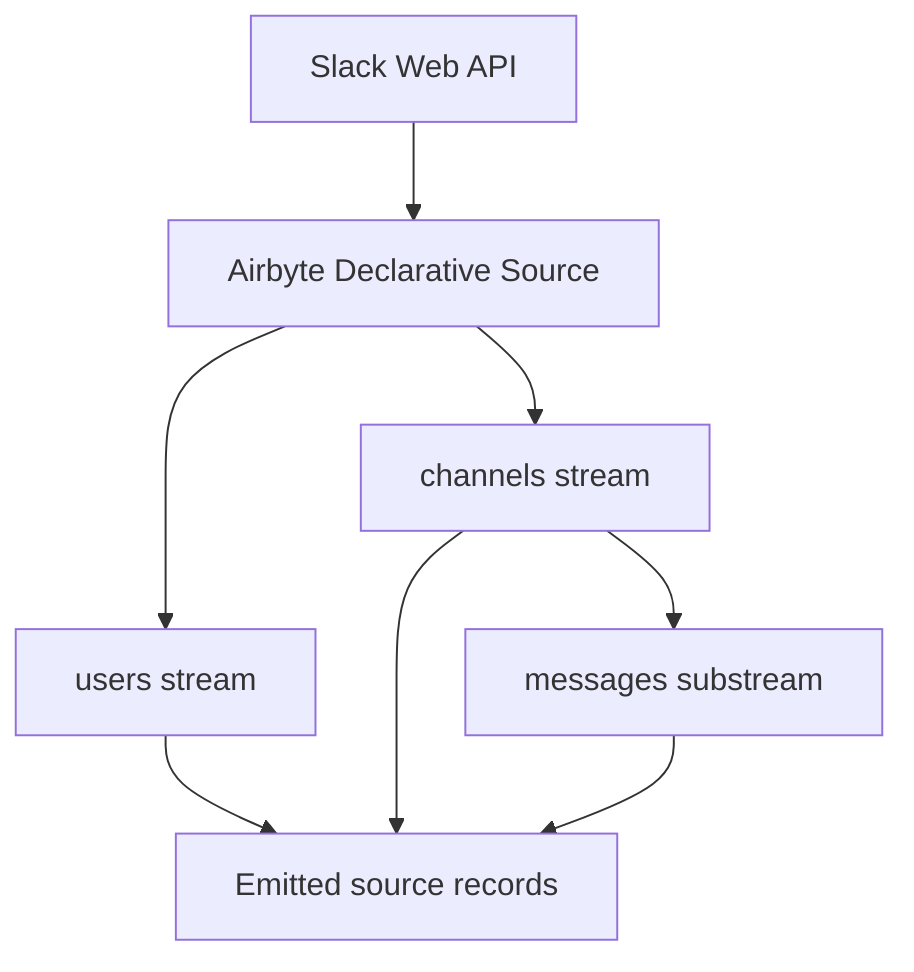
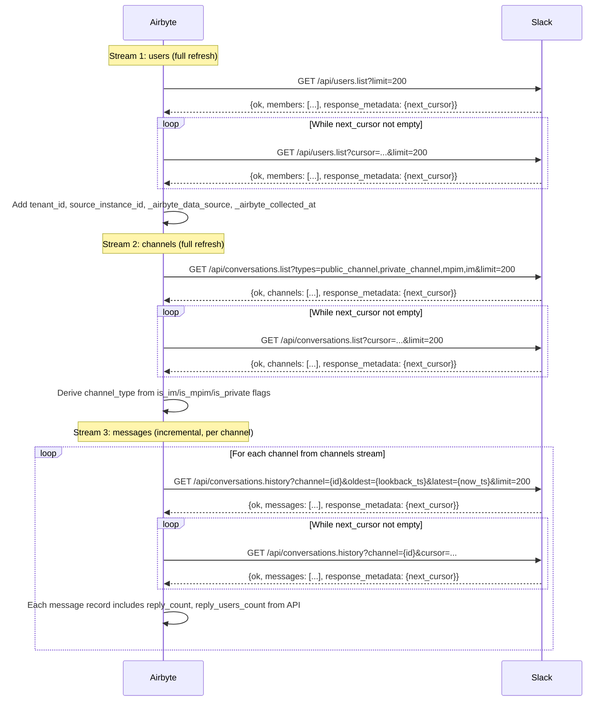

# Technical Design — Slack Connector

<!-- toc -->

- [1. Architecture Overview](#1-architecture-overview)
  - [1.1 Architectural Vision](#11-architectural-vision)
  - [1.2 Architecture Drivers](#12-architecture-drivers)
  - [1.3 Architecture Layers](#13-architecture-layers)
- [2. Principles & Constraints](#2-principles--constraints)
  - [2.1 Design Principles](#21-design-principles)
  - [2.2 Constraints](#22-constraints)
- [3. Technical Architecture](#3-technical-architecture)
  - [3.1 Domain Model](#31-domain-model)
  - [3.2 Component Model](#32-component-model)
  - [3.3 API Contracts](#33-api-contracts)
  - [3.4 Internal Dependencies](#34-internal-dependencies)
  - [3.5 External Dependencies](#35-external-dependencies)
  - [3.6 Interactions & Sequences](#36-interactions--sequences)
  - [3.7 Database schemas & tables](#37-database-schemas--tables)
  - [3.8 Deployment Topology](#38-deployment-topology)
- [4. Additional context](#4-additional-context)
  - [Scope and Limitations](#scope-and-limitations)
  - [Bronze-to-Silver Aggregation Strategy](#bronze-to-silver-aggregation-strategy)
  - [Incremental Sync Strategy](#incremental-sync-strategy)
  - [Rate Limit Handling](#rate-limit-handling)
  - [Identity Model](#identity-model)
  - [Assumptions and Risks](#assumptions-and-risks)
  - [Non-Applicable Sections](#non-applicable-sections)
- [5. Traceability](#5-traceability)

<!-- /toc -->

- [ ] `p3` - **ID**: `cpt-insightspec-design-slack-connector`

## 1. Architecture Overview

### 1.1 Architectural Vision

The Slack connector is a declarative Airbyte source manifest that extracts raw data from the Slack Web API for Standard workspaces. The executable manifest targets Airbyte declarative manifest version `6.60.9` (manifest yaml format documentation: https://docs.airbyte.com/platform/connector-development/config-based/understanding-the-yaml-file/yaml-overview), and follows the same design philosophy as the Zoom connector — all behavior is expressed directly in the YAML manifest without custom code.

The connector implements three source streams:

- `users` for user directory and identity support
- `channels` for channel directory and type metadata
- `messages` as a child stream of `channels` for raw message collection

The `thread_replies` stream (`conversations.replies`) is excluded from the declarative manifest. In Airbyte Declarative YAML, `SubstreamPartitionRouter` triggers for **every** parent record unconditionally — there is no way to filter only messages with `reply_count > 0`. This would cause an API call for every message in every channel, resulting in an N+1 explosion: 2000 channels × 100 messages = 200K `conversations.replies` calls at Tier 3 (50 req/min) = ~66 hours per sync. Thread reply metadata (`reply_count`, `reply_users_count`) is still available on each parent message record — Silver can use these for aggregate thread counts without per-user reply attribution. Per-user thread reply attribution requires a future Python CDK iteration with conditional child stream filtering.

Raw messages are emitted to Bronze as individual records. Aggregation to per-user daily counts (`collab_chat_activity`) is performed downstream in the Silver transformation layer, not in the connector.

**Scope**: Standard workspace endpoints only. Enterprise Grid (`admin.analytics.getFile`) and huddle parsing are deferred to a future iteration.

**Aggregation strategy**: Unlike M365 (which receives pre-aggregated data from Graph API) or the full PRD vision (in-connector aggregation), this implementation emits raw message records. The Bronze→Silver transformation aggregates by `(user_id, date, channel_type)` to produce `collab_chat_activity` counts. This trade-off keeps the connector purely declarative while delivering the same analytical output.

### 1.2 Architecture Drivers

**PRD**: [PRD.md](./PRD.md)

#### Functional Drivers

| Requirement | Design Response |
|-------------|-----------------|
| `cpt-insightspec-fr-slack-chat-standard` | `messages` child stream reads `conversations.history` per channel; aggregation to per-user daily counts deferred to Silver |
| `cpt-insightspec-fr-slack-thread-batching` | Thread reply metadata (`reply_count`, `reply_users_count`) available on parent messages; per-user reply attribution deferred — see [1.1 Architectural Vision](#11-architectural-vision) for rationale |
| `cpt-insightspec-fr-slack-user-directory` | `users` stream from `users.list` with email, role, active status |
| `cpt-insightspec-fr-slack-bot-filtering` | Bot users flagged via `is_bot` field in Bronze; filtering applied in Silver transformation (all records collected for auditability) |
| `cpt-insightspec-fr-slack-channel-type-cache` | `channels` stream from `conversations.list` provides authoritative channel type metadata; joined to messages in Silver |
| `cpt-insightspec-fr-slack-identity-key` | `email` from `users` stream; joined to messages via `user` (Slack user ID) in Silver |
| `cpt-insightspec-fr-slack-incremental-sync` | `messages` uses `DatetimeBasedCursor` with `oldest`/`latest` Unix timestamp parameters; lookback window: 7 days |
| `cpt-insightspec-fr-slack-deduplication` | Message PK: `(channel_id, ts)` — Slack guarantees `ts` uniqueness per channel |
| `cpt-insightspec-fr-slack-utc-timestamps` | Slack `ts` is Unix epoch (UTC by definition); stored as-is in Bronze, converted in Silver |
| `cpt-insightspec-fr-slack-instance-context` | `source_instance_id` and `tenant_id` stamped via `AddFields` transformations |

#### NFR Allocation

| NFR ID | NFR Summary | Design Response | Verification |
|--------|-------------|-----------------|--------------|
| `cpt-insightspec-nfr-slack-freshness` | Data in Bronze ≤ 24h after run | Daily scheduled run; incremental cursor from last sync | Compare latest `ts` in Bronze with current date |
| `cpt-insightspec-nfr-slack-completeness` | All non-bot users extracted | Cursor pagination exhausts all pages; bot filtering in Silver | Compare user count with `users.list` total |

#### Deferred Requirements (not in the first iteration)

| Requirement | Reason | Future Path |
|-------------|--------|-------------|
| `cpt-insightspec-fr-slack-chat-enterprise` | Enterprise Grid requires `admin.analytics.getFile` (gzipped NDJSON) — needs custom decoder | Python CDK with gzip NDJSON decoder |
| `cpt-insightspec-fr-slack-strategy-selection` | Only Standard mode in MVP | Config UI + auto-detect via `auth.test` response (`enterprise_id` presence) |
| `cpt-insightspec-fr-slack-huddle-activity` | Huddle event parsing requires custom logic for `subtype = "huddle_thread"` | Python CDK: parse huddle events from `messages` stream |
| `cpt-insightspec-fr-slack-collection-runs` | Run logging stream not critical for MVP | Connector-emitted run log stream |
| `cpt-insightspec-fr-slack-user-scd` | SCD Type 2 versioning not supported in Declarative YAML | Destination MERGE SQL or Python CDK change detection |
| `cpt-insightspec-fr-slack-thread-batching` | Declarative YAML `SubstreamPartitionRouter` cannot conditionally filter parents — calling `conversations.replies` for every message causes N+1 explosion (200K+ API calls) | Python CDK: conditional child stream with `reply_count > 0` filter + rate limit budget allocation |

### 1.3 Architecture Layers



- [ ] `p3` - **ID**: `cpt-insightspec-tech-slack-connector`

| Layer | Responsibility | Technology |
|-------|---------------|------------|
| Source API | Slack Web API endpoints | REST / JSON / cursor pagination |
| Authentication | Bot Token (`xoxb-*`) passed as Bearer | OAuth 2.0 Bot Token |
| Connector | Stream definitions, pagination, incremental sync | Airbyte declarative manifest v6.60.9 |
| Execution | Container runtime for source and destination | Airbyte Declarative Connector framework |
| Bronze | Raw data storage with source-native schema | Destination connector (PostgreSQL / ClickHouse) |

## 2. Principles & Constraints

### 2.1 Design Principles

#### Manifest-Driven Simplicity

- [ ] `p2` - **ID**: `cpt-insightspec-principle-slack-manifest-driven`

All connector behavior is expressed in the declarative YAML manifest. No custom Python code. This keeps the connector reproducible, auditable, and aligned with the Zoom connector pattern.

#### Raw-First Bronze

- [ ] `p2` - **ID**: `cpt-insightspec-principle-slack-raw-first`

Bronze tables store raw API records without aggregation. The connector's job is to reliably extract and deliver data; aggregation to `collab_chat_activity` counts happens in the Silver transformation layer. This separation keeps the connector simple and the aggregation logic testable in SQL.

#### Channel-Type Authority from Source

- [ ] `p2` - **ID**: `cpt-insightspec-principle-slack-channel-authority`

Channel type (`im`, `mpim`, `public_channel`, `private_channel`) is determined exclusively from `conversations.list` metadata, never from channel ID prefix conventions. The `channels` stream provides the authoritative type lookup for message attribution in Silver. Channel ID prefix conventions (`C`, `G`, `D`) are unreliable — Slack Connect blurred boundaries and internal routing has changed over time.

#### Separate Raw Collection

- [ ] `p2` - **ID**: `cpt-insightspec-principle-slack-separate-raw`

Each API entity (users, channels, messages) maps to a separate Bronze table. This preserves the source data model, enables independent stream configuration, and allows the Silver layer to join and aggregate with full flexibility.

### 2.2 Constraints

#### Slack API Rate Limits

- [ ] `p2` - **ID**: `cpt-insightspec-constraint-slack-rate-limits`

Slack enforces tiered rate limits: Tier 2 (20 req/min) for `users.list` and `conversations.list`, Tier 3 (50 req/min) for `conversations.history` and `conversations.replies`. The connector handles HTTP 429 responses via `WaitTimeFromHeader` with `Retry-After` header, identical to the Zoom connector pattern.

**Impact**: For large workspaces (>2000 channels), the `messages` stream will generate high API call volume. At Tier 3 (50 req/min), scanning 2000 channels × 7 days × multiple pages could take several hours. This is acceptable for daily batch collection but limits the feasibility of more frequent runs.

#### Thread Reply N+1 Problem

- [ ] `p2` - **ID**: `cpt-insightspec-constraint-slack-thread-n1`

`conversations.history` returns only parent messages. Counting thread replies per user requires a separate `conversations.replies` call per threaded parent message, sharing the Tier 3 rate limit with `conversations.history`. In the Declarative YAML framework, the parent-child relationship executes synchronously — no throttling control beyond the Airbyte runtime's built-in retry.

**Impact**: In active workspaces, thousands of threaded messages per day could exhaust rate limits. The MVP accepts this risk — if rate limits are hit, the Airbyte runtime retries with backoff. A future CDK iteration can implement explicit thread budget throttling per PRD FR `cpt-insightspec-fr-slack-thread-batching`.

#### No In-Connector Aggregation

- [ ] `p2` - **ID**: `cpt-insightspec-constraint-slack-no-aggregation`

Airbyte Declarative YAML cannot perform GROUP BY operations. The connector emits raw message records; aggregation to per-user daily counts is the responsibility of the Silver transformation layer.

#### Bot Token Scope Dependency

- [ ] `p2` - **ID**: `cpt-insightspec-constraint-slack-scopes`

The connector requires a Bot Token (`xoxb-*`) with specific OAuth scopes: `channels:history`, `channels:read`, `groups:history`, `groups:read`, `im:history`, `im:read`, `mpim:history`, `mpim:read`, `users:read`, `users:read.email`. Missing scopes will cause specific streams to fail (e.g., no `groups:read` → private channels not listed; no `users:read.email` → no email in user records → broken identity resolution).

## 3. Technical Architecture

### 3.1 Domain Model

| Entity | Stream | Notes |
|--------|--------|-------|
| SlackUser | `users` | User directory: email, role, active status, bot flag |
| SlackChannel | `channels` | Channel directory: type, name, member count |
| SlackMessage | `messages` | Raw message: user, ts, channel_id, thread metadata (`reply_count`, `reply_users_count`) |

**Relationships**:

- `SlackChannel` → `SlackMessage`: one-to-many by `channel_id`
- `SlackUser` → `SlackMessage`: one-to-many by `user` field (Slack user ID)
- `SlackUser.email` → Identity Manager: cross-system resolution in Silver

### 3.2 Component Model

#### Declarative Stream Components

- [ ] `p2` - **ID**: `cpt-insightspec-component-slack-declarative-streams`

##### Why this component exists

Implements the complete Slack Standard workspace connector as a YAML declarative manifest executed by the Airbyte Declarative Connector framework. No custom code required.

##### Responsibility scope

- Define the shared requester and Bot Token authentication
- Define three streams with cursor pagination, incremental sync (where possible), and transformations
- Define rate limit handling (HTTP 429 + `Retry-After`)
- Define parent-child relationship: `channels` → `messages`

##### Responsibility boundaries

- Does not perform message aggregation (deferred to Silver)
- Does not parse huddle events (deferred to Python CDK iteration)
- Does not support Enterprise Grid endpoints
- Does not implement SCD Type 2 change detection
- Does not emit a `collection_runs` stream

##### Related components (by ID)

- `cpt-insightspec-principle-slack-manifest-driven`
- `cpt-insightspec-principle-slack-raw-first`
- `cpt-insightspec-principle-slack-channel-authority`

| Component | Type | Responsibility |
|-----------|------|----------------|
| `base_requester` | Shared requester | Slack base URL (`https://slack.com/api/`), Bot Token Bearer auth, Accept: JSON |
| `base_error_handler` | Shared error handler | HTTP 429/503 → `WaitTimeFromHeader` (`Retry-After`); HTTP 500/502/504 → `ExponentialBackoffStrategy` |
| `users` | Root stream | Active Slack users with email, role, bot flag; cursor pagination |
| `channels` | Root stream | All accessible channels with type metadata; cursor pagination |
| `messages` | Child stream | Raw messages per channel, partitioned by `channel_id`; incremental sync via `oldest`/`latest`. Each record includes `reply_count` and `reply_users_count` for thread metadata |

### 3.3 API Contracts

The connector exposes no public API. Its implementation contract is the declarative source manifest and the Slack Web API endpoints it calls.

#### Source Config Schema

- [ ] `p2` - **ID**: `cpt-insightspec-interface-slack-source-config`

- **Technology**: Airbyte source config JSON

| Field | Type | Required | Description |
|-------|------|----------|-------------|
| `bot_token` | String | Yes | Slack Bot Token (`xoxb-*`). Marked `airbyte_secret: true` |
| `insight_tenant_id` | String | Yes | Insight platform tenant ID |
| `source_instance_id` | String | Yes | Slack workspace identifier (e.g., `slack-acme`) |
| `start_date` | String | Yes | Incremental sync start date (`YYYY-MM-DD`) |
| `lookback_days` | Integer | No | Days to look back on each run (default: `7`) |
| `page_size` | Integer | No | Records per API page (default: `200`, max: `999`) |
| `channel_types` | String | No | Channel types to scan (default: `public_channel,private_channel,mpim,im`) |

### 3.4 Internal Dependencies

| Component | Depends On | Interface |
|-----------|------------|-----------|
| Slack Manifest | Airbyte Declarative Connector framework | Executed by `source-declarative-manifest` image |
| Silver pipeline | Slack Bronze tables | Reads raw messages, channels, users; aggregates to `collab_chat_activity` |
| Identity Manager | `email` from `users` stream | Resolves email → canonical `person_id` |

### 3.5 External Dependencies

#### Slack Web API

| Endpoint | Stream | Rate Limit | Pagination |
|----------|--------|------------|------------|
| `GET /api/users.list` | `users` | Tier 2 (20/min) | `response_metadata.next_cursor` |
| `GET /api/conversations.list` | `channels` | Tier 2 (20/min) | `response_metadata.next_cursor` |
| `GET /api/conversations.history` | `messages` | Tier 3 (50/min) | `response_metadata.next_cursor` |
| `GET /api/conversations.replies` | *(deferred — see [1.1](#11-architectural-vision))* | Tier 3 (50/min) | `response_metadata.next_cursor` |
| `POST /api/auth.test` | (check) | Special (100+/min) | N/A |

**Authentication**: `Authorization: Bearer xoxb-*`

**Common pagination pattern**: All list endpoints use cursor-based pagination. `response_metadata.next_cursor` in response → pass as `cursor` request parameter. Stop when `next_cursor` is empty string (`""`).

#### Docker Hub Images

| Image | Purpose |
|-------|---------|
| `airbyte/source-declarative-manifest` | Executes the Slack manifest |
| `airbyte/destination-postgres` (or other) | Writes to Bronze layer |

### 3.6 Interactions & Sequences

#### Standard Workspace Sync

**ID**: `cpt-insightspec-seq-slack-standard-sync`

**Use cases**: `cpt-insightspec-usecase-slack-incremental-sync`

**Actors**: `cpt-insightspec-actor-slack-operator`



**Description**: The connector runs three streams sequentially. `users` and `channels` are full refresh (small datasets). `messages` iterates over all channels from the `channels` stream, reading `conversations.history` within the lookback window. Each message record includes thread metadata (`reply_count`, `reply_users_count`) from the API response — Silver uses these for aggregate thread counts. Per-user reply attribution via `conversations.replies` is deferred due to the Declarative YAML N+1 limitation (see [1.1 Architectural Vision](#11-architectural-vision)).

### 3.7 Database schemas & tables

- [ ] `p3` - **ID**: `cpt-insightspec-db-slack-bronze-model`

Bronze tables are created by the destination container. Raw Slack data is stored without aggregation.

#### Table: `slack_users`

**ID**: `cpt-insightspec-dbtable-slack-users`

| Column | Type | Description |
|--------|------|-------------|
| `slack_user_id` | String | Slack user ID (`U0123ABC`) |
| `email` | String | User email (requires `users:read.email` scope) |
| `display_name` | String | `profile.display_name` or `real_name` |
| `real_name` | String | Full name |
| `is_admin` | Boolean | Workspace admin flag |
| `is_owner` | Boolean | Workspace owner flag |
| `is_restricted` | Boolean | Guest (single-channel) flag |
| `is_ultra_restricted` | Boolean | Guest (ultra-restricted) flag |
| `is_bot` | Boolean | Bot user flag |
| `deleted` | Boolean | Deactivated user flag |
| `tz` | String | User timezone |
| `updated` | Integer | Last profile update (Unix timestamp) |
| `tenant_id` | String | Insight tenant ID from config |
| `source_instance_id` | String | Slack workspace identifier from config |
| `_airbyte_data_source` | String | Always `insight_slack` |
| `_airbyte_collected_at` | DateTime | Collection timestamp |

**PK**: `slack_user_id`

#### Table: `slack_channels`

**ID**: `cpt-insightspec-dbtable-slack-channels`

| Column | Type | Description |
|--------|------|-------------|
| `channel_id` | String | Slack channel ID |
| `name` | String | Channel name (empty for IMs) |
| `is_channel` | Boolean | Public channel flag |
| `is_group` | Boolean | Private channel flag |
| `is_im` | Boolean | Direct message flag |
| `is_mpim` | Boolean | Group DM flag |
| `is_private` | Boolean | Private flag |
| `is_archived` | Boolean | Archived flag |
| `num_members` | Integer | Member count |
| `created` | Integer | Channel creation timestamp |
| `creator` | String | Creator user ID |
| `channel_type` | String | Derived: `im` / `mpim` / `public_channel` / `private_channel` |
| `tenant_id` | String | Insight tenant ID |
| `source_instance_id` | String | Workspace identifier |
| `_airbyte_data_source` | String | Always `insight_slack` |
| `_airbyte_collected_at` | DateTime | Collection timestamp |

**PK**: `channel_id`

**`channel_type` derivation logic**: `is_im → 'im'`, `is_mpim → 'mpim'`, `is_private → 'private_channel'`, else `'public_channel'`

#### Table: `slack_messages`

**ID**: `cpt-insightspec-dbtable-slack-messages`

| Column | Type | Description |
|--------|------|-------------|
| `message_key` | String | PK: `{channel_id}:{ts}` |
| `channel_id` | String | Parent channel ID (from partition context) |
| `ts` | String | Message timestamp (Slack's unique message ID per channel) |
| `user` | String | Author Slack user ID |
| `type` | String | Message type (typically `message`) |
| `subtype` | String | Message subtype (`huddle_thread`, `channel_join`, etc.; nullable) |
| `thread_ts` | String | Thread parent timestamp (nullable; equals `ts` for parent messages) |
| `reply_count` | Integer | Number of thread replies (nullable; 0 if no thread) |
| `reply_users_count` | Integer | Number of unique reply authors (nullable) |
| `tenant_id` | String | Insight tenant ID |
| `source_instance_id` | String | Workspace identifier |
| `_airbyte_data_source` | String | Always `insight_slack` |
| `_airbyte_collected_at` | DateTime | Collection timestamp |

**PK**: `message_key`

**Note**: `subtype` is collected for future huddle event parsing (`subtype = "huddle_thread"`). Message body text (`text`) is intentionally excluded — only metadata fields are stored. Only aggregate counts are used for analytics.

### 3.8 Deployment Topology

- [ ] `p3` - **ID**: `cpt-insightspec-topology-slack-connector`

The Slack connector is deployed as a connection in the Airbyte Declarative Connector framework. No additional infrastructure required.

```
Connection: slack-{workspace_name}
├── Source image: airbyte/source-declarative-manifest
├── Manifest: src/connectors/collaboration/slack/manifest.yaml
├── Source config: {bot_token, insight_tenant_id, source_instance_id, start_date, lookback_days, page_size, channel_types}
├── Configured catalog: users, channels, messages
├── Destination image: airbyte/destination-postgres (or other)
├── Destination config: {host, port, database, schema, credentials}
└── State: per-stream cursor positions (messages: latest ts per channel)
```

## 4. Additional context

### Scope and Limitations

This design covers the Declarative YAML implementation for Standard Slack workspaces. The following capabilities from the PRD are intentionally deferred:

| Capability | PRD Requirement | Status | Future Path |
|-----------|----------------|------------|-------------|
| Enterprise Grid totals | `cpt-insightspec-fr-slack-chat-enterprise` | Deferred | Custom Python CDK decoder for gzipped NDJSON from `admin.analytics.getFile` |
| Enterprise Grid hybrid | `cpt-insightspec-fr-slack-chat-enterprise` | Deferred | Separate Airbyte connection (Standard mode on slower schedule) |
| Strategy selection | `cpt-insightspec-fr-slack-strategy-selection` | Standard only | Config UI + auto-detect via `auth.test` (`enterprise_id` presence) |
| Huddle activity | `cpt-insightspec-fr-slack-huddle-activity` | Deferred | Python CDK: parse `subtype = "huddle_thread"` events from `messages` stream |
| Collection runs | `cpt-insightspec-fr-slack-collection-runs` | Deferred | Connector-emitted run log stream |
| SCD Type 2 | `cpt-insightspec-fr-slack-user-scd` | Deferred | Destination MERGE SQL or Python CDK change detection |
| Thread throttling | `cpt-insightspec-fr-slack-thread-batching` | Airbyte runtime retry only | Python CDK: explicit rate limit budget allocation (15 req/min cap) |

### Bronze-to-Silver Aggregation Strategy

The connector emits raw records. The Silver transformation layer performs:

1. **Chat activity aggregation**: JOIN `slack_messages` with `slack_channels` on `channel_id` to resolve `channel_type`, then GROUP BY `(user, date_trunc('day', to_timestamp(cast(ts as float))), channel_type)` to produce `collab_chat_activity` counts (`direct_messages`, `group_chat_messages`, `channel_posts`, `total_chat_messages`).

2. **Thread reply counts**: Use `reply_count` from `slack_messages` records (available on parent messages from `conversations.history` API response). SUM `reply_count` per user per day to produce `channel_replies` counts. Note: this gives aggregate thread counts per channel but not per-user reply attribution (which user wrote which reply). Per-user attribution requires the `conversations.replies` endpoint — deferred to Python CDK iteration.

3. **Bot filtering**: `WHERE user NOT IN (SELECT slack_user_id FROM slack_users WHERE is_bot = true)`.

4. **Email join**: JOIN activity records to `slack_users` on `user = slack_user_id` to resolve `email` for identity resolution.

5. **Identity resolution**: Email → `person_id` via Identity Manager in Silver step 2.

### Incremental Sync Strategy

The `messages` stream uses `DatetimeBasedCursor` with:

- `cursor_field`: `ts` (Slack message timestamp — Unix epoch seconds with microsecond precision as string)
- `cursor_datetime_formats`: `["%s.%f", "%s"]` (Unix timestamp with optional fractional seconds)
- `start_datetime`: `config['start_date']` converted to Unix timestamp
- `end_datetime`: current time as Unix timestamp
- `lookback_window`: `P7D` (7 days, configurable via `lookback_days`)
- Request parameters: `oldest` (Unix timestamp) and `latest` (Unix timestamp) injected into request
- `step`: `P1D` (one day per request window to limit response size)
- `cursor_granularity`: `PT1S`

The `users` and `channels` streams are **full refresh** — no incremental sync. They are small enough (typically <10K users, <5K channels) that full refresh per run is acceptable.

Thread reply metadata (`reply_count`, `reply_users_count`) is included in each parent message record from `conversations.history` — no separate stream needed for aggregate counts.

### Rate Limit Handling

Identical to the Zoom connector pattern:

- HTTP 429 → `WaitTimeFromHeader` with `Retry-After`
- HTTP 503 → `WaitTimeFromHeader` with `Retry-After`
- HTTP 500/502/504 → `ExponentialBackoffStrategy` with factor 5, max 5 retries

### Identity Model

- `slack_user_id` is the source-native identity anchor (e.g., `U0123ABC`)
- `email` is the cross-system identity key (from `users.list` with `users:read.email` scope)
- Silver layer joins messages to users via `user = slack_user_id` to resolve email
- Identity Manager resolves email → canonical `person_id`

### Assumptions and Risks

- Bot Token scopes are granted by workspace admin before connector setup
- `users:read.email` scope is available and returns email for the majority of users
- Slack `ts` field is unique per channel (guaranteed by Slack — used as part of composite PK)
- Thread reply metadata (`reply_count`, `reply_users_count`) is available on parent messages — per-user reply attribution is not available without `conversations.replies` (deferred)
- `conversations.list` with `types=public_channel,private_channel,mpim,im` returns all accessible channels for the bot token's scopes
- `subtype` field is collected for future huddle parsing but not analyzed in MVP
- Message body text (`text`) is excluded from Bronze — only metadata fields are stored for privacy and storage efficiency
- `conversations.replies` is not called in this iteration — `reply_count` on parent messages is used for aggregate thread counts instead

### Non-Applicable Sections

The following checklist domains have been evaluated and determined not applicable for this connector:

| Domain | Reason |
|--------|--------|
| **Security (SEC)** | The connector handles a single Bot Token, stored as `airbyte_secret` by the Airbyte framework. No custom authentication, authorization, or encryption logic exists in the connector. Credential storage and secret management delegated to the Airbyte platform. |
| **Performance (PERF)** | Batch connector where rate-limit management is the primary performance concern. Handled by Airbyte runtime retry + backoff. No custom caching, pooling, or latency optimization. API call volume scales linearly with channel count — documented in constraints. |
| **Reliability (REL)** | Idempotent extraction via primary keys per stream. No distributed state or transactions. Recovery handled by re-running the sync with the same lookback window (Airbyte framework manages cursor state). |
| **Usability (UX)** | No user-facing interface. Configuration is token + parameters in Airbyte UI. No accessibility, internationalization, or inclusivity requirements. |
| **Compliance (COMPL)** | Message body text is excluded from Bronze. Slack user emails are personal data under GDPR — retention, deletion, and data subject rights delegated to the Airbyte platform and destination operator. The connector does not store credentials outside the platform's secret management. |
| **Maintainability (MAINT)** | Declarative YAML manifest — maintained by updating stream definitions and inline schemas. No code to refactor. Schema changes are field additions/removals in the manifest. |
| **Testing (TEST)** | Connector validated via Airbyte framework connection check (`auth.test`) and schema validation. Declarative manifest validated by the framework runtime. No custom unit tests — the manifest is the implementation. |
| **Capacity / Cost (ARCH-DESIGN-010)** | API call volume scales with `channel_count × lookback_days × pages_per_channel`. Slack API is free (no per-call cost). Collection time is the primary budget concern — addressed in rate limit constraints. |

## 5. Traceability

| Artifact | Role |
|---------|------|
| [PRD.md](./PRD.md) | Product intent and scope |
| [DESIGN.md](./DESIGN.md) | implementation-aligned technical design |
| [slack.md](../slack.md) | Standalone connector reference with Bronze table schemas |
| [`manifest.yaml`](../../../../../../src/connectors/collaboration/slack/manifest.yaml) | Source of truth for executable implementation (future) |
