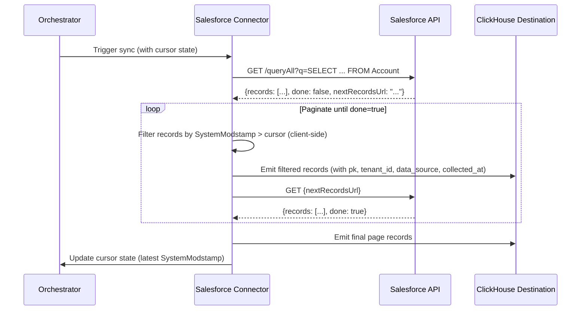
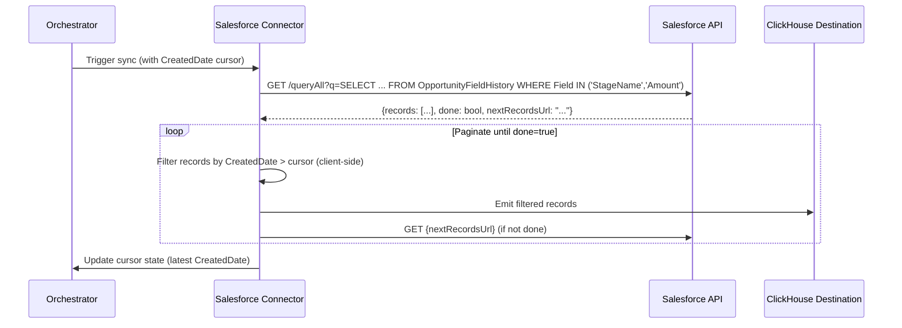
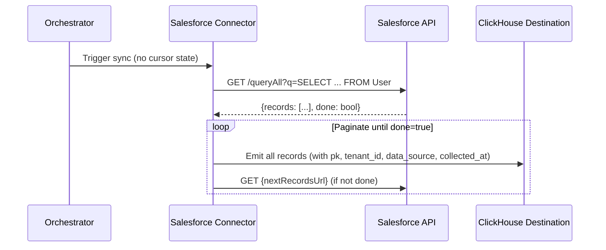

# DESIGN — Salesforce Connector

- [ ] `p1` - **ID**: `cpt-insightspec-design-sf-connector`

> Version 1.0 — March 2026
> Based on: CRM domain (`docs/components/connectors/crm/README.md`), [PRD.md](./PRD.md)

<!-- toc -->

- [1. Architecture Overview](#1-architecture-overview)
  - [1.1 Architectural Vision](#11-architectural-vision)
  - [1.2 Architecture Drivers](#12-architecture-drivers)
  - [1.3 Architecture Layers](#13-architecture-layers)
- [2. Principles & Constraints](#2-principles--constraints)
  - [2.1 Design Principles](#21-design-principles)
  - [2.2 Constraints](#22-constraints)
- [3. Technical Architecture](#3-technical-architecture)
  - [3.1 Domain Model](#31-domain-model)
  - [3.2 Component Model](#32-component-model)
  - [3.3 API Contracts](#33-api-contracts)
  - [3.4 Internal Dependencies](#34-internal-dependencies)
  - [3.5 External Dependencies](#35-external-dependencies)
  - [3.6 Interactions & Sequences](#36-interactions--sequences)
  - [3.7 Database schemas & tables](#37-database-schemas--tables)
  - [3.8 Deployment Topology](#38-deployment-topology)
- [4. Additional context](#4-additional-context)
  - [Identity Resolution Strategy](#identity-resolution-strategy)
  - [Silver / Gold Mappings](#silver--gold-mappings)
  - [Source-Specific Considerations](#source-specific-considerations)
- [5. Traceability](#5-traceability)
- [6. Non-Applicability Statements](#6-non-applicability-statements)

<!-- /toc -->

---

## 1. Architecture Overview

### 1.1 Architectural Vision

The Salesforce connector is an Airbyte declarative manifest connector (YAML, no custom code) that extracts CRM data from the Salesforce REST API v66.0 via SOQL queries. It produces seven Bronze streams:

1. **`accounts`** — company/organisation records via SOQL `SELECT ... FROM Account`.
2. **`contacts`** — customer contact records via SOQL `SELECT ... FROM Contact`.
3. **`opportunities`** — deal pipeline records via SOQL `SELECT ... FROM Opportunity`.
4. **`opportunity_history`** — stage and amount change history via SOQL `SELECT ... FROM OpportunityFieldHistory WHERE Field IN ('StageName', 'Amount')`.
5. **`tasks`** — to-do items, call logs, and follow-ups via SOQL `SELECT ... FROM Task`.
6. **`events`** — calendar meetings and scheduled activities via SOQL `SELECT ... FROM Event`.
7. **`users`** — Salesforce user directory via SOQL `SELECT ... FROM User`.

**Authentication**: OAuth 2.0 Client Credentials Flow via `OAuthAuthenticator` with `grant_type=client_credentials`. Requires an External Client App configured in the target Salesforce org.

**Base URL**: `{{ config['instance_url'] }}` (e.g., `https://mycompany.my.salesforce.com`).

**Query endpoint**: All streams use the `/services/data/v66.0/queryAll` endpoint (not `/query`), which includes soft-deleted records with `IsDeleted` field set to `true`. This eliminates the need for a separate deleted-records stream.

**Pagination**: `CursorPagination` via `nextRecordsUrl` — Salesforce returns up to 2,000 records per page and provides a `nextRecordsUrl` for the next batch. The paginator uses `RequestPath` injection (the next URL replaces the full request path).

**Sync mode**: Incremental via `DatetimeBasedCursor` on `SystemModstamp` (client-side filtering) for six entity streams. The `users` stream uses full refresh (small table, no incremental needed). The `opportunity_history` stream uses `CreatedDate` as cursor (history records are immutable — once created they are never modified).

**Downstream**: Bronze data feeds the CRM Silver ETL Job (`class_crm_deals`, `class_crm_activities`, `class_crm_contacts`, `class_crm_accounts`) and the Identity Manager (`users.Email` for internal salespeople resolution).

### 1.2 Architecture Drivers

#### Functional Drivers

| Requirement | Design Response |
|-------------|-----------------|
| `cpt-insightspec-fr-sf-account-extraction` | Stream `accounts` via SOQL `SELECT ... FROM Account` through `/queryAll` |
| `cpt-insightspec-fr-sf-contact-extraction` | Stream `contacts` via SOQL `SELECT ... FROM Contact` through `/queryAll` |
| `cpt-insightspec-fr-sf-opportunity-extraction` | Stream `opportunities` via SOQL `SELECT ... FROM Opportunity` through `/queryAll` |
| `cpt-insightspec-fr-sf-opportunity-history` | Stream `opportunity_history` via SOQL `SELECT ... FROM OpportunityFieldHistory WHERE Field IN ('StageName', 'Amount')` |
| `cpt-insightspec-fr-sf-task-extraction` | Stream `tasks` via SOQL `SELECT ... FROM Task` through `/queryAll` |
| `cpt-insightspec-fr-sf-event-extraction` | Stream `events` via SOQL `SELECT ... FROM Event` through `/queryAll` |
| `cpt-insightspec-fr-sf-user-extraction` | Stream `users` via SOQL `SELECT ... FROM User` through `/queryAll` |
| `cpt-insightspec-fr-sf-deduplication` | Primary key: URN `urn:salesforce:{tenant_id}:{source_instance_id}:{Id}` via `pk` field |
| `cpt-insightspec-fr-sf-identity-key` | `Email` field included in `users` stream SOQL select list |
| `cpt-insightspec-fr-sf-incremental-sync` | `DatetimeBasedCursor` on `SystemModstamp` with client-side filtering; `users` stream: full refresh |
| `cpt-insightspec-fr-sf-deleted-records` | All entity streams query `/queryAll` which includes `IsDeleted=true` records |
| `cpt-insightspec-fr-sf-api-limits` | `CompositeErrorHandler` with 403 `REQUEST_LIMIT_EXCEEDED`, 429 rate limit, 500/502/503/504 retry |
| `cpt-insightspec-fr-sf-instance-context` | `AddFields` transformation injects `pk`, `tenant_id`, `source_instance_id`, `data_source`, `collected_at` |
| `cpt-insightspec-fr-sf-field-preservation` | PascalCase field names preserved in schemas; no `KeysToSnakeCase` transformation |

#### NFR Allocation

| NFR ID | NFR Summary | Allocated To | Design Response | Verification Approach |
|--------|-------------|-------------|-----------------|----------------------|
| `cpt-insightspec-nfr-sf-freshness` | Data in Bronze within 24h of scheduled run | Orchestrator + connector | Incremental sync minimises extraction time; full refresh only on `users` (small table) | Monitor sync duration vs. 24h SLA |
| `cpt-insightspec-nfr-sf-completeness` | All matching records extracted per run | `queryAll` + `CursorPagination` | `/queryAll` includes soft-deleted records; pagination follows `nextRecordsUrl` until `done=true` | Compare record counts against Salesforce report |
| `cpt-insightspec-nfr-sf-utc-timestamps` | All timestamps in UTC | `InlineSchemaLoader` + Salesforce API | Salesforce REST API returns ISO 8601 UTC timestamps natively; schema declares `format: date-time` | Verify no timezone offsets in Bronze output |

### 1.3 Architecture Layers

| Layer | Responsibility | Technology |
|-------|---------------|------------|
| Source API | Salesforce REST API v66.0 (`/services/data/v66.0/queryAll`) | REST / JSON / SOQL |
| Authentication | OAuth 2.0 Client Credentials Flow | `OAuthAuthenticator` (`grant_type=client_credentials`) |
| Connector | Stream definitions, SOQL queries, incremental sync, error handling | Airbyte declarative manifest (YAML) |
| Execution | Container runtime | Airbyte Declarative Connector framework (CDK v6.44+) |
| Bronze | Raw data storage with source-native PascalCase schema | Destination connector (ClickHouse) |

---

## 2. Principles & Constraints

### 2.1 Design Principles

#### One Stream per Salesforce Object

- [ ] `p1` - **ID**: `cpt-insightspec-principle-sf-one-stream-per-object`

Each stream maps to exactly one Salesforce standard object (Account, Contact, Opportunity, OpportunityFieldHistory, Task, Event, User). This preserves the source-native 1:1 mapping, avoids nullable cross-type columns, and enables independent incremental cursors per stream.

#### Source-Native Schema

- [ ] `p1` - **ID**: `cpt-insightspec-principle-sf-source-native-schema`

Bronze tables preserve Salesforce's native PascalCase field names (e.g., `OwnerId`, `AccountId`, `SystemModstamp`) and data types. No renaming, no type coercion, no enum normalisation. Snake_case normalization is the Silver layer's responsibility.

#### Soft-Delete Inclusion via queryAll

- [ ] `p1` - **ID**: `cpt-insightspec-principle-sf-queryall`

All entity streams use the `/queryAll` endpoint instead of `/query`. This returns both active and soft-deleted records (with `IsDeleted=true`), eliminating the need for a separate deleted-records stream and ensuring the Bronze layer captures the full lifecycle of every record.

### 2.2 Constraints

#### Client-Side Incremental Filtering

- [ ] `p1` - **ID**: `cpt-insightspec-constraint-sf-client-side-incremental`

The `DatetimeBasedCursor` uses `is_client_side_incremental: true`. The SOQL query fetches all records; the Airbyte framework filters by `SystemModstamp` on the client side. This is necessary because the declarative manifest does not support injecting cursor values into the SOQL `WHERE` clause dynamically. Server-side SOQL filtering (adding `WHERE SystemModstamp > {cursor}`) would require a custom Python component.

#### Users Stream: Full Refresh Only

- [ ] `p1` - **ID**: `cpt-insightspec-constraint-sf-users-full-refresh`

The `users` stream does not define `incremental_sync`. It runs as full refresh on every sync. The User table is typically small (hundreds to low thousands of records), so full refresh is sustainable. SCD Type 2 history construction is deferred to the Silver layer using `collected_at` timestamps.

#### RecordTypeId and CurrencyIsoCode in Schema Only

- [ ] `p2` - **ID**: `cpt-insightspec-constraint-sf-optional-fields`

`RecordTypeId` and `CurrencyIsoCode` are defined in the inline schemas (for accounts, contacts, opportunities) but are intentionally excluded from SOQL `SELECT` queries. These fields are not available on all Salesforce orgs (they require Record Types and Multi-Currency features to be enabled). If present in the API response, they are captured via `additionalProperties: true`. If absent, they appear as `null`.

#### Custom Fields Deferred

- [ ] `p2` - **ID**: `cpt-insightspec-constraint-sf-custom-fields-deferred`

Custom field extraction (`__c` fields) as described in PRD requirement `cpt-insightspec-fr-sf-custom-fields` will be captured via a `raw_data` JSON column (ClickHouse native JSON type) containing the full API response payload. This avoids the 1:N unnest problem that would require Python CDK, and keeps the connector fully declarative. The `raw_data` column is not yet added to the connector manifest but is validated in the BambooHR connector as a working pattern.

---

## 3. Technical Architecture

### 3.1 Domain Model

**Core Entities**:

| Entity | Salesforce Object | Bronze Stream | Description |
|--------|-------------------|--------------|-------------|
| Account | `Account` | `accounts` | Company/organisation records with hierarchy, industry, and revenue data |
| Contact | `Contact` | `contacts` | Customer contact records with email, title, and account association |
| Opportunity | `Opportunity` | `opportunities` | Deal pipeline records with stage, amount, probability, and close date |
| Opportunity History | `OpportunityFieldHistory` | `opportunity_history` | Stage and amount change history for pipeline velocity analytics |
| Task | `Task` | `tasks` | To-do items, call logs, and follow-ups with polymorphic WhoId/WhatId references |
| Event | `Event` | `events` | Calendar meetings and scheduled activities with duration and location |
| User | `User` | `users` | Salesforce user directory for identity resolution and ownership attribution |

**Relationships**:
- Account `1:N` Contact (via `AccountId` on Contact)
- Account `1:N` Opportunity (via `AccountId` on Opportunity)
- Account `1:N` Account (via `ParentId` — parent-child hierarchy)
- Opportunity `1:N` OpportunityFieldHistory (via `OpportunityId`)
- User `1:N` Account/Contact/Opportunity/Task/Event (via `OwnerId`)
- Task/Event `N:1` Contact (via `WhoId` — polymorphic)
- Task/Event `N:1` Account/Opportunity (via `WhatId` — polymorphic)

### 3.2 Component Model

#### Salesforce Connector Manifest

- [ ] `p1` - **ID**: `cpt-insightspec-component-sf-manifest`

##### Why this component exists

Defines the complete Salesforce connector as a YAML declarative manifest — the single artifact required to extract CRM data from Salesforce into the Insight platform's Bronze layer.

##### Responsibility scope

Defines 7 streams with: OAuth 2.0 Client Credentials auth via `OAuthAuthenticator`, SOQL queries via `/queryAll` endpoint (including soft-deleted records), `CursorPagination` via `nextRecordsUrl` (2,000 records per page), `DatetimeBasedCursor` on `SystemModstamp` for 6 entity streams (client-side filtering), full refresh for `users` stream, `CreatedDate` cursor for `opportunity_history` (immutable records), `CompositeErrorHandler` for 403/429/5XX errors, `AddFields` for `pk`, `tenant_id`, `source_instance_id`, `data_source`, and `collected_at`, and inline JSON schemas for all streams with PascalCase field names.

##### Responsibility boundaries

Does not handle orchestration, scheduling, or state storage (managed by Airbyte/Orchestrator). Does not perform Silver/Gold transformations. Does not implement identity resolution. Does not write to Bronze tables (handled by the destination connector). Does not extract custom fields (`__c`) as key-value pairs (deferred — see constraint `cpt-insightspec-constraint-sf-custom-fields-deferred`). Does not resolve polymorphic `WhoId`/`WhatId` type discriminators (deferred to Silver). Does not validate Field-Level Security coverage (deferred to a Python CDK migration path). Does not implement SCD Type 2 for users (deferred to Silver layer).

##### Related components (by ID)

None within this artifact. At runtime, the connector is executed by the Airbyte platform and its Bronze output is consumed by dbt for Silver transformations (see Ingestion Layer DESIGN).

### 3.3 API Contracts

#### Salesforce REST API v66.0

- [ ] `p1` - **ID**: `cpt-insightspec-interface-sf-api-v66`

**Base URL**: `{{ config['instance_url'] }}` (e.g., `https://mycompany.my.salesforce.com`)

**Authentication**: OAuth 2.0 Client Credentials Flow via `OAuthAuthenticator`
- Token endpoint: `{{ config['instance_url'] }}/services/oauth2/token`
- Config values: `client_id` (Consumer Key) and `client_secret` (Consumer Secret, `airbyte_secret: true`) from a Salesforce External Client App
- Grant type: `client_credentials`
- The authenticator handles token refresh automatically

**Rate Limits**: Salesforce enforces API call limits per 24-hour rolling window (varies by edition: 15,000 for Enterprise, 5,000 for Professional). HTTP 403 with `REQUEST_LIMIT_EXCEEDED` on exhaustion. HTTP 429 on concurrent request limits.

---

##### Endpoint: GET /services/data/v66.0/queryAll

| Aspect | Detail |
|--------|--------|
| Method | `GET` |
| Path | `services/data/v66.0/queryAll` |
| Query params | `q` — SOQL query string |
| Response | `{"totalSize": N, "done": bool, "nextRecordsUrl": "...", "records": [{...}, ...]}` |
| Record path | `records` |
| Pagination | `nextRecordsUrl` provides the full path for the next page; `done=true` signals last page |
| Page size | Up to 2,000 records per response |
| Auth | OAuth 2.0 Bearer token |

**SOQL queries per stream**:

**accounts**:
```sql
SELECT Id, Name, Type, Industry, Website,
       OwnerId, ParentId,
       BillingCity, BillingState, BillingCountry,
       NumberOfEmployees, AnnualRevenue,
       IsDeleted, CreatedDate, LastModifiedDate, SystemModstamp
FROM Account
```

**contacts**:
```sql
SELECT Id, FirstName, LastName, Email, Title, Phone,
       AccountId, OwnerId, LeadSource,
       IsDeleted, CreatedDate, LastModifiedDate, SystemModstamp
FROM Contact
```

**opportunities**:
```sql
SELECT Id, Name, StageName, Amount, CloseDate,
       Probability, Type, LeadSource, ForecastCategory,
       AccountId, OwnerId,
       IsClosed, IsWon, IsDeleted,
       CreatedDate, LastModifiedDate, SystemModstamp
FROM Opportunity
```

**opportunity_history**:
```sql
SELECT Id, OpportunityId, Field, OldValue, NewValue,
       CreatedById, CreatedDate
FROM OpportunityFieldHistory
WHERE Field IN ('StageName', 'Amount')
```

**tasks**:
```sql
SELECT Id, Subject, ActivityDate, Status, Priority,
       WhoId, WhatId, OwnerId,
       TaskSubtype, CallType, CallDurationInSeconds,
       IsDeleted, CreatedDate, LastModifiedDate, SystemModstamp
FROM Task
```

**events**:
```sql
SELECT Id, Subject, StartDateTime, EndDateTime,
       WhoId, WhatId, OwnerId,
       Location, DurationInMinutes, EventSubtype,
       IsDeleted, CreatedDate, LastModifiedDate, SystemModstamp
FROM Event
```

**users**:
```sql
SELECT Id, Username, Email, FirstName, LastName,
       Title, Department, IsActive,
       ProfileId, UserRoleId,
       CreatedDate, LastModifiedDate, SystemModstamp
FROM User
```

---

#### Source Config Schema

```json
{
  "type": "object",
  "required": ["tenant_id", "instance_url", "source_instance_id", "client_id", "client_secret"],
  "properties": {
    "tenant_id": {
      "type": "string",
      "title": "Tenant ID",
      "description": "Tenant isolation identifier (UUID)."
    },
    "instance_url": {
      "type": "string",
      "title": "Instance URL",
      "description": "Salesforce instance URL (e.g., 'https://mycompany.my.salesforce.com').",
      "examples": ["https://mycompany.my.salesforce.com"]
    },
    "source_instance_id": {
      "type": "string",
      "title": "Source Instance ID",
      "description": "Stable identifier for this Salesforce org (e.g., 'salesforce-acme-prod').",
      "examples": ["salesforce-acme-prod"]
    },
    "client_id": {
      "type": "string",
      "title": "Client ID",
      "description": "OAuth Consumer Key from the Salesforce External Client App."
    },
    "client_secret": {
      "type": "string",
      "title": "Client Secret",
      "description": "OAuth Consumer Secret from the Salesforce External Client App.",
      "airbyte_secret": true
    },
    "start_date": {
      "type": "string",
      "title": "Start Date",
      "description": "UTC date for initial incremental sync (YYYY-MM-DDTHH:MM:SSZ). Defaults to 2020-01-01.",
      "pattern": "^[0-9]{4}-[0-9]{2}-[0-9]{2}T[0-9]{2}:[0-9]{2}:[0-9]{2}Z$",
      "examples": ["2024-01-01T00:00:00Z"]
    }
  }
}
```

### 3.4 Internal Dependencies

| Dependency Module | Interface Used | Purpose |
|-------------------|---------------|---------|
| Identity Manager | Downstream consumer | Reads `Email` from `users` Bronze table for person resolution (internal salespeople only) |
| CRM Silver ETL Job | Downstream consumer | Reads all Bronze streams to produce `class_crm_deals`, `class_crm_activities`, `class_crm_contacts`, `class_crm_accounts` |

### 3.5 External Dependencies

| Dependency | Interface Used | Purpose |
|-----------|---------------|---------|
| Salesforce REST API v66.0 | HTTPS / JSON / SOQL | Source system for CRM entity extraction via `/queryAll` |
| Airbyte Declarative Connector framework (CDK v6.44+) | Container runtime | Executes the YAML manifest |
| ClickHouse destination connector | Airbyte protocol | Writes extracted records to Bronze tables |

### 3.6 Interactions & Sequences

#### Incremental Entity Sync (accounts, contacts, opportunities, tasks, events)

**ID**: `cpt-insightspec-seq-sf-incremental-sync`



#### Opportunity History Sync

**ID**: `cpt-insightspec-seq-sf-opportunity-history-sync`



#### Users Full Refresh Sync

**ID**: `cpt-insightspec-seq-sf-users-sync`



### 3.7 Database schemas & tables

#### Table: `accounts`

- [ ] `p1` - **ID**: `cpt-insightspec-dbtable-sf-accounts`

| Column | Type | Description |
|--------|------|-------------|
| `pk` | String | PK: URN `urn:salesforce:{tenant_id}:{source_instance_id}:{Id}` |
| `tenant_id` | String | Tenant identifier — injected by connector from config |
| `source_instance_id` | String | Source instance identifier (e.g., `salesforce-acme-prod`) — injected by connector from config |
| `Id` | String | Salesforce 18-char Account ID |
| `Name` | String | Account/company name |
| `Type` | String | Account type (e.g., `Customer`, `Partner`, `Prospect`) |
| `Industry` | String | Industry classification |
| `Website` | String | Company website URL |
| `OwnerId` | String | Salesforce User ID of the account owner — joins to `users.Id` |
| `ParentId` | String | Parent Account ID — for account hierarchy |
| `RecordTypeId` | String | Record type ID (only present if Record Types enabled in org) |
| `BillingCity` | String | Billing address city |
| `BillingState` | String | Billing address state/province |
| `BillingCountry` | String | Billing address country |
| `NumberOfEmployees` | Integer | Number of employees |
| `AnnualRevenue` | Number | Annual revenue |
| `CreatedDate` | DateTime | Record creation timestamp (UTC) |
| `LastModifiedDate` | DateTime | Last modification timestamp (UTC) |
| `IsDeleted` | Boolean | Soft-delete flag — `true` if record is in Recycle Bin |
| `SystemModstamp` | DateTime | System modification timestamp — incremental sync cursor |
| `data_source` | String | `salesforce` — connector identifier |
| `collected_at` | DateTime | Extraction timestamp (UTC) |

---

#### Table: `contacts`

- [ ] `p1` - **ID**: `cpt-insightspec-dbtable-sf-contacts`

| Column | Type | Description |
|--------|------|-------------|
| `pk` | String | PK: URN `urn:salesforce:{tenant_id}:{source_instance_id}:{Id}` |
| `tenant_id` | String | Tenant identifier — injected by connector from config |
| `source_instance_id` | String | Source instance identifier — injected by connector from config |
| `Id` | String | Salesforce 18-char Contact ID |
| `FirstName` | String | First/given name |
| `LastName` | String | Last/family name |
| `Email` | String | Contact email — NOT resolved to `person_id` (external customers) |
| `Title` | String | Job title |
| `Phone` | String | Phone number |
| `AccountId` | String | Associated Account ID — joins to `accounts.Id` |
| `OwnerId` | String | Salesforce User ID of the contact owner — joins to `users.Id` |
| `RecordTypeId` | String | Record type ID (only present if Record Types enabled in org) |
| `LeadSource` | String | Lead source (e.g., `Web`, `Referral`, `Trade Show`) |
| `CreatedDate` | DateTime | Record creation timestamp (UTC) |
| `LastModifiedDate` | DateTime | Last modification timestamp (UTC) |
| `IsDeleted` | Boolean | Soft-delete flag — `true` if record is in Recycle Bin |
| `SystemModstamp` | DateTime | System modification timestamp — incremental sync cursor |
| `data_source` | String | `salesforce` — connector identifier |
| `collected_at` | DateTime | Extraction timestamp (UTC) |

---

#### Table: `opportunities`

- [ ] `p1` - **ID**: `cpt-insightspec-dbtable-sf-opportunities`

| Column | Type | Description |
|--------|------|-------------|
| `pk` | String | PK: URN `urn:salesforce:{tenant_id}:{source_instance_id}:{Id}` |
| `tenant_id` | String | Tenant identifier — injected by connector from config |
| `source_instance_id` | String | Source instance identifier — injected by connector from config |
| `Id` | String | Salesforce 18-char Opportunity ID |
| `Name` | String | Opportunity/deal name |
| `StageName` | String | Current pipeline stage (e.g., `Qualification`, `Proposal`, `Closed Won`) |
| `Amount` | Number | Deal value |
| `CurrencyIsoCode` | String | Currency code (only present if Multi-Currency enabled in org) |
| `CloseDate` | Date | Expected or actual close date |
| `Probability` | Number | Win probability percentage |
| `Type` | String | Opportunity type (e.g., `New Business`, `Renewal`) |
| `LeadSource` | String | Lead source |
| `ForecastCategory` | String | Forecast category (e.g., `Pipeline`, `Best Case`, `Commit`) |
| `AccountId` | String | Associated Account ID — joins to `accounts.Id` |
| `OwnerId` | String | Salesforce User ID of the opportunity owner — joins to `users.Id` |
| `RecordTypeId` | String | Record type ID (only present if Record Types enabled in org) |
| `IsClosed` | Boolean | Whether the opportunity is in a closed stage |
| `IsWon` | Boolean | Whether the opportunity was won |
| `IsDeleted` | Boolean | Soft-delete flag — `true` if record is in Recycle Bin |
| `CreatedDate` | DateTime | Record creation timestamp (UTC) |
| `LastModifiedDate` | DateTime | Last modification timestamp (UTC) |
| `SystemModstamp` | DateTime | System modification timestamp — incremental sync cursor |
| `data_source` | String | `salesforce` — connector identifier |
| `collected_at` | DateTime | Extraction timestamp (UTC) |

---

#### Table: `opportunity_history`

- [ ] `p2` - **ID**: `cpt-insightspec-dbtable-sf-opportunity-history`

| Column | Type | Description |
|--------|------|-------------|
| `pk` | String | PK: URN `urn:salesforce:{tenant_id}:{source_instance_id}:{Id}` |
| `tenant_id` | String | Tenant identifier — injected by connector from config |
| `source_instance_id` | String | Source instance identifier — injected by connector from config |
| `Id` | String | Salesforce 18-char OpportunityFieldHistory ID |
| `OpportunityId` | String | Parent Opportunity ID — joins to `opportunities.Id` |
| `Field` | String | Field name that changed (`StageName` or `Amount`) |
| `OldValue` | String | Previous field value |
| `NewValue` | String | New field value |
| `CreatedById` | String | User ID who made the change — joins to `users.Id` |
| `CreatedDate` | DateTime | Timestamp of the change — incremental sync cursor (immutable records) |
| `data_source` | String | `salesforce` — connector identifier |
| `collected_at` | DateTime | Extraction timestamp (UTC) |

---

#### Table: `tasks`

- [ ] `p1` - **ID**: `cpt-insightspec-dbtable-sf-tasks`

| Column | Type | Description |
|--------|------|-------------|
| `pk` | String | PK: URN `urn:salesforce:{tenant_id}:{source_instance_id}:{Id}` |
| `tenant_id` | String | Tenant identifier — injected by connector from config |
| `source_instance_id` | String | Source instance identifier — injected by connector from config |
| `Id` | String | Salesforce 18-char Task ID |
| `Subject` | String | Task subject/description |
| `ActivityDate` | Date | Activity date (date only, no time component) |
| `Status` | String | Task status (e.g., `Not Started`, `In Progress`, `Completed`) |
| `Priority` | String | Task priority (e.g., `High`, `Normal`, `Low`) |
| `WhoId` | String | Polymorphic reference to Contact or Lead |
| `WhatId` | String | Polymorphic reference to Account, Opportunity, Campaign, etc. |
| `OwnerId` | String | Salesforce User ID of the task owner — joins to `users.Id` |
| `TaskSubtype` | String | Task subtype (e.g., `Task`, `Call`, `Email`) |
| `CallType` | String | Call type for call-logged tasks (e.g., `Inbound`, `Outbound`) |
| `CallDurationInSeconds` | Integer | Call duration in seconds for call-logged tasks |
| `IsDeleted` | Boolean | Soft-delete flag — `true` if record is in Recycle Bin |
| `CreatedDate` | DateTime | Record creation timestamp (UTC) |
| `LastModifiedDate` | DateTime | Last modification timestamp (UTC) |
| `SystemModstamp` | DateTime | System modification timestamp — incremental sync cursor |
| `data_source` | String | `salesforce` — connector identifier |
| `collected_at` | DateTime | Extraction timestamp (UTC) |

---

#### Table: `events`

- [ ] `p1` - **ID**: `cpt-insightspec-dbtable-sf-events`

| Column | Type | Description |
|--------|------|-------------|
| `pk` | String | PK: URN `urn:salesforce:{tenant_id}:{source_instance_id}:{Id}` |
| `tenant_id` | String | Tenant identifier — injected by connector from config |
| `source_instance_id` | String | Source instance identifier — injected by connector from config |
| `Id` | String | Salesforce 18-char Event ID |
| `Subject` | String | Event subject/description |
| `StartDateTime` | DateTime | Event start time (UTC) |
| `EndDateTime` | DateTime | Event end time (UTC) |
| `WhoId` | String | Polymorphic reference to Contact or Lead |
| `WhatId` | String | Polymorphic reference to Account, Opportunity, Campaign, etc. |
| `OwnerId` | String | Salesforce User ID of the event owner — joins to `users.Id` |
| `Location` | String | Event location |
| `DurationInMinutes` | Integer | Event duration in minutes |
| `EventSubtype` | String | Event subtype (e.g., `Event`, `Call`) |
| `IsDeleted` | Boolean | Soft-delete flag — `true` if record is in Recycle Bin |
| `CreatedDate` | DateTime | Record creation timestamp (UTC) |
| `LastModifiedDate` | DateTime | Last modification timestamp (UTC) |
| `SystemModstamp` | DateTime | System modification timestamp — incremental sync cursor |
| `data_source` | String | `salesforce` — connector identifier |
| `collected_at` | DateTime | Extraction timestamp (UTC) |

---

#### Table: `users`

- [ ] `p1` - **ID**: `cpt-insightspec-dbtable-sf-users`

| Column | Type | Description |
|--------|------|-------------|
| `pk` | String | PK: URN `urn:salesforce:{tenant_id}:{source_instance_id}:{Id}` |
| `tenant_id` | String | Tenant identifier — injected by connector from config |
| `source_instance_id` | String | Source instance identifier — injected by connector from config |
| `Id` | String | Salesforce 18-char User ID |
| `Username` | String | Salesforce username (email-format login identifier) |
| `Email` | String | User email — identity key for cross-system person resolution (internal salespeople) |
| `FirstName` | String | First/given name |
| `LastName` | String | Last/family name |
| `Title` | String | Job title |
| `Department` | String | Department name |
| `IsActive` | Boolean | Whether the user account is active |
| `ProfileId` | String | Salesforce Profile ID (determines permissions) |
| `UserRoleId` | String | Salesforce Role ID (determines data access hierarchy) |
| `CreatedDate` | DateTime | Record creation timestamp (UTC) |
| `LastModifiedDate` | DateTime | Last modification timestamp (UTC) |
| `SystemModstamp` | DateTime | System modification timestamp |
| `data_source` | String | `salesforce` — connector identifier |
| `collected_at` | DateTime | Extraction timestamp (UTC) — used for SCD Type 2 at Silver |

### 3.8 Deployment Topology

- [ ] `p1` - **ID**: `cpt-insightspec-topology-sf-deployment`

```
Connection: salesforce-{source_instance_id}
├── Source image: airbyte/source-declarative-manifest
├── Manifest: src/ingestion/connectors/crm/salesforce/connector.yaml
├── Descriptor: src/ingestion/connectors/crm/salesforce/descriptor.yaml
├── Source config: tenant_id, instance_url, source_instance_id, client_id, client_secret, start_date
├── Configured catalog: 7 streams
│   ├── accounts (incremental | append+deduped, cursor: SystemModstamp)
│   ├── contacts (incremental | append+deduped, cursor: SystemModstamp)
│   ├── opportunities (incremental | append+deduped, cursor: SystemModstamp)
│   ├── opportunity_history (incremental | append+deduped, cursor: CreatedDate)
│   ├── tasks (incremental | append+deduped, cursor: SystemModstamp)
│   ├── events (incremental | append+deduped, cursor: SystemModstamp)
│   └── users (full refresh | overwrite)
├── Check stream: users
├── Destination image: airbyte/destination-clickhouse
├── Destination config: host, port, database, schema, credentials
└── API version: Salesforce REST API v66.0
```

---

## 4. Additional context

### Identity Resolution Strategy

`Email` from `users` is the primary identity signal. The Identity Manager maps it to the canonical `person_id` used across all Silver streams. This resolves internal salespeople only — Salesforce users who own accounts, contacts, opportunities, tasks, and events.

`contacts.Email` is for external customers and is NOT resolved to `person_id`. This matches the boundary established by the HubSpot connector: internal users (salespeople) are resolved; external contacts (customers) are not.

Salesforce `Id` (18-char) on all records and `OwnerId` on entity records are Salesforce-internal identifiers — retained for lineage and joins within the Salesforce data domain but not used as cross-system identity keys.

### Silver / Gold Mappings

| Bronze table | Silver target | Status |
|-------------|--------------|--------|
| `users` | Identity Manager (`Email` to `person_id`) | Direct feed (internal salespeople only) |
| `opportunities` | `class_crm_deals` | Via CRM Silver ETL Job |
| `opportunity_history` | `class_crm_deals` | Stage transition history for pipeline velocity |
| `tasks` | `class_crm_activities` | Via CRM Silver ETL Job (merged with events) |
| `events` | `class_crm_activities` | Via CRM Silver ETL Job (merged with tasks) |
| `contacts` | `class_crm_contacts` | Via CRM Silver ETL Job |
| `accounts` | `class_crm_accounts` | Via CRM Silver ETL Job |

### Source-Specific Considerations

1. **queryAll vs. query**: All streams use `/queryAll` instead of `/query`. This includes soft-deleted records (`IsDeleted=true`) in the response, which is essential for CRM analytics — stale opportunities inflating the pipeline is a data quality problem. Soft-deleted records are retained in the Salesforce Recycle Bin for 15 days (default) before permanent purge. Hard-deleted (permanently purged) records are invisible to all API endpoints, including `queryAll`.

2. **PascalCase field names**: Salesforce API returns all field names in PascalCase (e.g., `OwnerId`, `AccountId`, `SystemModstamp`). These are preserved as-is in Bronze. Snake_case normalization (e.g., `owner_id`, `account_id`, `system_modstamp`) happens at the Silver layer via dbt transformations, matching the platform's "Bronze preserves source-native schema" principle.

3. **RecordTypeId and CurrencyIsoCode**: These fields are defined in inline schemas but excluded from SOQL `SELECT` queries. Not all Salesforce orgs have Record Types or Multi-Currency enabled. The `additionalProperties: true` setting on all schemas allows these fields to be captured when present in the API response without causing query errors on orgs that lack them.

4. **Polymorphic references (WhoId/WhatId)**: Tasks and Events contain polymorphic `WhoId` (Contact or Lead) and `WhatId` (Account, Opportunity, Campaign, etc.) references. The current connector does not include type discriminator fields (`WhoType`, `WhatType`). Type resolution is deferred to the Silver layer, which can infer object type from the Salesforce ID prefix (first 3 characters) or via lookup joins.

5. **Client-side incremental filtering**: The `DatetimeBasedCursor` with `is_client_side_incremental: true` fetches all records from the API and filters on the client side. This means every sync fetches the full dataset from Salesforce. For large orgs, this may be inefficient. A future optimization could inject cursor values into SOQL `WHERE` clauses via a custom Python component or migrate to the Salesforce Bulk API 2.0 for large-volume extraction.

6. **Opportunity history immutability**: `OpportunityFieldHistory` records are immutable — once created, they are never modified. The `CreatedDate` cursor (instead of `SystemModstamp`) exploits this property: the connector only needs to fetch records created since the last sync, without concern for retroactive updates.

7. **Custom fields (`__c`)**: Custom fields will be captured via a `raw_data` JSON column containing the full API response payload (PRD requirement `cpt-insightspec-fr-sf-custom-fields`). ClickHouse's native JSON type preserves source types and enables dot-notation access (`raw_data.Customer_Segment__c`). Silver dbt models extract and promote selected custom fields into `Map` columns. No separate `_ext` tables or Python CDK needed.

8. **API budget monitoring**: Salesforce returns `Sforce-Limit-Info: api-usage=N/M` in response headers on every successful API call. This is the only source of real-time API budget data. The Airbyte Declarative framework does not expose response headers to the connector, so proactive budget management (stopping before exhaustion) is not possible without migrating to Python CDK. Operators should monitor API consumption via Salesforce Setup > Company Information > API Requests.

9. **SOQL character limit**: SOQL queries have a 100,000 character limit. When custom fields are added to SELECT clauses via the `raw_data` approach (which captures the full response), this is not an issue because the SOQL query only selects standard fields. However, if future iterations add explicit custom field names to SOQL queries, orgs with hundreds of `__c` fields may approach this limit and require query splitting.

10. **Compound fields**: Salesforce compound field types (Address, Name, Geolocation) return structured JSON objects instead of scalar values. These are captured as-is in the `raw_data` JSON column. Compound fields cannot be used in SOQL WHERE clauses.

11. **Sandbox detection**: Sandbox orgs use different login URLs (`test.salesforce.com` or `*.sandbox.my.salesforce.com`). The connector does not auto-detect sandbox vs. production — the operator provides the `instance_url` and `source_instance_id` at configuration time. It is the operator's responsibility to label sandbox connections appropriately in `source_instance_id` (e.g., `salesforce-acme-sandbox`).

---

## 5. Traceability

- **PRD**: [PRD.md](./PRD.md)
- **Domain README**: [../../README.md](../../README.md) — CRM domain overview
- **Connector Framework DESIGN**: [../../../../domain/connector/specs/DESIGN.md](../../../../domain/connector/specs/DESIGN.md)
- **ADR directory**: [./ADR/](./ADR/)

---

## 6. Non-Applicability Statements

- **Custom Python components**: Not required for v1.0. All Salesforce extraction patterns (SOQL queries, pagination, incremental sync, error handling) are handled by declarative manifest components. Custom field unnest (`__c` key-value extraction) and FLS validation are deferred to a future Python CDK migration.
- **API key authentication**: Not implemented. Salesforce uses OAuth 2.0 Client Credentials Flow exclusively.
- **Webhook / real-time streaming**: Not applicable. Salesforce Streaming API and Platform Events are out of scope; the connector operates in batch mode.
- **Write operations**: Not applicable. The connector is read-only.
- **Bulk API 2.0**: Not implemented in v1.0. The REST API with SOQL and cursor pagination is sufficient for initial deployment. Bulk API migration is an optimization path for large orgs identified in the PRD risks.
- **SCD Type 2 at connector level**: Not implemented. Users stream runs full refresh; SCD Type 2 versioning is constructed at the Silver layer using `collected_at` timestamps.
- **Deleted-records stream**: Not required as a separate stream. All entity streams use `/queryAll` which includes soft-deleted records with `IsDeleted=true`.
