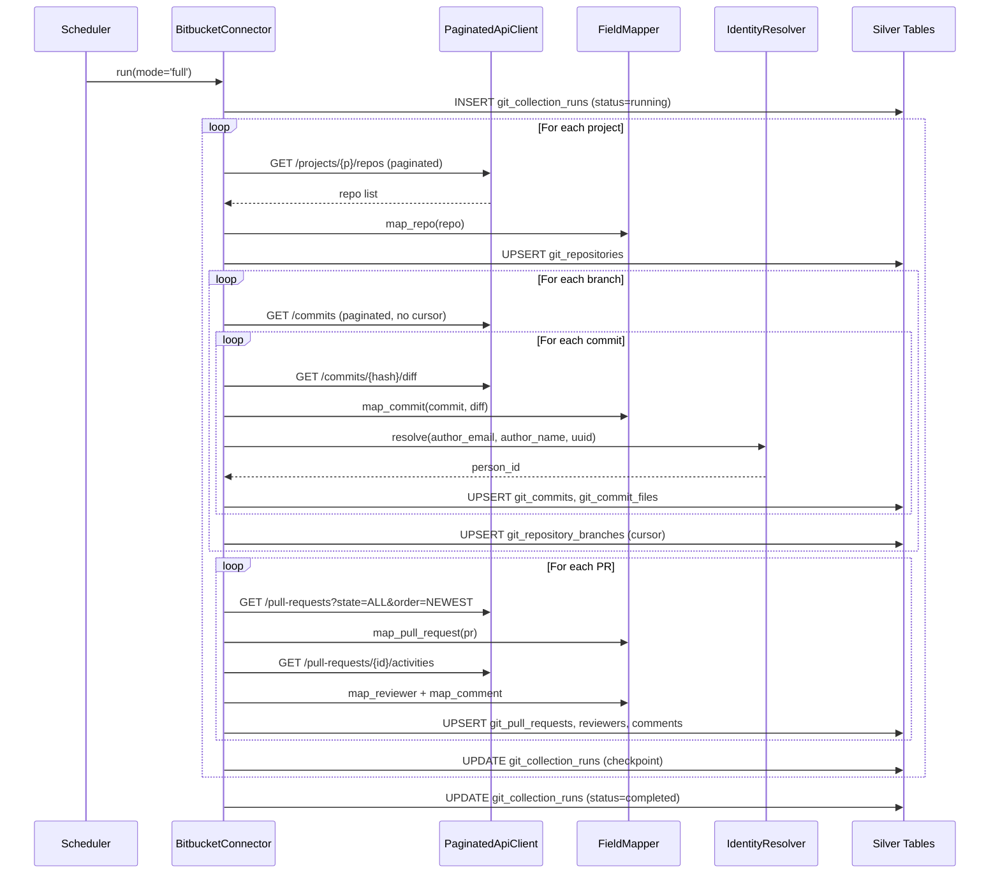
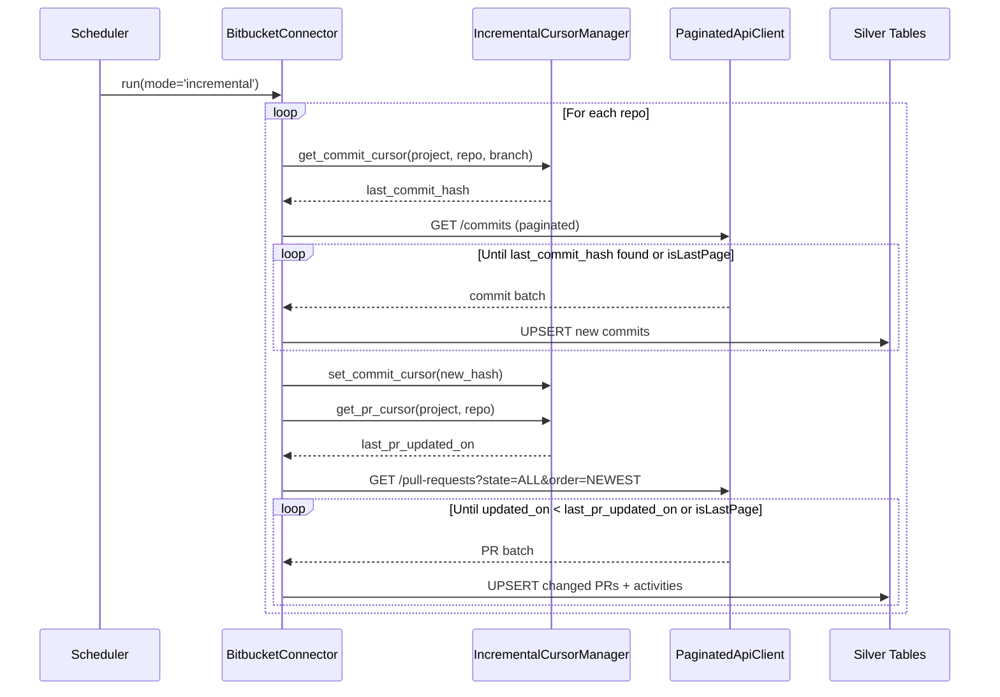

# DESIGN — Bitbucket Server Connector

> Version 1.0 — March 2026
> Based on: Unified git data model (`docs/components/connectors/git/README.md`), [PRD.md](./PRD.md)

<!-- toc -->

- [1. Architecture Overview](#1-architecture-overview)
  - [1.1 Architectural Vision](#11-architectural-vision)
  - [1.2 Architecture Drivers](#12-architecture-drivers)
  - [1.3 Architecture Layers](#13-architecture-layers)
- [2. Principles & Constraints](#2-principles--constraints)
  - [2.1 Design Principles](#21-design-principles)
  - [2.2 Constraints](#22-constraints)
- [3. Technical Architecture](#3-technical-architecture)
  - [3.1 Domain Model](#31-domain-model)
  - [3.2 Component Model](#32-component-model)
  - [3.3 API Contracts](#33-api-contracts)
  - [3.4 Internal Dependencies](#34-internal-dependencies)
  - [3.5 External Dependencies](#35-external-dependencies)
  - [3.6 Interactions & Sequences](#36-interactions--sequences)
  - [3.7 Database schemas & tables](#37-database-schemas--tables)
- [4. Additional context](#4-additional-context)
  - [API Details](#api-details)
  - [Field Mapping to Unified Schema](#field-mapping-to-unified-schema)
  - [Collection Strategy](#collection-strategy)
  - [Identity Resolution Details](#identity-resolution-details)
  - [Bitbucket-Specific Considerations](#bitbucket-specific-considerations)
- [5. Traceability](#5-traceability)

<!-- /toc -->

---

## 1. Architecture Overview

### 1.1 Architectural Vision

The Bitbucket Server connector is an ETL batch-pull component that collects version control data from self-hosted Bitbucket Server and Data Center instances via the REST API v1.0, transforms the data to the unified `git_*` Silver schema, and writes it to the shared analytical store. It uses `data_source = "insight_bitbucket_server"` as a discriminator, enabling cross-platform analytics alongside GitHub and GitLab data in the same tables.

The architecture follows a layered pipeline: API pagination → raw field extraction → schema mapping → identity resolution → upsert write. An optional Bronze-layer API cache (`bitbucket_api_cache`) can be inserted between the API client and the mapper to reduce redundant calls. Incremental collection state is maintained via cursor fields in the Silver tables themselves (`git_repository_branches.last_commit_hash`, `git_pull_requests.updated_on`), avoiding a separate state store.

Fault tolerance is achieved through per-repository checkpointing and continue-on-error semantics for non-fatal API errors. The connector is designed to be idempotent: repeated runs with the same cursor state produce no side effects.

### 1.2 Architecture Drivers

**PRD Reference**: [PRD.md](./PRD.md)

#### Functional Drivers

| Requirement | Design Response |
|-------------|-----------------|
| `cpt-insightspec-fr-bb-discover-repos` | `BitbucketConnector.collect_projects()` paginates `/projects` then `/projects/{p}/repos`; writes to `git_repositories` |
| `cpt-insightspec-fr-bb-collect-commits` | `BitbucketConnector.collect_commits()` per branch; uses diff endpoint for stats; writes to `git_commits` + `git_commit_files` |
| `cpt-insightspec-fr-bb-collect-prs` | `BitbucketConnector.collect_pull_requests()` with `state=ALL, order=NEWEST`; early exit on cursor |
| `cpt-insightspec-fr-bb-collect-reviewers` | `FieldMapper.map_reviewer()` merges PR `reviewers` array + activities with `APPROVED`/`UNAPPROVED` |
| `cpt-insightspec-fr-bb-collect-comments` | `FieldMapper.map_comment()` from activities with `action=COMMENTED`; captures `anchor`, `severity`, `state` |
| `cpt-insightspec-fr-bb-identity-resolution` | `IdentityResolver` called per author/reviewer; email-first, username fallback, numeric ID last resort |
| `cpt-insightspec-fr-bb-incremental-cursors` | `IncrementalCursorManager` reads/writes `git_repository_branches` and `git_pull_requests` cursors |
| `cpt-insightspec-fr-bb-checkpoint` | Progress saved to `git_collection_runs` after each repository |
| `cpt-insightspec-fr-bb-api-cache` | Optional `ApiCache` component wraps `PaginatedApiClient`; keyed by `{endpoint_type}:{project}:{repo}:{params}` |

#### NFR Allocation

| NFR ID | NFR Summary | Allocated To | Design Response | Verification Approach |
|--------|-------------|--------------|-----------------|----------------------|
| `cpt-insightspec-nfr-bb-auth` | Support Basic Auth, Bearer, PAT | `PaginatedApiClient` | Auth header injected from config; strategy pattern for auth type | Config validation test + integration test with each auth type |
| `cpt-insightspec-nfr-bb-rate-limiting` | Configurable sleep + backoff | `PaginatedApiClient.api_call_with_retry()` | Exponential backoff on 429/5xx; configurable `request_delay_ms` and `page_size` | Unit test retry logic; load test with mock rate-limited server |
| `cpt-insightspec-nfr-bb-schema-compliance` | All data in unified `git_*` tables | `FieldMapper` + write layer | No Bitbucket-specific Silver tables; all writes target unified schema | Schema diff test against `git/README.md` table definitions |
| `cpt-insightspec-nfr-bb-data-source` | `data_source = "insight_bitbucket_server"` on all rows | `FieldMapper` | Hard-coded constant injected into every mapping function | Row-level assertion in integration tests |
| `cpt-insightspec-nfr-bb-idempotent` | Upsert semantics, no duplicates | Write layer | Upsert keyed on natural PKs per table | Run collection twice; verify row counts unchanged |

### 1.3 Architecture Layers

```
┌─────────────────────────────────────────────────────────────────────┐
│  Orchestrator / Scheduler                                           │
│  (triggers BitbucketConnector.run())                                │
└─────────────────────────────┬───────────────────────────────────────┘
                              │
┌─────────────────────────────▼───────────────────────────────────────┐
│  BitbucketConnector (collection orchestration)                      │
│  ├── collect_projects()                                             │
│  ├── collect_repositories(project)                                  │
│  ├── collect_branches(project, repo)                                │
│  ├── collect_commits(project, repo, branch, cursor)                 │
│  ├── collect_pull_requests(project, repo, cursor)                   │
│  └── collect_pr_activities(project, repo, pr_id)                   │
└────────┬──────────────────┬──────────────────┬──────────────────────┘
         │                  │                  │
┌────────▼────────┐ ┌───────▼───────┐ ┌───────▼──────────────────────┐
│ PaginatedApi    │ │ FieldMapper   │ │ IncrementalCursorManager     │
│ Client          │ │               │ │                              │
│ (+ optional     │ │ map_repo()    │ │ get_commit_cursor()          │
│  ApiCache)      │ │ map_commit()  │ │ get_pr_cursor()              │
│                 │ │ map_pr()      │ │ set_commit_cursor()          │
│ paginate()      │ │ map_reviewer()│ │ set_pr_cursor()              │
│ retry_backoff() │ │ map_comment() │ └──────────────────────────────┘
└─────────────────┘ └───────┬───────┘
                            │
                   ┌────────▼────────┐
                   │ IdentityResolver│
                   │                 │
                   │ resolve(email,  │
                   │  name, uuid)    │
                   └────────┬────────┘
                            │
           ┌────────────────▼─────────────────────────────┐
           │  Silver Tables (unified git_* schema)         │
           │  git_repositories, git_commits,               │
           │  git_commit_files, git_commits_files_ext,      │
           │  git_pull_requests,                            │
           │  git_pull_requests_reviewers,                  │
           │  git_pull_requests_comments,                   │
           │  git_pull_requests_commits, git_tickets,       │
           │  git_repository_branches, git_collection_runs  │
           │  [+ optional Bronze: bitbucket_api_cache]      │
           └────────────────────────────────────────────────┘
```

| Layer | Responsibility | Technology |
|-------|---------------|------------|
| Orchestration | Trigger, checkpoint, run logging | Python / scheduler |
| Collection | API pagination, cursor management, retry | `BitbucketConnector`, `PaginatedApiClient` |
| Transformation | Bitbucket → unified schema field mapping | `FieldMapper` |
| Identity | Email/username → `person_id` resolution | `IdentityResolver` |
| Storage | Upsert to unified Silver tables; optional Bronze cache | ClickHouse (or configured target DB) |

---

## 2. Principles & Constraints

### 2.1 Design Principles

#### Unified Schema First

- [ ] `p1` - **ID**: `cpt-insightspec-principle-bb-unified-schema`

All Bitbucket data is mapped to the existing `git_*` Silver tables; no new Bitbucket-specific Silver tables are introduced. Bitbucket-specific fields that have no unified schema equivalent (e.g., `severity`, `task_count`) are mapped to nullable columns already present in the schema. The `data_source` discriminator enables source-specific filtering without schema proliferation.

#### Incremental by Default

- [ ] `p2` - **ID**: `cpt-insightspec-principle-bb-incremental`

Every collection run is incremental by default. Full collection is the degenerate case of an incremental run with no prior cursor state. Cursors are stored in the Silver tables themselves, eliminating a separate state database.

#### Fault Tolerance Over Completeness

- [ ] `p2` - **ID**: `cpt-insightspec-principle-bb-fault-tolerance`

A partial collection run that completes successfully for most repositories is preferable to a run that halts on first error. Non-fatal errors (404, malformed data) are logged and skipped. Fatal errors (401, 403) halt the run immediately. Progress is checkpointed after each repository.

### 2.2 Constraints

#### Bitbucket Server REST API v1.0 Only

- [ ] `p1` - **ID**: `cpt-insightspec-constraint-bb-api-version`

The connector targets the Bitbucket Server REST API v1.0. Bitbucket Cloud uses a different API (v2.0, different auth, different field names) and is explicitly out of scope. The connector MUST NOT assume Bitbucket Cloud API availability.

#### No Bitbucket-Specific Silver Tables

- [ ] `p1` - **ID**: `cpt-insightspec-constraint-bb-no-silver-tables`

The Bronze-layer `bitbucket_api_cache` table is the only Bitbucket-specific table. All analytics data lives in the shared `git_*` Silver schema. This constraint ensures cross-platform Gold-layer queries require no source-specific table joins.

---

## 3. Technical Architecture

### 3.1 Domain Model

**Technology**: Python dataclasses / TypedDict

**Core Entities**:

| Entity | Description | Maps To |
|--------|-------------|---------|
| `BitbucketProject` | Organizational grouping; has `key` and `name` | `git_repositories.project_key` |
| `BitbucketRepo` | Git repository; has `slug`, `name`, `forkable`, `public` | `git_repositories` |
| `BitbucketBranch` | Branch with `displayId` (name) and `latestCommit` | `git_repository_branches` |
| `BitbucketCommit` | Commit with `id` (SHA), `author`, `authorTimestamp`, `parents` | `git_commits` |
| `BitbucketDiff` | Per-file diff from `/commits/{hash}/diff`; has `diffs[]` with hunks | `git_commit_files` |
| `BitbucketPR` | Pull request; `fromRef`, `toRef`, `reviewers[]`, `state` | `git_pull_requests` |
| `BitbucketActivity` | PR event: `COMMENTED`, `APPROVED`, `UNAPPROVED`, `MERGED`, `DECLINED` | `git_pull_requests_reviewers`, `git_pull_requests_comments` |
| `CollectionCursor` | In-memory cursor: `last_commit_hash`, `last_pr_updated_on` | `git_repository_branches`, `git_pull_requests` |

**Relationships**:
- `BitbucketProject` 1:N → `BitbucketRepo`
- `BitbucketRepo` 1:N → `BitbucketBranch`, `BitbucketPR`
- `BitbucketBranch` 1:N → `BitbucketCommit`
- `BitbucketCommit` 1:1 → `BitbucketDiff` (fetched separately)
- `BitbucketPR` 1:N → `BitbucketActivity`

### 3.2 Component Model

#### BitbucketConnector

- [ ] `p1` - **ID**: `cpt-insightspec-component-bb-connector`

##### Why this component exists

Orchestrates the full collection pipeline: iterates projects → repos → branches/PRs, manages cursors, writes to Silver tables, records collection run metadata.

##### Responsibility scope

- Entry point for all collection runs (full and incremental).
- Calls `PaginatedApiClient` for all API requests.
- Calls `FieldMapper` to transform each API response to Silver schema rows.
- Calls `IdentityResolver` per author/reviewer before writing.
- Calls `IncrementalCursorManager` to read/write cursors.
- Writes all rows to Silver tables via the configured DB adapter.
- Records start/end/status/counts in `git_collection_runs`.
- Checkpoints progress after each repository.

##### Responsibility boundaries

- Does NOT implement pagination logic (delegated to `PaginatedApiClient`).
- Does NOT implement field mapping (delegated to `FieldMapper`).
- Does NOT resolve identities (delegated to `IdentityResolver`).
- Does NOT implement caching (optional `ApiCache` wraps `PaginatedApiClient` externally).

##### Related components (by ID)

- `cpt-insightspec-component-bb-api-client` — calls for all API requests
- `cpt-insightspec-component-bb-field-mapper` — calls to transform responses
- `cpt-insightspec-component-bb-cursor-manager` — calls to read/write cursors
- `cpt-insightspec-component-bb-identity-resolver` — calls for each person reference

---

#### PaginatedApiClient

- [ ] `p2` - **ID**: `cpt-insightspec-component-bb-api-client`

##### Why this component exists

Encapsulates Bitbucket Server REST API pagination, authentication, and retry logic so that collection code never deals with raw HTTP concerns.

##### Responsibility scope

- Constructs authenticated HTTP requests (Basic Auth / Bearer / PAT).
- Implements the `paginate_endpoint()` loop using `start` / `limit` / `isLastPage` / `nextPageStart`.
- Implements `api_call_with_retry()` with configurable `max_retries` and `base_delay`.
- Handles HTTP 429 and 5xx with exponential backoff; raises immediately on 401/403.
- Returns raw parsed JSON to callers.

##### Responsibility boundaries

- Does NOT apply field mapping or schema transformation.
- Does NOT cache responses (optionally wrapped by `ApiCache`).
- Does NOT interpret business logic from response payloads.

##### Related components (by ID)

- `cpt-insightspec-component-bb-api-cache` — optional wrapping component

---

#### FieldMapper

- [ ] `p2` - **ID**: `cpt-insightspec-component-bb-field-mapper`

##### Why this component exists

Translates Bitbucket API response dicts (camelCase) to unified `git_*` Silver schema dicts (snake_case), applying state normalization, null handling for missing fields, and constant injection (`data_source`, `_version`).

##### Responsibility scope

- `map_repo()`, `map_commit()`, `map_commit_file()`, `map_pull_request()`, `map_reviewer()`, `map_comment()`
- `normalize_state(bitbucket_state)` → unified state string
- `extract_jira_tickets(title, description, messages)` → list of ticket keys
- Injects `data_source = "insight_bitbucket_server"` and `_version` on all rows

##### Responsibility boundaries

- Does NOT call the API, write to the database, or call the Identity Manager.

##### Related components (by ID)

- `cpt-insightspec-component-bb-connector` — calls this component

---

#### IncrementalCursorManager

- [ ] `p2` - **ID**: `cpt-insightspec-component-bb-cursor-manager`

##### Why this component exists

Reads and writes collection cursors from/to the Silver tables to enable incremental collection without a separate state store.

##### Responsibility scope

- `get_commit_cursor(project_key, repo_slug, branch_name)` → `last_commit_hash` from `git_repository_branches`
- `set_commit_cursor(project_key, repo_slug, branch_name, commit_hash, commit_date)` → upsert `git_repository_branches`
- `get_pr_cursor(project_key, repo_slug)` → `MAX(updated_on)` from `git_pull_requests`

##### Responsibility boundaries

- Does NOT fetch data from the API or transform field values.

##### Related components (by ID)

- `cpt-insightspec-component-bb-connector` — calls this component

---

#### IdentityResolver

- [ ] `p2` - **ID**: `cpt-insightspec-component-bb-identity-resolver`

##### Why this component exists

Resolves Bitbucket user references (email, username, numeric ID) to canonical `person_id` values via the Identity Manager, enabling cross-platform person analytics.

##### Responsibility scope

- `resolve(email, name, uuid, source_label)` → `person_id` string or None
- Priority: email → username (with Bitbucket context) → numeric UUID
- Normalizes email to lowercase before lookup.
- Caches resolved mappings within a single collection run.

##### Responsibility boundaries

- Does NOT write to any database table directly.
- Does NOT implement the Identity Manager; calls it as an external service.

##### Related components (by ID)

- `cpt-insightspec-component-bb-connector` — calls this component

---

#### ApiCache (Optional)

- [ ] `p3` - **ID**: `cpt-insightspec-component-bb-api-cache`

##### Why this component exists

Optional Bronze-layer cache wrapping `PaginatedApiClient`. Stores raw API responses in `bitbucket_api_cache` to reduce redundant calls for slow-changing data and to support offline reprocessing.

##### Responsibility scope

- Intercepts `PaginatedApiClient` calls; checks `bitbucket_api_cache` for a valid (non-expired) entry.
- On cache hit: returns cached `response_body`; increments `hit_count`.
- On cache miss: calls through to API; stores response in `bitbucket_api_cache`.
- Cache key format: `{endpoint_type}:{project_key}:{repo_slug}:{additional_params}`
- Supports TTL-based expiry (`expires_at`) and conditional requests (`etag` / `last_modified`).

##### Responsibility boundaries

- Only caches GET requests; never caches writes.
- Is entirely optional; the connector functions correctly without it.

##### Related components (by ID)

- `cpt-insightspec-component-bb-api-client` — wraps this component when cache is enabled

---

### 3.3 API Contracts

- [ ] `p2` - **ID**: `cpt-insightspec-interface-bb-connector-api`

**Technology**: Python module / CLI

**Contracts**: `cpt-insightspec-contract-bb-api`, `cpt-insightspec-contract-bb-identity-mgr`

**Entry Point**:

```python
class BitbucketConnector:
    def __init__(self, config: BitbucketConnectorConfig): ...
    def run(self, mode: Literal['full', 'incremental'] = 'incremental') -> CollectionRunResult: ...
```

**Configuration schema** (`BitbucketConnectorConfig`):

| Field | Type | Description |
|-------|------|-------------|
| `base_url` | str | Bitbucket Server base URL (e.g., `https://git.company.com`) |
| `auth_type` | `'basic'` / `'bearer'` / `'pat'` | Authentication method |
| `credentials` | dict | `{username, password}` or `{token}` depending on `auth_type` |
| `project_keys` | list[str] or None | Specific project keys to collect; None = all accessible |
| `page_size` | int | API pagination page size (default 100, max 1000) |
| `request_delay_ms` | int | Sleep between requests in ms (default 100) |
| `max_retries` | int | Max retry attempts for transient errors (default 3) |
| `retry_base_delay` | float | Base delay in seconds for exponential backoff (default 1.0) |
| `enable_api_cache` | bool | Enable `bitbucket_api_cache` Bronze table (default False) |
| `cache_ttl_seconds` | dict | Per-category TTL: `{repos: 86400, commits: 3600, prs: 3600}` |

---

### 3.4 Internal Dependencies

| Dependency Module | Interface Used | Purpose |
|-------------------|----------------|---------|
| `git_repository_branches` table | SQL read/write | Commit cursor state |
| `git_pull_requests` table | SQL read | PR cursor state |
| `git_collection_runs` table | SQL write | Run checkpoint and metadata |

**Dependency Rules**:
- No circular dependencies between components.
- `BitbucketConnector` is the only component that writes to Silver tables directly.
- All inter-component communication is in-process via direct method calls.

---

### 3.5 External Dependencies

#### Bitbucket Server REST API v1.0

| Aspect | Value |
|--------|-------|
| Base URL | `https://git.company.com/rest/api/1.0` (org-specific) |
| Auth | HTTP Basic / Bearer Token / PAT |
| Pagination | `start` + `limit` + `isLastPage` + `nextPageStart` |
| Rate limiting | Typically none by default; may be org-configured |

#### Identity Manager Service

| Aspect | Value |
|--------|-------|
| Interface | Internal service call |
| Input | `email`, `name`, `source_label = "bitbucket_server"`, `uuid` |
| Output | `person_id` string or None |
| Criticality | Non-blocking — unresolved identities stored with `person_id = NULL` |

#### Unified Silver Tables

| Aspect | Value |
|--------|-------|
| Schema | Defined in `docs/components/connectors/git/README.md` |
| Write pattern | Upsert keyed on natural primary keys |
| `data_source` | Always `"insight_bitbucket_server"` |

---

### 3.6 Interactions & Sequences

#### Full Collection Run

**ID**: `cpt-insightspec-seq-bb-full-run`

**Use cases**: `cpt-insightspec-usecase-bb-initial-collection`

**Actors**: `cpt-insightspec-actor-bb-platform-engineer`, `cpt-insightspec-actor-bb-scheduler`



**Description**: Full collection iterates all projects, repos, branches, and PRs with no cursor check.

---

#### Incremental Collection Run

**ID**: `cpt-insightspec-seq-bb-incremental`

**Use cases**: `cpt-insightspec-usecase-bb-incremental`

**Actors**: `cpt-insightspec-actor-bb-scheduler`



**Description**: Incremental run reads cursors first, stops fetching when it reaches already-collected data.

---

### 3.7 Database schemas & tables

- [ ] `p2` - **ID**: `cpt-insightspec-db-bb-bronze`

#### Table: `bitbucket_api_cache`

**ID**: `cpt-insightspec-dbtable-bb-api-cache`

**Schema**:

| Column | Type | Description |
|--------|------|-------------|
| `id` | Int64 | PRIMARY KEY — auto-generated |
| `cache_key` | String | Cache key: `{endpoint_type}:{project_key}:{repo_slug}:{params}` |
| `endpoint` | String | Full API endpoint path |
| `request_params` | String | JSON-encoded request params |
| `response_body` | String | Full API response JSON |
| `response_status` | Int64 | HTTP status code |
| `etag` | String | ETag header (nullable) |
| `last_modified` | String | Last-Modified header (nullable) |
| `cached_at` | DateTime64(3) | When cached |
| `expires_at` | DateTime64(3) | Expiry timestamp (nullable) |
| `hit_count` | Int64 | Cache hit counter (default 0) |
| `data_source` | String | Always `'insight_bitbucket_server'` |
| `_version` | UInt64 | Deduplication version (Unix ms) |

**PK**: `id`

**Constraints**: `(cache_key, data_source)` should be UNIQUE for active entries

**Additional info**:
- Indexes: `idx_cache_key (cache_key, data_source)`, `idx_endpoint (endpoint)`, `idx_expires_at (expires_at)`
- Cache key examples: `repos:PROJ:my-repo`, `commits:PROJ:my-repo:main:until=abc123`, `pr:PROJ:my-repo:12345`
- TTL strategies: TTL-based (`expires_at`), event-based (webhook invalidation), manual purge
- This is the only Bitbucket-specific table; all Silver tables are shared with GitHub/GitLab

**Cache SQL usage pattern**:
```sql
-- Check cache before API call
SELECT response_body, cached_at
FROM bitbucket_api_cache
WHERE cache_key = 'repos:MYPROJ:my-repo'
  AND data_source = 'insight_bitbucket_server'
  AND (expires_at IS NULL OR expires_at > NOW())
ORDER BY cached_at DESC
LIMIT 1;

-- Store API response
INSERT INTO bitbucket_api_cache (
  cache_key, endpoint, request_params, response_body,
  response_status, cached_at, data_source, _version
) VALUES (
  'repos:MYPROJ:my-repo',
  '/rest/api/1.0/projects/MYPROJ/repos/my-repo',
  '{}',
  '{"slug": "my-repo", "name": "My Repo", ...}',
  200,
  NOW(),
  'insight_bitbucket_server',
  toUnixTimestamp64Milli(NOW())
);
```

**Reference**: All `git_*` Silver table schemas are defined in `docs/components/connectors/git/README.md`.

---

#### Table: `git_commits_files_ext`

**ID**: `cpt-insightspec-dbtable-bb-commits-files-ext`

**Schema**:

| Column | Type | Constraints | Description |
|--------|------|-------------|-------------|
| `tenant_id` | UUID | REQUIRED | Tenant identifier — injected by framework |
| `source_instance_id` | String | REQUIRED | Source instance identifier (e.g. `bitbucket-acme-prod`) |
| `id` | Int64 | PRIMARY KEY | Auto-generated unique identifier |
| `project_key` | String | REQUIRED | Repository owner — joins to `git_commit_files.project_key` |
| `repo_slug` | String | REQUIRED | Repository name — joins to `git_commit_files.repo_slug` |
| `commit_hash` | String | REQUIRED | Commit SHA — joins to `git_commit_files.commit_hash` |
| `file_path` | String | REQUIRED | File path — joins to `git_commit_files.file_path` |
| `field_id` | String | REQUIRED | Machine identifier for the property (e.g. `ai_thirdparty_flag`, `scancode_metadata`) |
| `field_name` | String | REQUIRED | Human-readable label for the property (e.g. `"AI Third-party Flag"`) |
| `field_value_str` | String | NULLABLE | String / JSON value; NULL when the property is purely numeric |
| `field_value_int` | Int64 | NULLABLE | Integer or boolean (0/1) value; NULL when the property is not an integer |
| `field_value_float` | Float64 | NULLABLE | Fractional numeric value; NULL when the property is not a float |
| `collected_at` | DateTime64(3) | REQUIRED | When this property was collected/computed |
| `data_source` | String | DEFAULT '' | Source discriminator — always `'insight_bitbucket_server'` for this connector |
| `_version` | UInt64 | REQUIRED | Deduplication version (Unix ms) |

**PK**: `id`

**Indexes**:
- `idx_commit_file_ext_lookup`: `(tenant_id, source_instance_id, project_key, repo_slug, commit_hash, file_path, field_id, data_source)`
- `idx_file_ext_field_id`: `(field_id)`

**Populated by**: AI detection pipeline and ScanCode pipeline (separate from the Bitbucket connector). The connector itself does not populate this table; it is enriched post-collection.

**Common property keys**:
- `ai_thirdparty_flag` — AI-detected third-party code (0 or 1) — value: `field_value_int`
- `scancode_thirdparty_flag` — License scanner detected third-party (0 or 1) — value: `field_value_int`
- `scancode_metadata` — License and copyright scanning results for this file — value: `field_value_str` (JSON)

**Schema reference**: `docs/components/connectors/git/README.md` → `git_commits_files_ext`

---

## 4. Additional context

### API Details

**Base URL**: `https://git.company.com` (organization-specific)

**API Base Path**: `/rest/api/1.0`

**Authentication Headers**:

```http
Authorization: Bearer {token}
Content-Type: application/json
```

**Alternative auth**: HTTP Basic (`Authorization: Basic {base64(username:password)}`), PAT (`Authorization: Bearer {pat}`)

**Key Endpoints**:

| Endpoint | Method | Purpose |
|----------|--------|---------|
| `/rest/api/1.0/projects` | GET | List all projects |
| `/rest/api/1.0/projects/{project}/repos` | GET | List repositories in project |
| `/rest/api/1.0/projects/{project}/repos/{repo}` | GET | Get single repository details |
| `/rest/api/1.0/projects/{project}/repos/{repo}/branches` | GET | List branches |
| `/rest/api/1.0/projects/{project}/repos/{repo}/commits` | GET | List commits |
| `/rest/api/1.0/projects/{project}/repos/{repo}/commits/{hash}` | GET | Get single commit details |
| `/rest/api/1.0/projects/{project}/repos/{repo}/commits/{hash}/diff` | GET | Commit diff (file stats) |
| `/rest/api/1.0/projects/{project}/repos/{repo}/pull-requests` | GET | List pull requests |
| `/rest/api/1.0/projects/{project}/repos/{repo}/pull-requests/{id}` | GET | Get single PR details |
| `/rest/api/1.0/projects/{project}/repos/{repo}/pull-requests/{id}/activities` | GET | PR activities (reviews, comments) |
| `/rest/api/1.0/projects/{project}/repos/{repo}/pull-requests/{id}/commits` | GET | PR commits |
| `/rest/api/1.0/projects/{project}/repos/{repo}/pull-requests/{id}/changes` | GET | PR file changes |

**Pagination**: All list endpoints use server-side pagination with the following query parameters and response structure.

**Query parameters**:
- `start` — Page start index (default: 0)
- `limit` — Page size (default: 25, recommended: 100, max: 1000)

**Response structure**:
```json
{
  "size": 25,
  "limit": 100,
  "isLastPage": false,
  "start": 0,
  "nextPageStart": 100,
  "values": [
    {"...item data..."}
  ]
}
```

**Pagination algorithm**:
```python
def paginate_endpoint(api_client, endpoint, **params):
    """Paginate through Bitbucket API endpoint."""
    start = 0
    limit = 100
    all_items = []

    while True:
        response = api_client.get(endpoint, params={
            **params,
            'start': start,
            'limit': limit
        })

        all_items.extend(response['values'])

        if response.get('isLastPage', True):
            break

        start = response['nextPageStart']

    return all_items
```

---

### Field Mapping to Unified Schema

**Repository** → `git_repositories`:

```python
{
    'tenant_id': config.tenant_id,
    'source_instance_id': config.source_instance_id,
    'project_key': api_data['project']['key'],
    'repo_slug': api_data['slug'],
    'repo_uuid': str(api_data.get('id')) or None,
    'name': api_data['name'],
    'full_name': None,                                   # Not available in Bitbucket
    'description': api_data.get('description'),
    'is_private': 1 if not api_data.get('public') else 0,
    'created_on': None,                                  # Not available
    'updated_on': None,                                  # Not available
    'size': None, 'language': None,                      # Not available
    'has_issues': None, 'has_wiki': None,                # Not available
    'fork_policy': 'forkable' if api_data.get('forkable') else None,
    'metadata': json.dumps(api_data),
    'data_source': 'insight_bitbucket_server',
    '_version': int(time.time() * 1000)
}
```

**Commit** → `git_commits`:

```python
{
    'tenant_id': config.tenant_id,
    'source_instance_id': config.source_instance_id,
    'project_key': project_key,
    'repo_slug': repo_slug,
    'commit_hash': api_data['id'],                       # Full SHA-1 (40 chars)
    'branch': branch_name,
    'author_name': api_data['author']['name'],           # e.g., "John.Smith" (dot-separated)
    'author_email': api_data['author']['emailAddress'],
    'committer_name': api_data['committer']['name'],
    'committer_email': api_data['committer']['emailAddress'],
    'message': api_data['message'],
    'date': datetime.fromtimestamp(api_data['authorTimestamp'] / 1000),
    'parents': json.dumps([p['id'] for p in api_data.get('parents', [])]),
    'files_changed': len(diff_data.get('diffs', [])),
    'lines_added': calculate_lines_added(diff_data),
    'lines_removed': calculate_lines_removed(diff_data),
    'is_merge_commit': 1 if len(api_data.get('parents', [])) > 1 else 0,
    'metadata': json.dumps(api_data),
    'collected_at': datetime.now(),
    'data_source': 'insight_bitbucket_server',
    '_version': int(time.time() * 1000)
}
```

**Commit file** → `git_commit_files` (one row per file in diff):

```python
{
    'tenant_id': config.tenant_id,
    'source_instance_id': config.source_instance_id,
    'project_key': project_key,
    'repo_slug': repo_slug,
    'commit_hash': commit_hash,
    'diff_hash': sha256(diff_content),
    'file_path': diff['destination']['toString'],        # or source if deleted
    'file_extension': extract_extension(file_path),
    'lines_added': calculate_file_lines_added(diff),
    'lines_removed': calculate_file_lines_removed(diff),
    # ai_thirdparty_flag, scancode_thirdparty_flag, scancode_metadata
    # are stored in git_commits_files_ext (populated by separate enrichment pipelines)
    'collected_at': datetime.now(),
    'data_source': 'insight_bitbucket_server',
    '_version': int(time.time() * 1000)
}
```

**Pull Request** → `git_pull_requests`:

```python
{
    'tenant_id': config.tenant_id,
    'source_instance_id': config.source_instance_id,
    'project_key': project_key,
    'repo_slug': repo_slug,
    'pr_id': api_data['id'],
    'pr_number': api_data['id'],                         # Same as pr_id in Bitbucket
    'title': api_data['title'],
    'description': api_data.get('description', ''),
    'state': normalize_state(api_data['state']),         # OPEN / MERGED / DECLINED
    'author_name': api_data['author']['user']['name'],
    'author_uuid': str(api_data['author']['user']['id']),
    'source_branch': api_data['fromRef']['displayId'],
    'destination_branch': api_data['toRef']['displayId'],
    'created_on': datetime.fromtimestamp(api_data['createdDate'] / 1000),
    'updated_on': datetime.fromtimestamp(api_data['updatedDate'] / 1000),
    'closed_on': datetime.fromtimestamp(api_data['closedDate'] / 1000) if api_data.get('closedDate') else None,
    'merge_commit_hash': api_data.get('properties', {}).get('mergeCommit', {}).get('id'),
    'commit_count': None,  # from /pull-requests/{id}/commits
    'comment_count': None, # from activities
    'task_count': None,    # Bitbucket-specific, from activities
    'files_changed': None, 'lines_added': None, 'lines_removed': None,  # from /changes
    'duration_seconds': calculate_duration(api_data),
    'jira_tickets': extract_jira_tickets(api_data),
    'metadata': json.dumps(api_data),
    'collected_at': datetime.now(),
    'data_source': 'insight_bitbucket_server',
    '_version': int(time.time() * 1000)
}
```

**State normalization**: Bitbucket `OPEN` → `OPEN`, `MERGED` → `MERGED`, `DECLINED` → `DECLINED`

**PR Reviewer** → `git_pull_requests_reviewers` (from activities `APPROVED`/`UNAPPROVED` + PR `reviewers` array):

```python
{
    'tenant_id': config.tenant_id,
    'source_instance_id': config.source_instance_id,
    'project_key': project_key, 'repo_slug': repo_slug, 'pr_id': pr_id,
    'reviewer_name': user_data['name'],
    'reviewer_uuid': str(user_data['id']),
    'reviewer_email': user_data.get('emailAddress'),
    'status': api_data.get('status', 'UNAPPROVED'),     # APPROVED / UNAPPROVED
    'role': 'REVIEWER',
    'approved': 1 if api_data.get('status') == 'APPROVED' else 0,
    'reviewed_at': datetime.fromtimestamp(api_data['createdDate'] / 1000) if api_data.get('createdDate') else None,
    'metadata': json.dumps(api_data), 'collected_at': datetime.now(),
    'data_source': 'insight_bitbucket_server', '_version': int(time.time() * 1000)
}
```

> Reviewers appear in two places: (1) PR `reviewers` array (current status), (2) activities with `APPROVED`/`UNAPPROVED` (historical events). Mapper merges both sources.

**PR Comment** → `git_pull_requests_comments` (from activities `action=COMMENTED`):

```python
{
    'tenant_id': config.tenant_id,
    'source_instance_id': config.source_instance_id,
    'project_key': project_key, 'repo_slug': repo_slug, 'pr_id': pr_id,
    'comment_id': comment_data['id'],
    'content': comment_data['text'],
    'author_name': user_data['name'], 'author_uuid': str(user_data['id']),
    'author_email': user_data.get('emailAddress'),
    'created_at': datetime.fromtimestamp(comment_data['createdDate'] / 1000),
    'updated_at': datetime.fromtimestamp(comment_data['updatedDate'] / 1000),
    'state': comment_data.get('state'),                  # OPEN / RESOLVED
    'severity': comment_data.get('severity'),            # NORMAL / BLOCKER
    'thread_resolved': 1 if comment_data.get('threadResolved') else 0,
    'file_path': comment_data.get('anchor', {}).get('path'),   # NULL for general comments
    'line_number': comment_data.get('anchor', {}).get('line'), # NULL for general comments
    'metadata': json.dumps(comment_data), 'collected_at': datetime.now(),
    'data_source': 'insight_bitbucket_server', '_version': int(time.time() * 1000)
}
```

**Comment types**:
- **General comments**: `anchor` is null → `file_path` and `line_number` are NULL
- **Inline comments**: `anchor` contains file path and line number → both fields populated

---

### Collection Strategy

**Incremental commit collection** (cursor: `git_repository_branches.last_commit_hash`):

```sql
SELECT branch_name, last_commit_hash, last_commit_date
FROM git_repository_branches
WHERE tenant_id = '<tenant_id>'
  AND project_key = 'MYPROJ' AND repo_slug = 'my-repo'
  AND data_source = 'insight_bitbucket_server';
```

**Incremental PR collection** (cursor: `MAX(updated_on)` from `git_pull_requests`):

```sql
SELECT MAX(updated_on) AS last_update
FROM git_pull_requests
WHERE tenant_id = '<tenant_id>'
  AND project_key = 'MYPROJ' AND repo_slug = 'my-repo'
  AND data_source = 'insight_bitbucket_server';
```

**Collection algorithm**:
1. Fetch branches from `/branches`
2. For each branch: check cursor → fetch commits until `last_commit_hash` found → update cursor
3. For PRs: fetch `state=ALL, order=NEWEST` → early-exit when `updated_on < cursor`
4. For each changed PR: collect full PR data (activities, commits, file changes)

**Rate limiting**: Configurable inter-request sleep (default 100 ms); exponential backoff on HTTP 429 with configurable `max_retries` (default 3) and `base_delay` (default 1 s).

**Retry logic**:
```python
def api_call_with_retry(func, max_retries=3, base_delay=1):
    """Execute API call with exponential backoff retry."""
    for attempt in range(max_retries):
        try:
            return func()
        except requests.HTTPError as e:
            if e.response.status_code == 429:  # Rate limited
                delay = base_delay * (2 ** attempt)
                logger.warning(f"Rate limited, retrying in {delay}s...")
                time.sleep(delay)
            elif e.response.status_code >= 500:  # Server error
                delay = base_delay * (2 ** attempt)
                logger.error(f"Server error, retrying in {delay}s...")
                time.sleep(delay)
            else:
                raise

    raise Exception(f"Max retries ({max_retries}) exceeded")
```

**Error handling**:

| HTTP Status | Response |
|-------------|----------|
| 401, 403 | Halt, log, notify operator |
| 404 | Skip item, log warning, continue |
| 429, 5xx | Exponential backoff retry |
| Malformed data | Skip item, log raw response, continue |

**Fault tolerance**: Checkpoint to `git_collection_runs` after each repository. On restart: skip already-processed repositories. Mark run `completed_with_errors` when some items failed.

---

### Identity Resolution Details

**Priority**: email (normalized lowercase) → username with `source_label = "bitbucket_server"` → numeric `author_uuid`

**Bitbucket-specific**: Author names use dot-separated format (`John.Smith`); user IDs are numeric integers. Identity Manager receives these with a Bitbucket context label for disambiguation.

**Cross-source**: The Identity Manager resolves to a single `person_id` regardless of platform, using email as the primary join key across Bitbucket, GitHub, and GitLab.

---

### Bitbucket-Specific Considerations

**NULL fields** (not available in Bitbucket Server API): `git_repositories.created_on`, `updated_on`, `size`, `language`, `has_issues`, `has_wiki`, `full_name`

**Task count**: `git_pull_requests.task_count` populated for Bitbucket only (inline PR checkboxes); NULL for GitHub/GitLab.

**Review model differences**:

| Feature | Bitbucket | GitHub |
|---------|-----------|--------|
| Review states | `APPROVED`, `UNAPPROVED` | `APPROVED`, `CHANGES_REQUESTED`, `COMMENTED`, `DISMISSED` |
| Comment severity | `NORMAL`, `BLOCKER` | Not supported |
| Thread resolution | Supported | Supported (different model) |

**PR participants vs reviewers**: Only formal reviewers in `git_pull_requests_reviewers`; participants implicit from `git_pull_requests_comments.author_name` (see OQ-BB-3 in PRD).

---

## 5. Traceability

- **PRD**: [PRD.md](./PRD.md)
- **Unified git schema**: [`docs/components/connectors/git/README.md`](../README.md)
- **Connectors architecture**: [`docs/architecture/CONNECTORS_ARCHITECTURE.md`](../../../../architecture/CONNECTORS_ARCHITECTURE.md)
