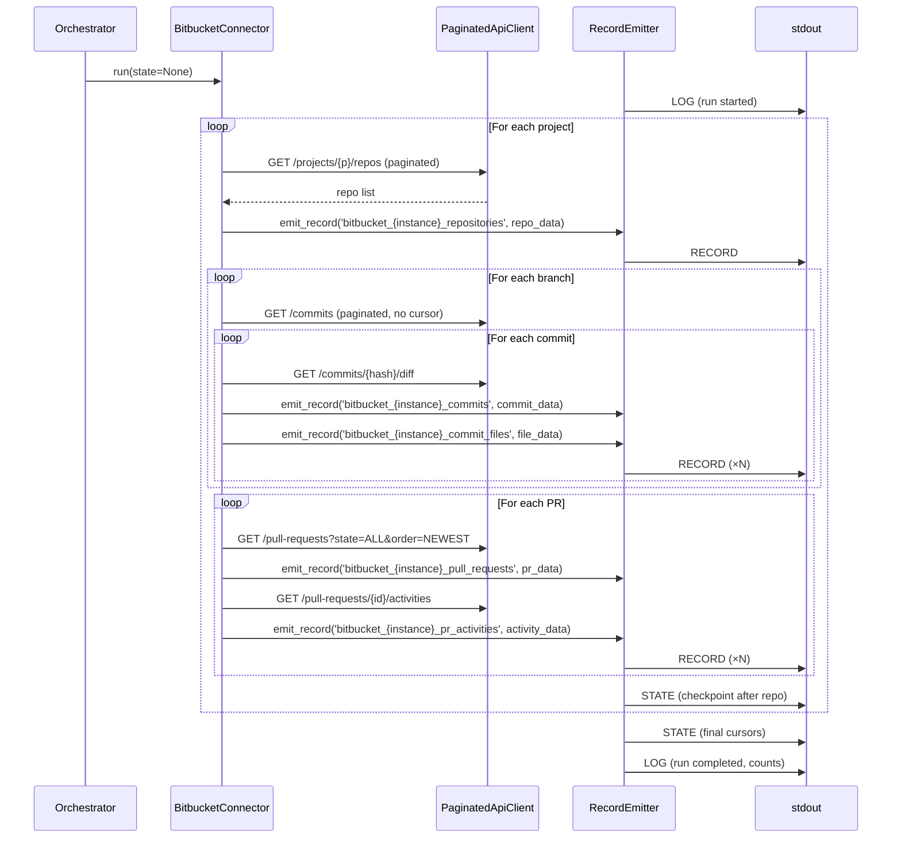
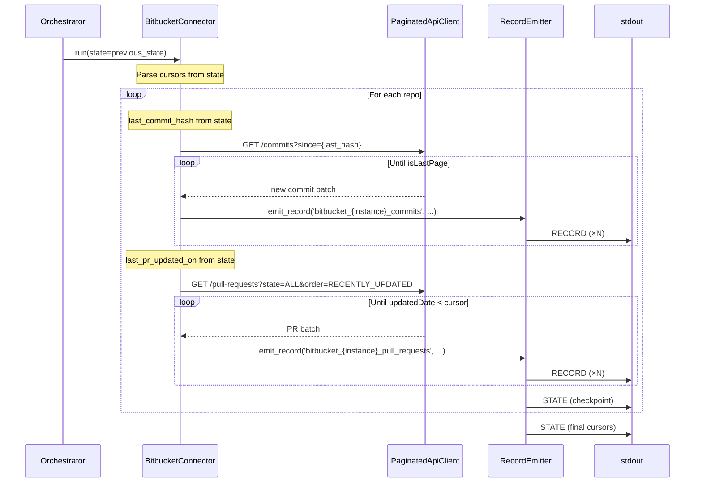

# DESIGN — Bitbucket Server Connector

> Version 2.0 — March 2026 (Airbyte protocol, Bronze-only, multi-instance)
> Based on: Unified git data model (`docs/components/connectors/git/README.md`), [PRD.md](./PRD.md)

<!-- toc -->

- [1. Architecture Overview](#1-architecture-overview)
  - [1.1 Architectural Vision](#11-architectural-vision)
  - [1.2 Architecture Drivers](#12-architecture-drivers)
  - [1.3 Architecture Layers](#13-architecture-layers)
- [2. Principles & Constraints](#2-principles--constraints)
  - [2.1 Design Principles](#21-design-principles)
  - [2.2 Constraints](#22-constraints)
- [3. Technical Architecture](#3-technical-architecture)
  - [3.1 Domain Model](#31-domain-model)
  - [3.2 Component Model](#32-component-model)
  - [3.3 API Contracts](#33-api-contracts)
  - [3.4 Internal Dependencies](#34-internal-dependencies)
  - [3.5 External Dependencies](#35-external-dependencies)
  - [3.6 Interactions & Sequences](#36-interactions--sequences)
  - [3.7 Database schemas & tables](#37-database-schemas--tables)
- [4. Additional context](#4-additional-context)
  - [API Details](#api-details)
  - [Field Mapping (API → RECORD Data)](#field-mapping-api--record-data)
  - [Output Schema Examples — Core Streams](#output-schema-examples--core-streams)
  - [Output Schema Examples — Config & Permissions](#output-schema-examples--config--permissions)
  - [Stream Inventory](#stream-inventory)
  - [Collection Strategy](#collection-strategy)
  - [Incremental Sync Capabilities](#incremental-sync-capabilities)
  - [Bitbucket-Specific Considerations](#bitbucket-specific-considerations)
- [5. Traceability](#5-traceability)

<!-- /toc -->

---

## 1. Architecture Overview

### 1.1 Architectural Vision

The Bitbucket Server connector is a batch-pull extractor that collects version control data from self-hosted Bitbucket Server and Data Center instances via the REST API v1.0 and emits it as Airbyte protocol messages to stdout. It uses `data_source = "insight_bitbucket_server"` as a discriminator. An orchestrator (Airbyte or compatible) consumes stdout, routes RECORD messages to Bronze tables, and persists STATE messages for incremental sync. Downstream dbt transformations produce unified `git_*` Silver tables for cross-platform analytics.

The architecture follows a pipeline: API pagination → raw field extraction → RECORD message emission to stdout. Incremental collection state is received from the orchestrator at startup (previous STATE) and emitted as STATE messages during the run. Multiple connector instances can run against the same Bitbucket Server with different credentials/project scopes, each identified by a unique `instance_name`.

Fault tolerance is achieved through per-repository STATE checkpointing and continue-on-error semantics for non-fatal API errors. The connector is designed to be deterministic: repeated runs with the same input state produce identical output records.

### 1.2 Architecture Drivers

**PRD Reference**: [PRD.md](./PRD.md)

#### Functional Drivers

| Requirement | Design Response |
|-------------|-----------------|
| `cpt-insightspec-fr-bb-discover-repos` | `BitbucketConnector.collect_projects()` paginates `/projects` then `/projects/{p}/repos`; emits RECORD messages on `bitbucket_repositories` stream |
| `cpt-insightspec-fr-bb-collect-commits` | `BitbucketConnector.collect_commits()` per branch; uses diff endpoint for stats; emits RECORDs on `bitbucket_commits` + `bitbucket_commit_files` streams |
| `cpt-insightspec-fr-bb-collect-prs` | `BitbucketConnector.collect_pull_requests()` with `state=ALL, order=NEWEST`; early exit on cursor |
| `cpt-insightspec-fr-bb-collect-reviewers` | `RecordEmitter.emit_reviewer()` merges PR `reviewers` array + activities with `APPROVED`/`UNAPPROVED`/`NEEDS_WORK` |
| `cpt-insightspec-fr-bb-collect-comments` | `RecordEmitter.emit_comment()` from activities with `action=COMMENTED`; captures `anchor`, `severity`, `state` |
| `cpt-insightspec-fr-bb-incremental-cursors` | STATE messages received from orchestrator at startup; emitted after each repository checkpoint |
| `cpt-insightspec-fr-bb-checkpoint` | STATE message emitted after each repository; orchestrator persists for resume |

#### NFR Allocation

| NFR ID | NFR Summary | Allocated To | Design Response | Verification Approach |
|--------|-------------|--------------|-----------------|----------------------|
| `cpt-insightspec-nfr-bb-auth` | Support Basic Auth, Bearer, PAT | `PaginatedApiClient` | Auth header injected from config; strategy pattern for auth type | Config validation test + integration test with each auth type |
| `cpt-insightspec-nfr-bb-rate-limiting` | Configurable sleep + backoff | `PaginatedApiClient.api_call_with_retry()` | Exponential backoff on 429/5xx; configurable `request_delay_ms` and `page_size` | Unit test retry logic; load test with mock rate-limited server |
| `cpt-insightspec-nfr-bb-schema-compliance` | All data emitted as Airbyte RECORD messages | `RecordEmitter` | Stream names follow `bitbucket_{instance}_{stream}` convention; all records include raw JSON data | Validate RECORD message structure against stream catalog |
| `cpt-insightspec-nfr-bb-data-source` | `data_source = "insight_bitbucket_server"` on all records | `RecordEmitter` | Hard-coded constant injected into every RECORD message data | Assertion on emitted RECORD messages |
| `cpt-insightspec-nfr-bb-idempotent` | Deterministic output | `RecordEmitter` | Same input state + same API data = identical RECORD output | Run connector twice with same state; diff stdout |

### 1.3 Architecture Layers

```
┌─────────────────────────────────────────────────────────────────────┐
│  Orchestrator (Airbyte or compatible)                               │
│  - invokes connector as subprocess                                  │
│  - provides previous STATE (stdin/config)                           │
│  - consumes stdout (RECORD, STATE, LOG messages)                    │
│  - routes RECORDs to Bronze tables, persists STATE                  │
└─────────────────────────────┬───────────────────────────────────────┘
                              │ invokes
┌─────────────────────────────▼───────────────────────────────────────┐
│  BitbucketConnector (collection + emission)                         │
│  ├── collect_projects()                                             │
│  ├── collect_repositories(project)                                  │
│  ├── collect_branches(project, repo)                                │
│  ├── collect_commits(project, repo, branch, cursor)                 │
│  ├── collect_pull_requests(project, repo, cursor)                   │
│  └── collect_pr_activities(project, repo, pr_id)                   │
└────────┬──────────────────┬──────────────────────────────────────────┘
         │                  │
┌────────▼────────┐ ┌───────▼───────┐
│ PaginatedApi    │ │ RecordEmitter │
│ Client          │ │               │
│                 │ │ emit_record() │ ──→ stdout (RECORD messages)
│ paginate()      │ │ emit_state()  │ ──→ stdout (STATE messages)
│ retry_backoff() │ │ emit_log()    │ ──→ stdout (LOG messages)
└─────────────────┘ └───────────────┘
```

| Layer | Responsibility | Technology |
|-------|---------------|------------|
| Orchestration | Trigger, provide STATE, consume stdout, route to Bronze tables | Airbyte / custom orchestrator |
| Collection | API pagination, cursor management, retry | `BitbucketConnector`, `PaginatedApiClient` |
| Emission | Raw API data → Airbyte RECORD/STATE/LOG messages to stdout | `RecordEmitter` |
| Storage | Bronze tables (managed by orchestrator, NOT by connector) | ClickHouse (orchestrator's concern) |

---

## 2. Principles & Constraints

### 2.1 Design Principles

#### Unified Schema First

- [ ] `p1` - **ID**: `cpt-insightspec-principle-bb-unified-schema`

All Bitbucket data is emitted as Airbyte RECORD messages with stream names following the `bitbucket_{instance}_{stream}` convention (e.g., `bitbucket_team_alpha_commits`). The `instance_name` from config is embedded in every stream name, enabling the orchestrator to route each connector instance to its own set of Bronze tables without any orchestrator-side routing config. Each record includes `data_source = "insight_bitbucket_server"`. The connector emits raw API data — schema mapping to the unified model is a dbt concern, not a connector concern.

#### Incremental by Default

- [ ] `p2` - **ID**: `cpt-insightspec-principle-bb-incremental`

Every collection run is incremental by default. Full collection is the degenerate case of an incremental run with no prior cursor state. Cursor state is received from the orchestrator (previous STATE message) and emitted as STATE messages during the run. State storage is opaque to the connector — the orchestrator manages persistence.

#### Fault Tolerance Over Completeness

- [ ] `p2` - **ID**: `cpt-insightspec-principle-bb-fault-tolerance`

A partial collection run that completes successfully for most repositories is preferable to a run that halts on first error. Non-fatal errors (404, malformed data) are logged and skipped. Fatal errors (401, 403) halt the run immediately. Progress is checkpointed after each repository.

### 2.2 Constraints

#### Bitbucket Server REST API v1.0 Only

- [ ] `p1` - **ID**: `cpt-insightspec-constraint-bb-api-version`

The connector targets the Bitbucket Server REST API v1.0. Bitbucket Cloud uses a different API (v2.0, different auth, different field names) and is explicitly out of scope. The connector MUST NOT assume Bitbucket Cloud API availability.

#### Stdout-Only Output (No Direct Database Writes)

- [ ] `p1` - **ID**: `cpt-insightspec-constraint-bb-stdout-only`

The connector MUST NOT write to any database directly. All output is emitted as Airbyte protocol messages to stdout. The orchestrator is responsible for routing RECORD messages to Bronze tables and persisting STATE. The connector has no dependency on ClickHouse or any specific database driver.

---

## 3. Technical Architecture

### 3.1 Domain Model

**Technology**: Python dataclasses / TypedDict

**Core Entities**:

| Entity | Description | Emits To Stream |
|--------|-------------|-----------------|
| `BitbucketProject` | Organizational grouping; has `key` and `name` | `bitbucket_projects` |
| `BitbucketRepo` | Git repository; has `slug`, `name`, `forkable`, `public` | `bitbucket_repositories` |
| `BitbucketBranch` | Branch with `displayId` (name) and `latestCommit` | `bitbucket_branches` |
| `BitbucketCommit` | Commit with `id` (SHA), `author`, `authorTimestamp`, `parents` | `bitbucket_commits` |
| `BitbucketDiff` | Per-file diff from `/commits/{hash}/diff`; has `diffs[]` with hunks | `bitbucket_commit_files` |
| `BitbucketPR` | Pull request; `fromRef`, `toRef`, `reviewers[]`, `state` | `bitbucket_pull_requests` |
| `BitbucketActivity` | PR event: `COMMENTED`, `APPROVED`, `UNAPPROVED`, `MERGED`, `DECLINED` | `bitbucket_pr_activities` |
| `CollectionCursor` | In-memory cursor: `last_commit_hash`, `last_pr_updated_on` | STATE messages (managed by orchestrator) |

**Relationships**:
- `BitbucketProject` 1:N → `BitbucketRepo`
- `BitbucketRepo` 1:N → `BitbucketBranch`, `BitbucketPR`
- `BitbucketBranch` 1:N → `BitbucketCommit`
- `BitbucketCommit` 1:1 → `BitbucketDiff` (fetched separately)
- `BitbucketPR` 1:N → `BitbucketActivity`

### 3.2 Component Model

#### BitbucketConnector

- [ ] `p1` - **ID**: `cpt-insightspec-component-bb-connector`

##### Why this component exists

Orchestrates the full collection pipeline: iterates projects → repos → branches/PRs, manages cursors, emits Airbyte protocol messages to stdout.

##### Responsibility scope

- Entry point for all collection runs (full and incremental).
- Reads previous STATE from orchestrator (received at startup).
- Calls `PaginatedApiClient` for all API requests.
- Calls `RecordEmitter` to emit RECORD messages for each extracted entity.
- Emits STATE messages after each repository checkpoint.
- Emits LOG messages with run statistics.

##### Responsibility boundaries

- Does NOT implement pagination logic (delegated to `PaginatedApiClient`).
- Does NOT write to any database (stdout only).
- Does NOT resolve identities (downstream dbt concern).
- Does NOT own state persistence (orchestrator manages STATE).

##### Related components (by ID)

- `cpt-insightspec-component-bb-api-client` — calls for all API requests
- `cpt-insightspec-component-bb-record-emitter` — calls to emit RECORD/STATE/LOG messages

---

#### PaginatedApiClient

- [ ] `p2` - **ID**: `cpt-insightspec-component-bb-api-client`

##### Why this component exists

Encapsulates Bitbucket Server REST API pagination, authentication, and retry logic so that collection code never deals with raw HTTP concerns.

##### Responsibility scope

- Constructs authenticated HTTP requests (Basic Auth / Bearer / PAT).
- Implements the `paginate_endpoint()` loop using `start` / `limit` / `isLastPage` / `nextPageStart`.
- Implements `api_call_with_retry()` with configurable `max_retries` and `base_delay`.
- Handles HTTP 429 and 5xx with exponential backoff; raises immediately on 401/403.
- Returns raw parsed JSON to callers.

##### Responsibility boundaries

- Does NOT apply field mapping or schema transformation.
- Does NOT interpret business logic from response payloads.

##### Related components (by ID)

- `cpt-insightspec-component-bb-connector` — calls this component

---

#### RecordEmitter

- [ ] `p2` - **ID**: `cpt-insightspec-component-bb-record-emitter`

##### Why this component exists

Formats raw Bitbucket API response data into Airbyte protocol messages and writes them to stdout. Handles RECORD (data), STATE (cursor checkpoints), and LOG (status/errors) message types.

##### Responsibility scope

- `emit_record(stream, data)` → writes Airbyte RECORD message to stdout as JSON line
- `emit_state(state_data)` → writes Airbyte STATE message to stdout
- `emit_log(level, message)` → writes Airbyte LOG message to stdout
- Injects `data_source = "insight_bitbucket_server"` and `emitted_at` timestamp on all RECORD messages

##### Responsibility boundaries

- Does NOT call the API or manage cursors.
- Does NOT write to any database — stdout only.
- Does NOT transform data to Silver schema (downstream dbt concern).

##### Related components (by ID)

- `cpt-insightspec-component-bb-connector` — calls this component

---

### 3.3 API Contracts

- [ ] `p2` - **ID**: `cpt-insightspec-interface-bb-connector-api`

**Technology**: Python module / CLI

**Contracts**: `cpt-insightspec-contract-bb-api`

**Entry Point**:

```python
class BitbucketConnector:
    def __init__(self, config: BitbucketConnectorConfig): ...
    def run(self, state: dict | None = None) -> None:
        """Emits Airbyte RECORD/STATE/LOG messages to stdout. state = previous STATE from orchestrator."""
        ...
```

**Configuration schema** (`BitbucketConnectorConfig`):

| Field | Type | Description |
|-------|------|-------------|
| `base_url` | str | Bitbucket Server base URL (e.g., `https://git.company.com`) |
| `auth_type` | `'basic'` / `'bearer'` / `'pat'` | Authentication method |
| `credentials` | dict | `{username, password}` or `{token}` depending on `auth_type` |
| `instance_name` | str | **Required.** Unique instance identifier (e.g., `team_alpha`). Embedded in all stream names: `bitbucket_{instance_name}_{stream}` |
| `project_keys` | list[str] or None | Specific project keys to collect; None = all accessible |
| `page_size` | int | API pagination page size (default 100, max 1000) |
| `request_delay_ms` | int | Sleep between requests in ms (default 100) |
| `max_retries` | int | Max retry attempts for transient errors (default 3) |
| `retry_base_delay` | float | Base delay in seconds for exponential backoff (default 1.0) |

---

### 3.4 Internal Dependencies

| Dependency Module | Interface Used | Purpose |
|-------------------|----------------|---------|
| `stdout` | Airbyte protocol JSON lines | RECORD, STATE, LOG message emission |

**Dependency Rules**:
- No circular dependencies between components.
- The connector has NO database dependencies — all output goes to stdout.
- All inter-component communication is in-process via direct method calls.

---

### 3.5 External Dependencies

#### Bitbucket Server REST API v1.0

| Aspect | Value |
|--------|-------|
| Base URL | `https://git.company.com/rest/api/1.0` (org-specific) |
| Auth | HTTP Basic / Bearer Token / PAT |
| Pagination | `start` + `limit` + `isLastPage` + `nextPageStart` |
| Rate limiting | Typically none by default; may be org-configured |

#### Airbyte-Compatible Orchestrator

| Aspect | Value |
|--------|-------|
| Interface | Invokes connector as subprocess, consumes stdout |
| Input to connector | Configuration JSON + previous STATE |
| Output from connector | RECORD, STATE, LOG messages (JSON lines on stdout) |
| Criticality | Required — orchestrator routes records to Bronze tables and persists state |

---

### 3.6 Interactions & Sequences

#### Full Collection Run

**ID**: `cpt-insightspec-seq-bb-full-run`

**Use cases**: `cpt-insightspec-usecase-bb-initial-collection`

**Actors**: `cpt-insightspec-actor-bb-platform-engineer`, `cpt-insightspec-actor-bb-scheduler`



**Description**: Full collection iterates all projects, repos, branches, and PRs. All data emitted as RECORD messages to stdout. STATE checkpointed after each repository.

---

#### Incremental Collection Run

**ID**: `cpt-insightspec-seq-bb-incremental`

**Use cases**: `cpt-insightspec-usecase-bb-incremental`

**Actors**: `cpt-insightspec-actor-bb-scheduler`



**Description**: Incremental run reads cursors from provided state, stops fetching when it reaches already-collected data. Emits only new/changed records.

---

### 3.7 Database schemas & tables

> **Note**: The connector does NOT own database schemas or table DDL. It emits Airbyte RECORD messages to stdout; the orchestrator creates and manages Bronze tables. The connector declares its available streams via an Airbyte CATALOG message.

**Stream naming convention**: `bitbucket_{instance_name}_{stream_name}` (e.g., `bitbucket_team_alpha_commits`, `bitbucket_team_alpha_pull_requests`). The `instance_name` comes from connector config and ensures each connector instance writes to its own set of Bronze tables.

**RECORD message format** (one JSON line per record):

| Column | Type | Constraints | Description |
|--------|------|-------------|-------------|
| `tenant_id` | UUID | REQUIRED | Tenant identifier — injected by framework |
| `insight_source_id` | String | REQUIRED | Source instance identifier (e.g. `bitbucket-acme-prod`) |
| `id` | Int64 | PRIMARY KEY | Auto-generated unique identifier |
| `project_key` | String | REQUIRED | Repository owner — joins to `git_commit_files.project_key` |
| `repo_slug` | String | REQUIRED | Repository name — joins to `git_commit_files.repo_slug` |
| `commit_hash` | String | REQUIRED | Commit SHA — joins to `git_commit_files.commit_hash` |
| `file_path` | String | REQUIRED | File path — joins to `git_commit_files.file_path` |
| `field_id` | String | REQUIRED | Machine identifier for the property (e.g. `ai_thirdparty_flag`, `scancode_metadata`) |
| `field_name` | String | REQUIRED | Human-readable label for the property (e.g. `"AI Third-party Flag"`) |
| `field_value_str` | String | NULLABLE | String / JSON value; NULL when the property is purely numeric |
| `field_value_int` | Int64 | NULLABLE | Integer or boolean (0/1) value; NULL when the property is not an integer |
| `field_value_float` | Float64 | NULLABLE | Fractional numeric value; NULL when the property is not a float |
| `collected_at` | DateTime64(3) | REQUIRED | When this property was collected/computed |
| `data_source` | String | DEFAULT '' | Source discriminator — always `'insight_bitbucket_server'` for this connector |
| `_version` | UInt64 | REQUIRED | Deduplication version (Unix ms) |
```json
{"type": "RECORD", "record": {"stream": "bitbucket_team_alpha_commits", "data": {"instance_name": "team_alpha", "project_key": "RUSTLABS", "repo_slug": "rust-cli-toolkit", "id": "abc123...", "...": "..."}, "emitted_at": 1711350000000}}
```

**STATE message format** (emitted after each repository checkpoint):

**Indexes**:
- `idx_commit_file_ext_lookup`: `(tenant_id, insight_source_id, project_key, repo_slug, commit_hash, file_path, field_id, data_source)`
- `idx_file_ext_field_id`: `(field_id)`
```json
{"type": "STATE", "state": {"data": {"commits": {"RUSTLABS/rust-cli-toolkit": {"main": "abc123..."}}, "pull_requests": {"RUSTLABS/rust-cli-toolkit": {"last_updated_date": 1711234567000}}}}}
```

**LOG message format**:

**Common property keys**:
- `ai_thirdparty_flag` — AI-detected third-party code (0 or 1) — value: `field_value_int`
- `scancode_thirdparty_flag` — License scanner detected third-party (0 or 1) — value: `field_value_int`
- `scancode_metadata` — License and copyright scanning results for this file — value: `field_value_str` (JSON)
```json
{"type": "LOG", "log": {"level": "INFO", "message": "Collection complete: 5 repos, 1234 commits, 42 PRs"}}
```

For the full list of streams and their fields, see [Stream Inventory](#stream-inventory) and [Output Schema Examples](#output-schema-examples--core-streams) in Section 4.

---

## 4. Additional context

### API Details

**Base URL**: `https://git.company.com` (organization-specific)

**API Base Path**: `/rest/api/1.0`

**Authentication Headers**:

```http
Authorization: Bearer {token}
Content-Type: application/json
```

**Alternative auth**: HTTP Basic (`Authorization: Basic {base64(username:password)}`), PAT (`Authorization: Bearer {pat}`)

**Key Endpoints**:

| Endpoint | Method | Purpose |
|----------|--------|---------|
| `/rest/api/1.0/projects` | GET | List all projects |
| `/rest/api/1.0/projects/{project}/repos` | GET | List repositories in project |
| `/rest/api/1.0/projects/{project}/repos/{repo}` | GET | Get single repository details |
| `/rest/api/1.0/projects/{project}/repos/{repo}/branches` | GET | List branches |
| `/rest/api/1.0/projects/{project}/repos/{repo}/commits` | GET | List commits |
| `/rest/api/1.0/projects/{project}/repos/{repo}/commits/{hash}` | GET | Get single commit details |
| `/rest/api/1.0/projects/{project}/repos/{repo}/commits/{hash}/diff` | GET | Commit diff (file stats) |
| `/rest/api/1.0/projects/{project}/repos/{repo}/pull-requests` | GET | List pull requests |
| `/rest/api/1.0/projects/{project}/repos/{repo}/pull-requests/{id}` | GET | Get single PR details |
| `/rest/api/1.0/projects/{project}/repos/{repo}/pull-requests/{id}/activities` | GET | PR activities (reviews, comments) |
| `/rest/api/1.0/projects/{project}/repos/{repo}/pull-requests/{id}/commits` | GET | PR commits |
| `/rest/api/1.0/projects/{project}/repos/{repo}/pull-requests/{id}/changes` | GET | PR file changes |
| `/rest/api/1.0/projects/{project}/repos/{repo}/pull-requests/{id}/merge` | GET | Check PR merge eligibility |
| `/rest/api/1.0/application-properties` | GET | Server version and build info |

**Pagination**: All list endpoints use server-side pagination with the following query parameters and response structure.

**Query parameters**:
- `start` — Page start index (default: 0)
- `limit` — Page size (default: 25, recommended: 100, max: 1000)

**Response structure**:
```json
{
  "size": 25,
  "limit": 100,
  "isLastPage": false,
  "start": 0,
  "nextPageStart": 100,
  "values": [
    {"...item data..."}
  ]
}
```

**Pagination algorithm**:
```python
def paginate_endpoint(api_client, endpoint, **params):
    """Paginate through Bitbucket API endpoint."""
    start = 0
    limit = 100
    all_items = []

    while True:
        response = api_client.get(endpoint, params={
            **params,
            'start': start,
            'limit': limit
        })

        all_items.extend(response['values'])

        if response.get('isLastPage', True):
            break

        start = response['nextPageStart']

    return all_items
```

---

### Field Mapping (API → RECORD Data)

**Repository** → `git_repositories`:

```python
{
    'tenant_id': config.tenant_id,
    'insight_source_id': config.insight_source_id,
    'instance_name': config.instance_name,               # Connector instance identifier
    'project_key': api_data['project']['key'],
    'repo_slug': api_data['slug'],
    'repo_uuid': str(api_data.get('id')) or None,
    'name': api_data['name'],
    'description': api_data.get('description'),
    'is_private': 1 if not api_data.get('public') else 0,
    'fork_policy': 'forkable' if api_data.get('forkable') else None,
    'hierarchy_id': api_data.get('hierarchyId'),             # Stable fork-hierarchy identifier
    'scm_id': api_data.get('scmId'),                         # SCM type (always "git")
    'state': api_data.get('state'),                          # AVAILABLE / INITIALISING / OFFLINE
    'status_message': api_data.get('statusMessage'),         # Human-readable state description
    'archived': 1 if api_data.get('archived') else 0,       # Whether repo is archived (read-only)
    'clone_urls': json.dumps(api_data.get('links', {}).get('clone', [])),  # Clone URLs (http/ssh)
    'web_url': (api_data.get('links', {}).get('self', [{}])[0].get('href')),  # Browser URL
    'metadata': json.dumps(api_data),
    'data_source': 'insight_bitbucket_server',
    '_version': int(time.time() * 1000)
}
```

**Branch** → `git_repository_branches`:

```python
{
    'instance_name': config.instance_name,
    'project_key': project_key,
    'repo_slug': repo_slug,
    'branch_name': api_data['displayId'],                    # Short branch name ("main")
    'branch_ref': api_data['id'],                            # Full ref ("refs/heads/main")
    'is_default': 1 if api_data.get('isDefault') else 0,    # Whether this is the default branch
    'last_commit_hash': api_data['latestCommit'],            # SHA of latest commit
    'last_commit_hash_legacy': api_data.get('latestChangeset'),  # Legacy alias (older BBS versions)
    'data_source': 'insight_bitbucket_server',
    '_version': int(time.time() * 1000)
}
```

**Commit** → `git_commits`:

```python
{
    'tenant_id': config.tenant_id,
    'insight_source_id': config.insight_source_id,
    'instance_name': config.instance_name,
    'project_key': project_key,
    'repo_slug': repo_slug,
    'commit_hash': api_data['id'],                       # Full SHA-1 (40 chars)
    'branch': branch_name,
    'author_name': api_data['author']['name'],           # e.g., "John.Smith" (dot-separated)
    'author_email': api_data['author']['emailAddress'],
    'committer_name': api_data['committer']['name'],
    'committer_email': api_data['committer']['emailAddress'],
    'message': api_data['message'],
    'author_timestamp_ms': api_data['authorTimestamp'],      # Raw epoch ms (git-embedded, can be backdated)
    'committer_timestamp_ms': api_data['committerTimestamp'],  # Raw epoch ms
    'date': datetime.fromtimestamp(api_data['authorTimestamp'] / 1000),
    'parents': json.dumps([p['id'] for p in api_data.get('parents', [])]),
    'files_changed': len(diff_data.get('diffs', [])),
    'lines_added': calculate_lines_added(diff_data),
    'lines_removed': calculate_lines_removed(diff_data),
    'is_merge_commit': 1 if len(api_data.get('parents', [])) > 1 else 0,
    'metadata': json.dumps(api_data),
    'collected_at': datetime.now(),
    'data_source': 'insight_bitbucket_server',
    '_version': int(time.time() * 1000)
}
```

**Commit file** → `git_commit_files` (one row per file in diff):

```python
{
    'tenant_id': config.tenant_id,
    'insight_source_id': config.insight_source_id,
    'instance_name': config.instance_name,
    'project_key': project_key,
    'repo_slug': repo_slug,
    'commit_hash': commit_hash,
    'diff_hash': sha256(diff_content),
    'file_path': diff['destination']['toString'],        # or source if deleted
    'file_extension': extract_extension(file_path),
    'lines_added': calculate_file_lines_added(diff),
    'lines_removed': calculate_file_lines_removed(diff),
    'content_id': change.get('contentId'),                   # SHA of new blob
    'from_content_id': change.get('fromContentId'),          # SHA of old blob (zeros = new file)
    'parent_dir': change.get('path', {}).get('parent'),      # Parent directory path
    'path_components': json.dumps(change.get('path', {}).get('components', [])),  # Path segments
    'executable': 1 if change.get('executable') else 0,      # Whether file has executable bit
    'change_type': change.get('type'),                       # ADD / MODIFY / DELETE / MOVE / COPY
    'node_type': change.get('nodeType'),                     # FILE or SUBMODULE
    'percent_unchanged': change.get('percentUnchanged'),     # -1 when not calculated
    'git_change_type': change.get('properties', {}).get('gitChangeType'),  # Raw git change type
    'from_hash': change_context.get('fromHash'),             # Parent commit SHA
    'to_hash': change_context.get('toHash'),                 # This commit SHA
    # ai_thirdparty_flag, scancode_thirdparty_flag, scancode_metadata
    # are stored in git_commits_files_ext (populated by separate enrichment pipelines)
    'collected_at': datetime.now(),
    'data_source': 'insight_bitbucket_server',
    '_version': int(time.time() * 1000)
}
```

**Pull Request** → `git_pull_requests`:

```python
{
    'tenant_id': config.tenant_id,
    'insight_source_id': config.insight_source_id,
    'instance_name': config.instance_name,
    'project_key': project_key,
    'repo_slug': repo_slug,
    'pr_id': api_data['id'],
    'pr_number': api_data['id'],                         # Same as pr_id in Bitbucket
    'title': api_data['title'],
    'description': api_data.get('description', ''),
    'state': normalize_state(api_data['state']),         # OPEN / MERGED / DECLINED
    'version': api_data.get('version'),                      # Optimistic-lock version
    'is_open': 1 if api_data.get('open') else 0,            # True when state is OPEN
    'is_closed': 1 if api_data.get('closed') else 0,        # True when MERGED/DECLINED/SUPERSEDED
    'is_locked': 1 if api_data.get('locked') else 0,        # Whether PR is locked
    'is_draft': 1 if api_data.get('draft') else 0,          # Whether PR is a draft
    'author_name': api_data['author']['user']['name'],
    'author_uuid': str(api_data['author']['user']['id']),
    'source_branch': api_data['fromRef']['displayId'],
    'source_commit': api_data['fromRef'].get('latestCommit'),  # Source HEAD SHA
    'source_repo': json.dumps(api_data['fromRef'].get('repository', {})),  # Source repo (fork PRs)
    'destination_branch': api_data['toRef']['displayId'],
    'target_commit': api_data['toRef'].get('latestCommit'),  # Target HEAD SHA
    'target_repo': json.dumps(api_data['toRef'].get('repository', {})),  # Target repo
    'created_date_ms': api_data['createdDate'],               # Raw epoch ms
    'updated_date_ms': api_data['updatedDate'],               # Raw epoch ms
    'closed_date_ms': api_data.get('closedDate'),             # Raw epoch ms (null if not closed)
    'created_on': datetime.fromtimestamp(api_data['createdDate'] / 1000),
    'updated_on': datetime.fromtimestamp(api_data['updatedDate'] / 1000),
    'closed_on': datetime.fromtimestamp(api_data['closedDate'] / 1000) if api_data.get('closedDate') else None,
    'merge_commit_hash': api_data.get('properties', {}).get('mergeCommit', {}).get('id'),
    'duration_seconds': calculate_duration(api_data),
    'author_approved': 1 if api_data.get('author', {}).get('approved') else 0,
    'author_status': api_data.get('author', {}).get('status'),  # UNAPPROVED/APPROVED/NEEDS_WORK
    'reviewers': json.dumps(api_data.get('reviewers', [])),  # Full reviewer list with statuses
    'participants': json.dumps(api_data.get('participants', [])),  # Additional participants
    'web_url': (api_data.get('links', {}).get('self', [{}])[0].get('href')),  # Browser URL
    'merge_result_current': api_data.get('properties', {}).get('mergeResult', {}).get('current'),
    'resolved_task_count': api_data.get('properties', {}).get('resolvedTaskCount'),
    'open_task_count': api_data.get('properties', {}).get('openTaskCount'),
    'comment_count_api': api_data.get('properties', {}).get('commentCount'),  # API-reported count
    'metadata': json.dumps(api_data),
    'collected_at': datetime.now(),
    'data_source': 'insight_bitbucket_server',
    '_version': int(time.time() * 1000)
}
```

**State normalization**: Bitbucket `OPEN` → `OPEN`, `MERGED` → `MERGED`, `DECLINED` → `DECLINED`

**PR Reviewer** → `git_pull_requests_reviewers` (from activities `APPROVED`/`UNAPPROVED` + PR `reviewers` array):

```python
{
    'tenant_id': config.tenant_id,
    'insight_source_id': config.insight_source_id,
    'instance_name': config.instance_name,
    'project_key': project_key, 'repo_slug': repo_slug, 'pr_id': pr_id,
    'reviewer_name': user_data['name'],
    'reviewer_uuid': str(user_data['id']),
    'reviewer_email': user_data.get('emailAddress'),
    'status': api_data.get('status', 'UNAPPROVED'),     # APPROVED / UNAPPROVED
    'role': 'REVIEWER',
    'approved': 1 if api_data.get('status') == 'APPROVED' else 0,
    'reviewed_at_ms': api_data.get('createdDate'),             # Raw epoch ms
    'reviewed_at': datetime.fromtimestamp(api_data['createdDate'] / 1000) if api_data.get('createdDate') else None,
    'metadata': json.dumps(api_data), 'collected_at': datetime.now(),
    'data_source': 'insight_bitbucket_server', '_version': int(time.time() * 1000)
}
```

> Reviewers appear in two places: (1) PR `reviewers` array (current status), (2) activities with `APPROVED`/`UNAPPROVED` (historical events). Mapper merges both sources.

**PR Comment** → `git_pull_requests_comments` (from activities `action=COMMENTED`):

```python
{
    'tenant_id': config.tenant_id,
    'insight_source_id': config.insight_source_id,
    'instance_name': config.instance_name,
    'project_key': project_key, 'repo_slug': repo_slug, 'pr_id': pr_id,
    'comment_id': comment_data['id'],
    'comment_version': comment_data.get('version'),          # Optimistic-lock version
    'parent_comment_id': comment_data.get('parent', {}).get('id'),  # Parent comment (for replies)
    'replies': json.dumps([c['id'] for c in comment_data.get('comments', [])]),  # Nested reply IDs
    'content': comment_data['text'],
    'author_name': user_data['name'], 'author_uuid': str(user_data['id']),
    'author_email': user_data.get('emailAddress'),
    'created_date_ms': comment_data['createdDate'],            # Raw epoch ms
    'updated_date_ms': comment_data['updatedDate'],            # Raw epoch ms
    'created_at': datetime.fromtimestamp(comment_data['createdDate'] / 1000),
    'updated_at': datetime.fromtimestamp(comment_data['updatedDate'] / 1000),
    'state': comment_data.get('state'),                  # OPEN / RESOLVED
    'severity': comment_data.get('severity'),            # NORMAL / BLOCKER
    'thread_resolved': 1 if comment_data.get('threadResolved') else 0,
    'file_path': comment_data.get('anchor', {}).get('path'),   # NULL for general comments
    'line_number': comment_data.get('anchor', {}).get('line'), # NULL for general comments
    'anchor_from_hash': anchor.get('fromHash'),              # Base commit SHA (inline comments)
    'anchor_to_hash': anchor.get('toHash'),                  # Head commit SHA (inline comments)
    'anchor_line_type': anchor.get('lineType'),              # ADDED / REMOVED / CONTEXT
    'anchor_file_type': anchor.get('fileType'),              # FROM (old) or TO (new)
    'anchor_src_path': anchor.get('srcPath'),                # Old file path (if renamed)
    'anchor_diff_type': anchor.get('diffType'),              # EFFECTIVE / COMMIT / RANGE
    'anchor_orphaned': 1 if anchor.get('orphaned') else 0,  # Whether anchor is stale after rebase
    'metadata': json.dumps(comment_data), 'collected_at': datetime.now(),
    'data_source': 'insight_bitbucket_server', '_version': int(time.time() * 1000)
}
```

**Comment types**:
- **General comments**: `anchor` is null → `file_path` and `line_number` are NULL
- **Inline comments**: `anchor` contains file path and line number → both fields populated

**PR Activity (UPDATED)** → `git_pull_requests_activities` (reviewer changes):

```python
{
    'instance_name': config.instance_name,
    'project_key': project_key,
    'repo_slug': repo_slug,
    'pr_id': pr_id,
    'activity_id': activity_data['id'],
    'action': 'UPDATED',
    'created_date_ms': activity_data['createdDate'],          # Raw epoch ms
    'created_at': datetime.fromtimestamp(activity_data['createdDate'] / 1000),
    'user_name': activity_data['user']['name'],
    'user_id': str(activity_data['user']['id']),
    'added_reviewers': json.dumps([u['name'] for u in activity_data.get('addedReviewers', [])]),
    'removed_reviewers': json.dumps([u['name'] for u in activity_data.get('removedReviewers', [])]),
    'metadata': json.dumps(activity_data),
    'collected_at': datetime.now(),
    'data_source': 'insight_bitbucket_server',
    '_version': int(time.time() * 1000)
}
```

**PR Activity (RESCOPED)** → `git_pull_requests_activities` (scope changes / force-push):

```python
{
    'instance_name': config.instance_name,
    'project_key': project_key,
    'repo_slug': repo_slug,
    'pr_id': pr_id,
    'activity_id': activity_data['id'],
    'action': 'RESCOPED',
    'created_date_ms': activity_data['createdDate'],          # Raw epoch ms
    'created_at': datetime.fromtimestamp(activity_data['createdDate'] / 1000),
    'user_name': activity_data['user']['name'],
    'user_id': str(activity_data['user']['id']),
    'from_hash': activity_data.get('fromHash'),              # Previous HEAD SHA
    'to_hash': activity_data.get('toHash'),                  # New HEAD SHA
    'commits_added': json.dumps(activity_data.get('added', {}).get('values', [])),
    'commits_removed': json.dumps(activity_data.get('removed', {}).get('values', [])),
    'metadata': json.dumps(activity_data),
    'collected_at': datetime.now(),
    'data_source': 'insight_bitbucket_server',
    '_version': int(time.time() * 1000)
}
```

**User** → `git_users`:

```python
{
    'instance_name': config.instance_name,               # Connector instance identifier
    'user_id': str(api_data['id']),                          # Internal numeric user ID
    'username': api_data['name'],                            # Username / login
    'slug': api_data['slug'],                                # URL-safe username
    'display_name': api_data.get('displayName'),             # Full name
    'email': api_data.get('emailAddress'),                   # Email address
    'active': 1 if api_data.get('active') else 0,           # Whether account is active
    'user_type': api_data.get('type'),                       # NORMAL or SERVICE
    'web_url': (api_data.get('links', {}).get('self', [{}])[0].get('href')),  # Profile URL
    # Admin endpoint extras (nullable — only available with admin permissions)
    'created_timestamp_ms': api_data.get('createdTimestamp'),  # Raw epoch ms
    'last_auth_timestamp_ms': api_data.get('lastAuthenticationTimestamp'),  # Raw epoch ms
    'created_at': datetime.fromtimestamp(api_data['createdTimestamp'] / 1000) if api_data.get('createdTimestamp') else None,
    'last_authentication_at': datetime.fromtimestamp(api_data['lastAuthenticationTimestamp'] / 1000) if api_data.get('lastAuthenticationTimestamp') else None,
    'deletable': 1 if api_data.get('deletable') else None,  # None when not from admin endpoint
    'directory_name': api_data.get('directoryName'),         # Auth directory name
    'mutable_details': 1 if api_data.get('mutableDetails') else None,
    'mutable_groups': 1 if api_data.get('mutableGroups') else None,
    'metadata': json.dumps(api_data),
    'collected_at': datetime.now(),
    'data_source': 'insight_bitbucket_server',
    '_version': int(time.time() * 1000)
}
```

### Output Schema Examples — Core Streams

#### Stream: `projects`

**Endpoint:** `GET /rest/api/1.0/projects` | **Sync:** Full Refresh

```json
{
    "key": "RUSTLABS",                                       // Unique project key
    "id": 42,                                                // Internal numeric project ID
    "name": "Rust Labs",                                     // Human-readable project name
    "description": "Rust open-source tooling",               // Project description
    "public": false,                                         // Whether publicly visible
    "type": "NORMAL",                                        // NORMAL or PERSONAL
    "links": {                                               // Navigation links
        "self": [{"href": "https://git.company.com/projects/RUSTLABS"}]
    },
    "_synced_at": "2026-03-25T10:30:00.000Z"                // Connector sync timestamp
}
```

#### Stream: `repositories`

**Endpoint:** `GET /rest/api/1.0/projects/{key}/repos` | **Sync:** Full Refresh

```json
{
    "project_key": "RUSTLABS",                               // Context: parent project
    "slug": "rust-cli-toolkit",                              // URL-safe repo identifier
    "id": 1337,                                              // Internal numeric repo ID
    "name": "rust-cli-toolkit",                              // Repository name
    "hierarchyId": "e8b7c4d2f1a0",                           // Stable fork-hierarchy identifier
    "scmId": "git",                                          // SCM type (always git)
    "state": "AVAILABLE",                                    // AVAILABLE / INITIALISING / OFFLINE
    "statusMessage": "Available",                            // Human-readable state
    "forkable": true,                                        // Whether forks can be created
    "public": false,                                         // Whether publicly readable
    "archived": false,                                       // Whether repo is archived
    "project": {                                             // Embedded project object
        "key": "RUSTLABS",
        "id": 42,
        "name": "Rust Labs",
        "type": "NORMAL"
    },
    "links": {
        "clone": [                                           // Clone URLs
            {"href": "https://git.company.com/scm/rustlabs/rust-cli-toolkit.git", "name": "http"},
            {"href": "ssh://git@git.company.com:7999/rustlabs/rust-cli-toolkit.git", "name": "ssh"}
        ],
        "self": [{"href": "https://git.company.com/projects/RUSTLABS/repos/rust-cli-toolkit/browse"}]
    },
    "_synced_at": "2026-03-25T10:30:00.000Z"
}
```

#### Stream: `branches`

**Endpoint:** `GET /rest/api/1.0/projects/{key}/repos/{slug}/branches` | **Sync:** Full Refresh

```json
{
    "project_key": "RUSTLABS",                               // Context: project
    "repo_slug": "rust-cli-toolkit",                         // Context: repository
    "id": "refs/heads/main",                                 // Full ref name
    "displayId": "main",                                     // Short branch name
    "type": "BRANCH",                                        // Always BRANCH
    "latestCommit": "a1b2c3d4e5f6a7b8c9d0e1f2a3b4c5d6e7f8a9b0",  // Latest commit SHA
    "latestChangeset": "a1b2c3d4e5f6a7b8c9d0e1f2a3b4c5d6e7f8a9b0",  // Legacy alias
    "isDefault": true,                                       // Whether this is the default branch
    "_synced_at": "2026-03-25T10:30:00.000Z"
}
```

#### Stream: `tags`

**Endpoint:** `GET /rest/api/1.0/projects/{key}/repos/{slug}/tags` | **Sync:** Full Refresh

```json
{
    "project_key": "RUSTLABS",                               // Context: project
    "repo_slug": "rust-cli-toolkit",                         // Context: repository
    "id": "refs/tags/v2.1.0",                                // Full ref name
    "displayId": "v2.1.0",                                   // Short tag name
    "type": "TAG",                                           // Always TAG
    "latestCommit": "a1b2c3d4e5f6a7b8c9d0e1f2a3b4c5d6e7f8a9b0",  // Commit SHA the tag points to
    "latestChangeset": "a1b2c3d4e5f6a7b8c9d0e1f2a3b4c5d6e7f8a9b0",  // Legacy alias
    "hash": "f0e1d2c3b4a5968778695a4b3c2d1e0f9a8b7c6d",     // Tag object SHA (annotated tags)
    "_synced_at": "2026-03-25T10:30:00.000Z"
}
```

#### Stream: `users`

**Endpoint:** `GET /rest/api/1.0/admin/users` | **Sync:** Full Refresh

```sql
SELECT branch_name, last_commit_hash, last_commit_date
FROM git_repository_branches
WHERE tenant_id = '<tenant_id>'
  AND project_key = 'MYPROJ' AND repo_slug = 'my-repo'
  AND data_source = 'insight_bitbucket_server';
```json
{
    "name": "cyber",                                        // Username / login
    "emailAddress": "cyber@company.com",                   // Email address
    "active": true,                                          // Whether account is active
    "displayName": "Cyber Connector",                                // Full name
    "id": 501,                                               // Internal numeric user ID
    "slug": "cyber",                                        // URL-safe username
    "type": "NORMAL",                                        // NORMAL or SERVICE
    "links": {
        "self": [{"href": "https://git.company.com/users/cyber"}]
    },
    "createdTimestamp": 1672531200000,                        // Account creation (admin only)
    "lastAuthenticationTimestamp": 1711350000000,             // Last login (admin only)
    "deletable": true,                                       // Whether admin can delete
    "directoryName": "Bitbucket Internal Directory",         // Auth directory
    "mutableDetails": true,                                  // Whether details editable
    "mutableGroups": true,                                   // Whether group membership editable
    "_synced_at": "2026-03-25T10:30:00.000Z"
}
```

#### Stream: `groups`

**Endpoint:** `GET /rest/api/1.0/admin/groups` | **Sync:** Full Refresh

```json
{
    "name": "rust-developers",                               // Group name
    "deletable": true,                                       // Whether group can be deleted
    "_synced_at": "2026-03-25T10:30:00.000Z"
}
```

#### Stream: `group_members`

**Endpoint:** `GET /rest/api/1.0/admin/groups/more-members?context={group}` | **Sync:** Full Refresh

```json
{
    "group_name": "rust-developers",                         // Context: parent group
    "name": "cyber",                                        // Username / login
    "emailAddress": "cyber@company.com",                   // Email address
    "active": true,                                          // Whether account is active
    "displayName": "Cyber Connector",                                // Full name
    "id": 501,                                               // Internal numeric user ID
    "slug": "cyber",                                        // URL-safe username
    "type": "NORMAL",                                        // NORMAL or SERVICE
    "links": {
        "self": [{"href": "https://git.company.com/users/cyber"}]
    },
    "createdTimestamp": 1672531200000,                        // Account creation (admin)
    "lastAuthenticationTimestamp": 1711350000000,             // Last login (admin)
    "deletable": true,                                       // Whether admin can delete
    "directoryName": "Bitbucket Internal Directory",         // Auth directory
    "mutableDetails": true,                                  // Whether details editable
    "mutableGroups": true,                                   // Whether group membership editable
    "_synced_at": "2026-03-25T10:30:00.000Z"
}
```

#### Stream: `build_statuses`

**Endpoint:** `GET /rest/build-status/1.0/commits/{commitId}` | **Sync:** Full Refresh (per commit)

```json
{
    "project_key": "RUSTLABS",                               // Context: project
    "repo_slug": "rust-cli-toolkit",                         // Context: repository
    "commit_hash": "a1b2c3d4e5f6a7b8c9d0e1f2a3b4c5d6e7f8a9b0",  // Context: parent commit
    "state": "SUCCESSFUL",                                   // SUCCESSFUL / FAILED / INPROGRESS
    "key": "pipeline-rust-cli-toolkit-main-1847",            // Unique build identifier
    "name": "CI Pipeline #1847",                             // Human-readable build name
    "url": "https://ci.company.com/job/rust-cli-toolkit/1847",  // Link to build details
    "description": "Build successful",                       // Human-readable status
    "dateAdded": 1711350000000,                              // Unix milliseconds
    "_synced_at": "2026-03-25T10:30:00.000Z"
}
```

#### Stream: `pr_merge_eligibility`

**Endpoint:** `GET /rest/api/1.0/projects/{key}/repos/{slug}/pull-requests/{id}/merge` | **Sync:** Full Refresh (per PR)

```json
{
    "project_key": "RUSTLABS",                               // Context: project
    "repo_slug": "rust-cli-toolkit",                         // Context: repository
    "pr_id": 42,                                             // Context: parent PR
    "canMerge": false,                                       // Whether PR can currently be merged
    "conflicted": false,                                     // Whether there are merge conflicts
    "outcome": "CLEAN",                                      // CLEAN / CONFLICTED / UNKNOWN
    "vetoes": [                                              // Reasons merge is blocked
        {
            "summaryMessage": "Not all required builds are successful yet",
            "detailedMessage": "You need a minimum of 1 successful build before this pull request can be merged."
        }
    ],
    "_synced_at": "2026-03-25T10:30:00.000Z"
}
```

### Output Schema Examples — Config & Permissions

#### Stream: `project_permissions_users`

**Endpoint:** `GET /rest/api/1.0/projects/{key}/permissions/users` | **Sync:** Full Refresh

```json
{
    "project_key": "RUSTLABS",                               // Context: project
    "user": {                                                // User object
        "name": "cyber",
        "emailAddress": "cyber@company.com",
        "active": true,
        "displayName": "Cyber Connector",
        "id": 501,
        "slug": "cyber",
        "type": "NORMAL",
        "links": {"self": [{"href": "https://git.company.com/users/cyber"}]}
    },
    "permission": "PROJECT_ADMIN",                           // PROJECT_READ / PROJECT_WRITE / PROJECT_ADMIN
    "_synced_at": "2026-03-25T10:30:00.000Z"
}
```

#### Stream: `project_permissions_groups`

**Endpoint:** `GET /rest/api/1.0/projects/{key}/permissions/groups` | **Sync:** Full Refresh

```json
{
    "project_key": "RUSTLABS",                               // Context: project
    "group": {                                               // Group object
        "name": "rust-developers"
    },
    "permission": "PROJECT_WRITE",                           // PROJECT_READ / PROJECT_WRITE / PROJECT_ADMIN
    "_synced_at": "2026-03-25T10:30:00.000Z"
}
```

#### Stream: `repo_permissions_users`

**Endpoint:** `GET /rest/api/1.0/projects/{key}/repos/{slug}/permissions/users` | **Sync:** Full Refresh

```json
{
    "project_key": "RUSTLABS",                               // Context: project
    "repo_slug": "rust-cli-toolkit",                         // Context: repository
    "user": {                                                // User object
        "name": "cyber",
        "emailAddress": "cyber@company.com",
        "active": true,
        "displayName": "Cyber Connector",
        "id": 501,
        "slug": "cyber",
        "type": "NORMAL",
        "links": {"self": [{"href": "https://git.company.com/users/cyber"}]}
    },
    "permission": "REPO_ADMIN",                              // REPO_READ / REPO_WRITE / REPO_ADMIN
    "_synced_at": "2026-03-25T10:30:00.000Z"
}
```

#### Stream: `repo_permissions_groups`

**Endpoint:** `GET /rest/api/1.0/projects/{key}/repos/{slug}/permissions/groups` | **Sync:** Full Refresh

```json
{
    "project_key": "RUSTLABS",                               // Context: project
    "repo_slug": "rust-cli-toolkit",                         // Context: repository
    "group": {                                               // Group object
        "name": "rust-developers"
    },
    "permission": "REPO_WRITE",                              // REPO_READ / REPO_WRITE / REPO_ADMIN
    "_synced_at": "2026-03-25T10:30:00.000Z"
}
```

#### Stream: `global_permissions_users`

**Endpoint:** `GET /rest/api/1.0/admin/permissions/users` | **Sync:** Full Refresh

```json
{
    "user": {                                                // User object
        "name": "cyber",
        "emailAddress": "cyber@company.com",
        "active": true,
        "displayName": "Cyber Connector",
        "id": 501,
        "slug": "cyber",
        "type": "NORMAL",
        "links": {"self": [{"href": "https://git.company.com/users/cyber"}]}
    },
    "permission": "PROJECT_CREATE",                          // LICENSED_USER / PROJECT_CREATE / ADMIN / SYS_ADMIN
    "_synced_at": "2026-03-25T10:30:00.000Z"
}
```

#### Stream: `global_permissions_groups`

```sql
SELECT MAX(updated_on) AS last_update
FROM git_pull_requests
WHERE tenant_id = '<tenant_id>'
  AND project_key = 'MYPROJ' AND repo_slug = 'my-repo'
  AND data_source = 'insight_bitbucket_server';
**Endpoint:** `GET /rest/api/1.0/admin/permissions/groups` | **Sync:** Full Refresh

```json
{
    "group": {                                               // Group object
        "name": "rust-developers"
    },
    "permission": "LICENSED_USER",                           // LICENSED_USER / PROJECT_CREATE / ADMIN / SYS_ADMIN
    "_synced_at": "2026-03-25T10:30:00.000Z"
}
```

#### Stream: `webhooks`

**Endpoint:** `GET /rest/api/1.0/projects/{key}/repos/{slug}/webhooks` | **Sync:** Full Refresh

```json
{
    "project_key": "RUSTLABS",                               // Context: project
    "repo_slug": "rust-cli-toolkit",                         // Context: repository
    "id": 7,                                                 // Webhook ID
    "name": "CI Pipeline Trigger",                           // Descriptive name
    "createdDate": 1704067200000,                            // Unix ms — creation
    "updatedDate": 1711350000000,                            // Unix ms — last update
    "events": [                                              // Subscribed events
        "repo:refs_changed",
        "pr:merged"
    ],
    "url": "https://ci.company.com/hooks/bitbucket",         // Target delivery URL
    "active": true,                                          // Whether webhook is enabled
    "scopeType": "repository",                               // repository or project
    "sslVerificationRequired": true,                         // Whether SSL cert must be valid
    "configuration": {},                                     // Key-value config (secret redacted)
    "_synced_at": "2026-03-25T10:30:00.000Z"
}
```

#### Stream: `branch_restrictions`

**Endpoint:** `GET /rest/branch-permissions/2.0/projects/{key}/repos/{slug}/restrictions` | **Sync:** Full Refresh

```json
{
    "project_key": "RUSTLABS",                               // Context: project
    "repo_slug": "rust-cli-toolkit",                         // Context: repository
    "id": 12,                                                // Restriction ID
    "scope": {
        "type": "REPOSITORY",                                // REPOSITORY or PROJECT
        "resourceId": 1337                                   // Internal resource ID
    },
    "type": "pull-request-only",                             // no-deletes / read-only / pull-request-only / fast-forward-only
    "matcher": {
        "id": "refs/heads/main",                             // Branch ref or pattern
        "displayId": "main",                                 // Human-readable label
        "type": {
            "id": "BRANCH",                                  // BRANCH / PATTERN / MODEL_CATEGORY / MODEL_BRANCH / ANY_REF
            "name": "Branch"                                 // Human-readable type name
        },
        "active": true                                       // Whether matcher is active
    },
    "users": [                                               // Exempted users
        {"name": "cyber", "id": 501, "displayName": "Cyber Connector", "type": "NORMAL"}
    ],
    "groups": ["rust-admins"],                               // Exempted groups
    "accessKeys": [],                                        // Exempted deploy keys
    "_synced_at": "2026-03-25T10:30:00.000Z"
}
```

#### Stream: `repo_hooks`

**Endpoint:** `GET /rest/api/1.0/projects/{key}/repos/{slug}/settings/hooks` | **Sync:** Full Refresh

```json
{
    "project_key": "RUSTLABS",                               // Context: project
    "repo_slug": "rust-cli-toolkit",                         // Context: repository
    "details": {
        "key": "com.atlassian.bitbucket.server.bitbucket-bundled-hooks:verify-committer-hook",
        "name": "Verify Committer",                          // Display name
        "type": "PRE_RECEIVE",                               // PRE_RECEIVE / POST_RECEIVE / PRE_PULL_REQUEST_MERGE
        "description": "Verifies the committer matches the authenticated user",
        "version": "10.2.1",                                 // Plugin version
        "scopeTypes": ["PROJECT", "REPOSITORY"]              // Applicable scopes
    },
    "enabled": true,                                         // Whether hook is active
    "configured": true,                                      // Whether explicitly configured
    "scope": {
        "type": "REPOSITORY",                                // PROJECT or REPOSITORY
        "resourceId": 1337                                   // Internal ID
    },
    "_synced_at": "2026-03-25T10:30:00.000Z"
}
```

#### Stream: `pr_merge_config`

**Endpoint:** `GET /rest/api/1.0/projects/{key}/repos/{slug}/settings/pull-requests` | **Sync:** Full Refresh

```json
{
    "project_key": "RUSTLABS",                               // Context: project
    "repo_slug": "rust-cli-toolkit",                         // Context: repository
    "mergeConfig": {
        "type": "REPOSITORY",                                // DEFAULT / REPOSITORY / PROJECT
        "commitSummaries": 20,                               // Commit messages in merge body
        "defaultStrategy": {
            "id": "no-ff",                                   // Default merge strategy
            "name": "Merge commit",
            "description": "Always create a merge commit",
            "flag": "--no-ff",                               // Git flag
            "enabled": true
        },
        "strategies": [                                      // All available strategies
            {"id": "no-ff", "name": "Merge commit", "description": "Always create a merge commit", "flag": "--no-ff", "enabled": true},
            {"id": "squash", "name": "Squash", "description": "Squash all commits into one", "flag": "--squash", "enabled": true},
            {"id": "ff-only", "name": "Fast-forward only", "description": "Only allow fast-forward merges", "flag": "--ff-only", "enabled": false}
        ]
    },
    "requiredAllApprovers": false,                           // All reviewers must approve
    "requiredApprovers": 2,                                  // Minimum approvals required
    "requiredAllTasksComplete": true,                        // All tasks must be resolved
    "requiredSuccessfulBuilds": 1,                           // Minimum passing builds
    "_synced_at": "2026-03-25T10:30:00.000Z"
}
```

#### Stream: `branch_model`

**Endpoint:** `GET /rest/branch-utils/1.0/projects/{key}/repos/{slug}/branchmodel` | **Sync:** Full Refresh

```json
{
    "project_key": "RUSTLABS",                               // Context: project
    "repo_slug": "rust-cli-toolkit",                         // Context: repository
    "development": {
        "id": "refs/heads/main",                             // Full ref of development branch
        "displayId": "main",                                 // Short branch name
        "type": "BRANCH",
        "latestCommit": "a1b2c3d4e5f6a7b8c9d0e1f2a3b4c5d6e7f8a9b0",
        "isDefault": true                                    // Whether it is the default branch
    },
    "types": [                                               // Branch type prefixes
        {"id": "BUGFIX", "displayName": "Bugfix", "prefix": "bugfix/"},
        {"id": "FEATURE", "displayName": "Feature", "prefix": "feature/"},
        {"id": "HOTFIX", "displayName": "Hotfix", "prefix": "hotfix/"},
        {"id": "RELEASE", "displayName": "Release", "prefix": "release/"}
    ],
    "_synced_at": "2026-03-25T10:30:00.000Z"
}
```

#### Stream: `application_properties`

**Endpoint:** `GET /rest/api/1.0/application-properties` | **Sync:** Full Refresh

```json
{
    "version": "10.2.1",                                     // Bitbucket Server version
    "buildNumber": "10201000",                               // Internal build number
    "buildDate": "1742860800000",                            // Build epoch timestamp (ms, as string)
    "displayName": "Bitbucket",                              // Product name
    "_synced_at": "2026-03-25T10:30:00.000Z"
}
```

---

### Stream Inventory

> Complete catalog of Bitbucket Server API streams organized by collection priority tier.

#### Tier 1 — Core Streams

| # | Stream | Endpoint | Sync Mode | Cursor | Target Table |
|---|--------|----------|-----------|--------|--------------|
| 1 | `projects` | `GET /rest/api/1.0/projects` | Full Refresh | — | `git_repositories` (project context) |
| 2 | `repositories` | `GET /rest/api/1.0/projects/{key}/repos` | Full Refresh | — | `git_repositories` |
| 3 | `branches` | `GET /rest/api/1.0/projects/{key}/repos/{slug}/branches` | Full Refresh | — | `git_repository_branches` |
| 4 | `commits` | `GET /rest/api/1.0/projects/{key}/repos/{slug}/commits` | Incremental | SHA (`?since=`) | `git_commits` |
| 5 | `pull_requests` | `GET /rest/api/1.0/projects/{key}/repos/{slug}/pull-requests?state=ALL` | Incremental | `updatedDate` | `git_pull_requests` |
| 6 | `pr_activities` | `GET /rest/api/1.0/projects/{key}/repos/{slug}/pull-requests/{id}/activities` | Full Refresh (per PR) | Driven by `pull_requests` cursor | `git_pr_reviews` + `git_pr_comments` |
| 7 | `users` | `GET /rest/api/1.0/users` | Full Refresh | — | `git_users` |

#### Tier 2 — Extended Streams

| # | Stream | Endpoint | Sync Mode | Cursor | Target Table |
|---|--------|----------|-----------|--------|--------------|
| 8 | `tags` | `GET /rest/api/1.0/projects/{key}/repos/{slug}/tags` | Full Refresh | — | `git_tags` |
| 9 | `pr_commits` | `GET /rest/api/1.0/projects/{key}/repos/{slug}/pull-requests/{id}/commits` | Full Refresh (per PR) | Driven by `pull_requests` cursor | `git_pr_commits` |
| 10 | `pr_changes` | `GET /rest/api/1.0/projects/{key}/repos/{slug}/pull-requests/{id}/changes` | Full Refresh (per PR) | Driven by `pull_requests` cursor | `git_pr_files` |
| 11 | `commit_changes` | `GET /rest/api/1.0/projects/{key}/repos/{slug}/commits/{hash}/changes` | Full Refresh (per commit) | Driven by `commits` cursor | `git_commit_files` |
| 12 | `build_statuses` | `GET /rest/build-status/1.0/commits/{hash}` | Full Refresh (per commit) | Driven by `commits` cursor | `bitbucket_build_statuses` |
| 13 | `pr_merge_eligibility` | `GET /rest/api/1.0/projects/{key}/repos/{slug}/pull-requests/{id}/merge` | Full Refresh (per PR) | Driven by `pull_requests` cursor | `bitbucket_pr_merge_eligibility` |

#### Tier 3 — Metadata & Admin Streams

| # | Stream | Endpoint | Sync Mode | Target Table |
|---|--------|----------|-----------|--------------|
| 14 | `groups` | `GET /rest/api/1.0/admin/groups` | Full Refresh | `bitbucket_groups` |
| 15 | `group_members` | `GET /rest/api/1.0/admin/groups/more-members?context={group}` | Full Refresh | `bitbucket_group_members` |
| 16 | `project_permissions_users` | `GET /rest/api/1.0/projects/{key}/permissions/users` | Full Refresh | `bitbucket_permissions` |
| 17 | `project_permissions_groups` | `GET /rest/api/1.0/projects/{key}/permissions/groups` | Full Refresh | `bitbucket_permissions` |
| 18 | `repo_permissions_users` | `GET /rest/api/1.0/projects/{key}/repos/{slug}/permissions/users` | Full Refresh | `bitbucket_permissions` |
| 19 | `repo_permissions_groups` | `GET /rest/api/1.0/projects/{key}/repos/{slug}/permissions/groups` | Full Refresh | `bitbucket_permissions` |
| 20 | `global_permissions_users` | `GET /rest/api/1.0/admin/permissions/users` | Full Refresh | `bitbucket_permissions` |
| 21 | `global_permissions_groups` | `GET /rest/api/1.0/admin/permissions/groups` | Full Refresh | `bitbucket_permissions` |
| 22 | `webhooks` | `GET /rest/api/1.0/projects/{key}/repos/{slug}/webhooks` | Full Refresh | `bitbucket_webhooks` |
| 23 | `branch_restrictions` | `GET /rest/branch-permissions/2.0/projects/{key}/repos/{slug}/restrictions` | Full Refresh | `bitbucket_branch_restrictions` |
| 24 | `repo_hooks` | `GET /rest/api/1.0/projects/{key}/repos/{slug}/settings/hooks` | Full Refresh | `bitbucket_repo_hooks` |
| 25 | `pr_merge_config` | `GET /rest/api/1.0/projects/{key}/repos/{slug}/settings/pull-requests` | Full Refresh | `bitbucket_pr_merge_config` |
| 26 | `branch_model` | `GET /rest/branch-utils/1.0/projects/{key}/repos/{slug}/branchmodel` | Full Refresh | `bitbucket_branch_model` |
| 27 | `application_properties` | `GET /rest/api/1.0/application-properties` | Full Refresh | `bitbucket_application_properties` |

#### Stream Dependency Graph

```
projects
  +-- repositories
  |     +-- branches
  |     +-- tags
  |     +-- commits
  |     |     +-- commit_changes
  |     |     +-- build_statuses
  |     +-- pull_requests
  |     |     +-- pr_activities (includes comments)
  |     |     +-- pr_changes
  |     |     +-- pr_commits
  |     |     +-- pr_merge_eligibility
  |     +-- webhooks
  |     +-- branch_restrictions
  |     +-- repo_hooks
  |     +-- pr_merge_config
  |     +-- branch_model
  |     +-- repo_permissions_users
  |     +-- repo_permissions_groups
  +-- project_permissions_users
  +-- project_permissions_groups

users (independent)
groups (independent, requires admin)
  +-- group_members
global_permissions_users (independent, requires admin)
global_permissions_groups (independent, requires admin)
application_properties (independent)
```

---

### Collection Strategy

**Incremental commit collection** (cursor: `last_commit_hash` from STATE):

The orchestrator provides the previous STATE message at startup. The connector parses commit cursors per `(project_key, repo_slug, branch)` from `state.commits`.

**Incremental PR collection** (cursor: `last_updated_date` from STATE):

The connector parses PR cursors per `(project_key, repo_slug)` from `state.pull_requests`.

**Collection algorithm**:
1. Parse cursors from provided STATE (or start fresh if no STATE)
2. Fetch branches from `/branches`
3. For each branch: use commit cursor → fetch commits with `?since={last_hash}` → emit RECORD messages
4. For PRs: fetch `state=ALL, order=RECENTLY_UPDATED` → early-exit when `updatedDate < cursor` → emit RECORD messages
5. For each changed PR: collect full PR data (activities, commits, file changes) → emit RECORD messages
6. Emit STATE message after each repository (checkpoint)

**Rate limiting**: Configurable inter-request sleep (default 100 ms); exponential backoff on HTTP 429 with configurable `max_retries` (default 3) and `base_delay` (default 1 s).

**Retry logic**:
```python
def api_call_with_retry(func, max_retries=3, base_delay=1):
    """Execute API call with exponential backoff retry."""
    for attempt in range(max_retries):
        try:
            return func()
        except requests.HTTPError as e:
            if e.response.status_code == 429:  # Rate limited
                delay = base_delay * (2 ** attempt)
                logger.warning(f"Rate limited, retrying in {delay}s...")
                time.sleep(delay)
            elif e.response.status_code >= 500:  # Server error
                delay = base_delay * (2 ** attempt)
                logger.error(f"Server error, retrying in {delay}s...")
                time.sleep(delay)
            else:
                raise

    raise Exception(f"Max retries ({max_retries}) exceeded")
```

**Error handling**:

| HTTP Status | Response |
|-------------|----------|
| 401, 403 | Halt, log, notify operator |
| 404 | Skip item, log warning, continue |
| 429, 5xx | Exponential backoff retry |
| Malformed data | Skip item, log raw response, continue |

**Fault tolerance**: Emit STATE message after each repository. On restart: orchestrator provides last persisted STATE; connector skips already-processed repositories. Emit LOG message with `completed_with_errors` when some items failed.

### Incremental Sync Capabilities

Per-stream breakdown of incremental sync support. For cursor SQL queries and the full collection algorithm, see [Collection Strategy](#collection-strategy) above.

| Stream | Sync Mode | Cursor Field | Server-Side Filter? | Orderable by Cursor? | Strategy |
|--------|-----------|-------------|--------------------|--------------------|----------|
| Projects | Full Refresh | None | No | No | Full scan each sync |
| Repositories | Full Refresh | None | No | No | Full scan each sync |
| Branches | Full Refresh | `latestCommit` (SHA, indirect) | No | `orderBy=MODIFICATION` | Full scan, compare `latestCommit` SHA to detect changes |
| Tags | Full Refresh | None | No | No | Full scan, set-diff by tag name |
| **Commits** | **Incremental** | **`since` (commit SHA)** | **Yes** (`?since=<SHA>`) | Newest-first (fixed) | Store last-seen SHA per branch, use `?since=&until=` |
| **Pull Requests** | **Incremental** | **`updatedDate` (epoch ms)** | No filter param | **`order=RECENTLY_UPDATED`** | Page with `RECENTLY_UPDATED`, stop at cursor timestamp |
| PR Activities | Full Refresh (per PR) | `id` (global monotonic int) | No | No (thread-grouped) | Full fetch per PR, driven by parent PR `updatedDate` |
| PR Changes | Full Refresh (per PR) | None | No | No | Fetch only for PRs updated since last sync |
| PR Commits | Full Refresh (per PR) | None | No | No | Fetch only for PRs updated since last sync |
| PR Merge Eligibility | Full Refresh (per PR) | None | No | No | Fetch only for open PRs |
| Users | Full Refresh | `createdTimestamp` (admin, not filterable) | No | No | Full scan each sync |
| Groups | Full Refresh | None | No | No | Full scan each sync |
| Group Members | Full Refresh | None | No | No | Full scan each sync |
| Project Permissions Users | Full Refresh | None | No | No | Full scan each sync |
| Project Permissions Groups | Full Refresh | None | No | No | Full scan each sync |
| Repo Permissions Users | Full Refresh | None | No | No | Full scan each sync |
| Repo Permissions Groups | Full Refresh | None | No | No | Full scan each sync |
| Global Permissions Users | Full Refresh | None | No | No | Full scan each sync |
| Global Permissions Groups | Full Refresh | None | No | No | Full scan each sync |
| Webhooks | Full Refresh | `updatedDate` (present, not filterable) | No | No | Full scan each sync |
| Build Statuses | Full Refresh (per commit) | `dateAdded` (not filterable) | No | Newest-first (fixed) | Fetch only for new commits (piggybacked on commit cursor) |
| Branch Restrictions | Full Refresh | None | No | No | Full scan each sync |
| Repo Hooks | Full Refresh | None | No | No | Full scan each sync |
| PR Merge Config | Full Refresh | None | No | No | Full scan each sync |
| Branch Model | Full Refresh | None | No | No | Full scan each sync |
| Default Reviewers | Full Refresh | None | No | No | Full scan each sync |
| Application Properties | Full Refresh | None | No | No | Single object, always fetch |

#### Detailed Incremental Patterns

**Commits — SHA-based cursor (native server-side support)**. The only stream with true server-side filtering: `?since={lastSHA}&until=refs/heads/{branch}`. State: last-synced SHA per (repo, branch). Caveat: `authorTimestamp`/`committerTimestamp` are git-embedded and can be backdated by committers — SHA cursor is the only reliable mechanism. Merge commits filterable via `?merges=include|exclude|only`.

**Pull Requests — timestamp cursor with client-side stop**. No server-side date filter exists, but `order=RECENTLY_UPDATED` sorts by `updatedDate` descending. State: `max(updatedDate)` per (project, repo). Algorithm: page through results, stop when `updatedDate < stored_cursor`. Always use `state=ALL` to capture MERGED/DECLINED PRs updated since last sync.

**PR Sub-streams — driven by parent PR cursor**. PR Activities, PR Changes, PR Commits, and PR Merge Eligibility have no independent cursors. Use the Pull Requests incremental sync to identify which PRs were updated, then fetch sub-stream data only for those PRs. PR Activities `id` is globally monotonic — store `max(activity_id)` per PR to detect new activities.

**Build Statuses — piggybacked on commit cursor**. Use the Commits SHA cursor to identify new commits, then fetch build statuses only for those SHAs. For in-progress builds: maintain a set of commit SHAs with `state=INPROGRESS` and re-poll until they resolve.

**Branches — change detection via SHA comparison**. Full refresh with `?orderBy=MODIFICATION`. State: map of `branch_name → latestCommit` SHA. Compare stored SHA with current — if different, branch was updated. Cannot detect deleted branches without full scan.

---

### Bitbucket-Specific Considerations

**Author name format**: Bitbucket Server author names use dot-separated corporate format (`John.Smith`). The connector stores these as-is in RECORD data. Normalization is a downstream dbt concern.

**Fields not available in Bitbucket Server API**: Repository `created_on`, `updated_on`, `size`, `language`, `has_issues`, `has_wiki`, `full_name` are not returned by the API and are NOT emitted in RECORD data. The connector only emits fields actually present in API responses. dbt Silver models handle NULL-filling for unified schema columns that have no Bitbucket equivalent.

**Task count**: `git_pull_requests.task_count` populated for Bitbucket only (inline PR checkboxes); NULL for GitHub/GitLab.

**Review model differences**:

| Feature | Bitbucket | GitHub |
|---------|-----------|--------|
| Review states | `APPROVED`, `UNAPPROVED` | `APPROVED`, `CHANGES_REQUESTED`, `COMMENTED`, `DISMISSED` |
| Comment severity | `NORMAL`, `BLOCKER` | Not supported |
| Thread resolution | Supported | Supported (different model) |

**PR participants vs reviewers**: Only formal reviewers in `git_pull_requests_reviewers`; participants implicit from `git_pull_requests_comments.author_name` (see OQ-BB-3 in PRD).

---

## 5. Traceability

- **PRD**: [PRD.md](./PRD.md)
- **Unified git schema**: [`docs/components/connectors/git/README.md`](../README.md)
- **Connectors architecture**: [`docs/architecture/CONNECTORS_ARCHITECTURE.md`](../../../../architecture/CONNECTORS_ARCHITECTURE.md)
