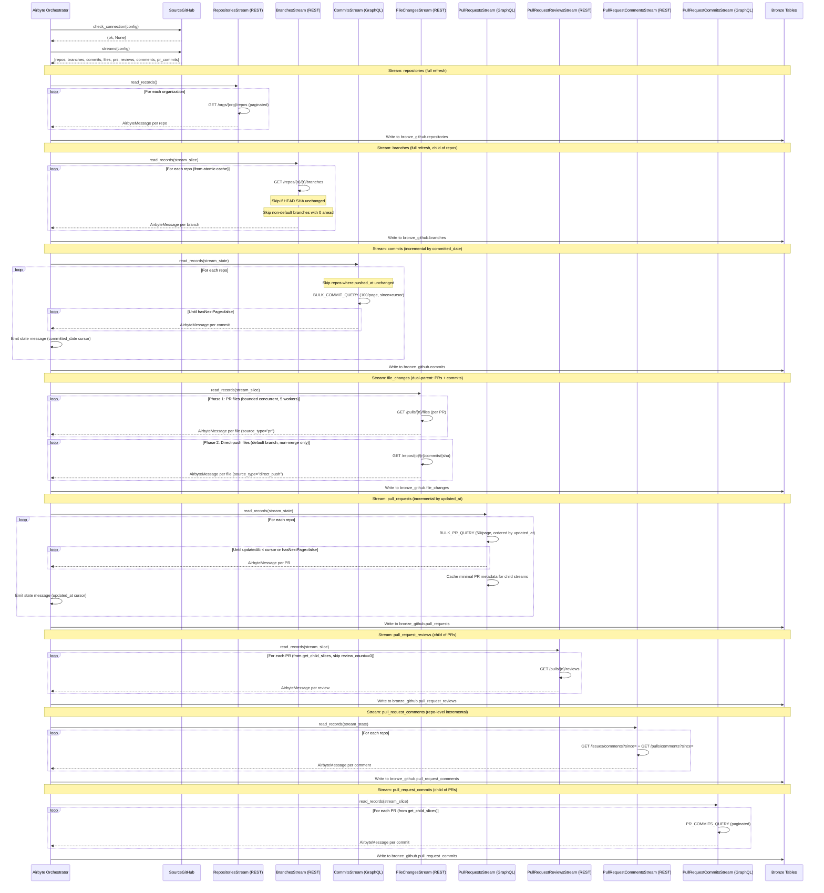
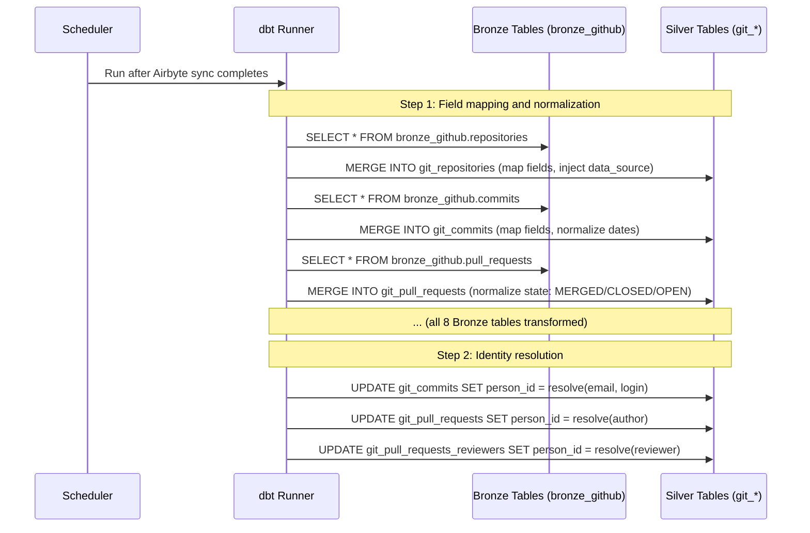
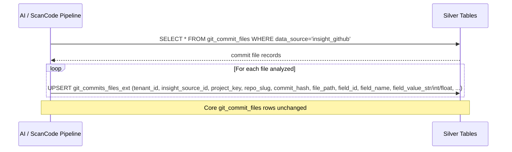

# DESIGN — GitHub Connector

> Version 2.0 — March 2026
> Based on: Unified git data model (`docs/components/connectors/git/README.md`), [PRD.md](./PRD.md)

<!-- toc -->

- [1. Architecture Overview](#1-architecture-overview)
  - [1.1 Architectural Vision](#11-architectural-vision)
  - [1.2 Architecture Drivers](#12-architecture-drivers)
  - [1.3 Architecture Layers](#13-architecture-layers)
- [2. Principles & Constraints](#2-principles--constraints)
  - [2.1 Design Principles](#21-design-principles)
  - [2.2 Constraints](#22-constraints)
- [3. Technical Architecture](#3-technical-architecture)
  - [3.1 Domain Model](#31-domain-model)
  - [3.2 Component Model](#32-component-model)
  - [3.3 API Contracts](#33-api-contracts)
  - [3.4 Internal Dependencies](#34-internal-dependencies)
  - [3.5 External Dependencies](#35-external-dependencies)
  - [3.6 Interactions & Sequences](#36-interactions--sequences)
  - [3.7 Database schemas & tables](#37-database-schemas--tables)
- [4. Additional context](#4-additional-context)
  - [API Details](#api-details)
  - [Field Mapping to Unified Schema](#field-mapping-to-unified-schema)
  - [Collection Strategy](#collection-strategy)
  - [Identity Resolution Details](#identity-resolution-details)
  - [GitHub-Specific Considerations](#github-specific-considerations)
- [5. Traceability](#5-traceability)
- [6. Non-Applicability Statements](#6-non-applicability-statements)

<!-- /toc -->

---

## 1. Architecture Overview

### 1.1 Architectural Vision

The GitHub connector is an Airbyte Python CDK source connector (`source_github/`) that collects version control data from GitHub organizations via REST API v3 and GraphQL API v4. It writes raw data to Bronze tables in ClickHouse via the Airbyte protocol. dbt models then transform Bronze data into Silver `git_*` tables that conform to the unified schema. Identity resolution is deferred to Silver Step 2.

The connector subclasses `AbstractSource` from the Airbyte CDK, exposing `check_connection()` and `streams()`. It provides 8 Airbyte streams, each either an `HttpStream` (REST) or a custom GraphQL stream subclass.

GraphQL is the preferred collection path for high-volume entities: the bulk commit query (100 commits/request) and bulk PR query (50 PRs/request) dramatically reduce API call counts and rate limit consumption compared to equivalent REST calls. REST v3 is used for repository discovery, branch enumeration, per-commit file stats, and PR reviews/comments.

Incremental collection state is managed by the Airbyte CDK for top-level streams (`commits` uses `committed_date` as cursor, `pull_requests` uses `updated_at` as cursor). Child streams use custom per-partition `_state` dicts (e.g., `synced_at` per PR, `seen` per commit). There is no separate state store or cursor manager component.

Fault tolerance is achieved through Airbyte CDK retry semantics, slice-level and page-level retry via the bounded concurrent executor, and continue-on-error semantics for non-fatal API errors. Repeated runs with the same state are idempotent.

### 1.2 Architecture Drivers

**PRD Reference**: [PRD.md](./PRD.md)

#### Functional Drivers

| Requirement | Design Response |
|-------------|-----------------|
| `cpt-insightspec-fr-gh-discover-repos` | `RepositoriesStream` (REST, full refresh) calls `GET /orgs/{org}/repos` (paginated); writes to `bronze_github.repositories` |
| `cpt-insightspec-fr-gh-collect-commits` | `CommitsStream` (GraphQL, incremental by `committed_date`) via `BULK_COMMIT_QUERY` at 100/page; writes to `bronze_github.commits` |
| `cpt-insightspec-fr-gh-collect-prs` | `PullRequestsStream` (GraphQL, incremental by `updated_at`) via `BULK_PR_QUERY` at 50/page; writes to `bronze_github.pull_requests` |
| `cpt-insightspec-fr-gh-collect-reviewers` | `PullRequestReviewsStream` (REST, child of PRs) calls `GET /pulls/{n}/reviews`; skips PRs with `review_count == 0`; writes to `bronze_github.pull_request_reviews` |
| `cpt-insightspec-fr-gh-collect-comments` | `PullRequestCommentsStream` (REST, repo-level incremental) calls `GET /issues/comments?since=` + `GET /pulls/comments?since=` (2 calls per repo instead of 2 per PR); writes to `bronze_github.pull_request_comments` |
| `cpt-insightspec-fr-gh-collect-repo-ext` | Repository extension metadata (stars, forks, watchers, etc.) is collected as part of the `RepositoriesStream` output; dbt transforms into `git_repositories_ext` EAV rows at Silver |
| `cpt-insightspec-fr-gh-history-depth` | `start_date` config parameter; passed as `since` to GraphQL commit queries on first full run |
| `cpt-insightspec-fr-gh-commit-files-ext` | `git_commits_files_ext` Silver table provisioned per README; populated by AI/ScanCode enrichment pipelines post-collection |
| `cpt-insightspec-fr-gh-identity-resolution` | Deferred to Silver Step 2 dbt models; the connector writes raw author/committer fields to Bronze |
| `cpt-insightspec-fr-gh-incremental-cursors` | Airbyte CDK manages cursor state for `commits` (`committed_date`) and `pull_requests` (`updated_at`); child streams use custom `_state` dicts |
| `cpt-insightspec-fr-gh-checkpoint` | Airbyte CDK handles state checkpointing natively via stream state messages |

#### NFR Allocation

| NFR ID | NFR Summary | Allocated To | Design Response | Verification Approach |
|--------|-------------|--------------|-----------------|----------------------|
| `cpt-insightspec-nfr-gh-auth` | Support PAT + GitHub App token | `clients/auth.py` | Header builders for REST and GraphQL; strategy pattern selects auth type based on config | Config validation test + integration test with each auth type |
| `cpt-insightspec-nfr-gh-rate-limiting` | Respect rate limits; backoff on 429 | `clients/rate_limiter.py` | Shared REST + GraphQL budget tracker with proactive backoff when remaining drops below `rate_limit_threshold` | Unit test retry logic; integration test with mock rate-limited server |
| `cpt-insightspec-nfr-gh-schema-compliance` | All data lands in Bronze then transforms to unified `git_*` Silver tables | Stream classes + dbt models | Connector writes to `bronze_github.*`; dbt transforms to `git_*` Silver tables; no GitHub-specific Silver tables | Schema diff test against `git/README.md` table definitions |
| `cpt-insightspec-nfr-gh-data-source` | `data_source = "insight_github"` on all rows | dbt Silver models | Injected by dbt during Bronze-to-Silver transformation | Row-level assertion in dbt tests |
| `cpt-insightspec-nfr-gh-idempotent` | Upsert semantics, no duplicates | Airbyte deduplication + dbt incremental models | Airbyte deduplicates on natural PKs; dbt incremental models use merge strategy | Run collection twice; verify row counts unchanged |

### 1.3 Architecture Layers

```text
+-----------------------------------------------------------------------+
|  Airbyte Orchestrator                                                  |
|  (triggers SourceGitHub via Airbyte protocol)                          |
+-------------------------------+---------------------------------------+
                                |
+-------------------------------v---------------------------------------+
|  SourceGitHub(AbstractSource)                                          |
|  +-- check_connection()                                                |
|  +-- streams() -> 8 stream instances                                   |
+----+----------+----------+----------+----------+----------+-----------+
     |          |          |          |          |          |
+----v----+ +---v----+ +--v-------+ +v-------+ +v---------+
|repos    | |branches| |commits   | |pull    | |pr_reviews|
|(REST    | |(REST   | |(GraphQL  | |requests| |(REST     |
| full    | | full   | | incr by  | |(GraphQL| | child    |
| refresh)| | refresh| | committed| | incr by| | of PRs)  |
|         | | child  | | _date)   | | updated| |          |
|         | | of     | |          | | _at)   | |          |
|         | | repos) | |          | |        | |          |
+---------+ +--------+ +----+-----+ +---+----+ +----------+
                             |           |
                             +-----+-----+------+
                                   |             |
                             +-----v-----+ +----v---+  +------v--------+
                             |file       | |pr_     |  |pr_commits     |
                             |_changes   | |comments|  |(GraphQL       |
                             |(REST      | |(REST   |  | child of PRs) |
                             | PR files +| | repo   |  |               |
                             | direct    | | incr)  |  |               |
                             | push)     | +--------+  +---------------+
                             +-----------+
     |
+----v-------------------------------------------------------------------+
|  Shared Infrastructure                                                  |
|  +-- clients/auth.py          (REST + GraphQL header builders)          |
|  +-- clients/rate_limiter.py  (shared budget tracker, proactive backoff)|
|  +-- clients/concurrent.py    (bounded parallel execution, retry)       |
|  +-- graphql/queries.py       (BULK_COMMIT_QUERY, BULK_PR_QUERY, etc.) |
|  +-- streams/base.py          (GitHubRestStream, GitHubGraphQLStream)   |
+----+-------------------------------------------------------------------+
     |
+----v-------------------------------------------------------------------+
|  Bronze Tables (bronze_github database in ClickHouse via Airbyte)       |
|  repositories, branches, commits, file_changes,                         |
|  pull_requests, pull_request_reviews, pull_request_comments,            |
|  pull_request_commits                                                   |
+----+-------------------------------------------------------------------+
     | dbt transforms
+----v-------------------------------------------------------------------+
|  Silver Tables (unified git_* schema)                                   |
|  git_repositories, git_repository_branches, git_commits,                |
|  git_commit_files, git_commits_files_ext,                               |
|  git_pull_requests, git_pull_requests_reviewers,                        |
|  git_pull_requests_comments, git_pull_requests_commits,                 |
|  git_tickets, git_repositories_ext                                      |
+------------------------------------------------------------------------+
     | dbt / analytics
+----v-------------------------------------------------------------------+
|  Gold Tables (cross-platform analytics, cycle time, review metrics)     |
+------------------------------------------------------------------------+
```

| Layer | Responsibility | Technology |
|-------|---------------|------------|
| Orchestration | Trigger connector, manage state, emit records | Airbyte CDK / Airbyte platform |
| Collection | REST/GraphQL pagination, rate limiting, concurrent fetching | `SourceGitHub`, 8 stream classes, `clients/*` |
| Bronze Storage | Raw API responses, 1:1 with API entities | ClickHouse `bronze_github` database (written by Airbyte) |
| Silver Transformation | Bronze-to-Silver mapping, identity resolution, normalization | dbt models |
| Silver Storage | Unified `git_*` schema, upsert semantics | ClickHouse (or configured target DB) |
| Gold Analytics | Cycle time, review metrics, cross-platform joins | dbt models / analytics layer |

---

## 2. Principles & Constraints

### 2.1 Design Principles

#### Unified Schema First

- [ ] `p1` - **ID**: `cpt-insightspec-principle-gh-unified-schema`

All GitHub data ultimately maps to the existing `git_*` Silver tables via dbt; no new GitHub-specific Silver tables are introduced. The `data_source` discriminator enables source-specific filtering without schema proliferation. Bronze tables in `bronze_github` are connector-specific but are an implementation detail of the Airbyte ingestion layer.

#### GraphQL-First Collection

- [ ] `p1` - **ID**: `cpt-insightspec-principle-gh-graphql-first`

GraphQL is the preferred API for bulk collection of commits and PRs. REST v3 is used only where GraphQL coverage is insufficient (repository discovery, branch enumeration, per-commit file stats, PR reviews, and repo-level comments). This principle drives a significant reduction in API calls for commit and PR collection compared to a REST-only approach.

#### Incremental by Default

- [ ] `p2` - **ID**: `cpt-insightspec-principle-gh-incremental`

Every collection run is incremental by default. Full collection is the degenerate case of an incremental run with no prior cursor state. The Airbyte CDK manages cursor state for top-level incremental streams; child streams maintain custom per-partition `_state` dicts. There is no separate state database.

#### Fault Tolerance Over Completeness

- [ ] `p2` - **ID**: `cpt-insightspec-principle-gh-fault-tolerance`

A partial collection run that completes successfully for most repositories is preferable to a run that halts on first error. Non-fatal errors (404, malformed data) are logged and skipped. Fatal errors (401, 403) halt the run immediately. The bounded concurrent executor provides slice-level and page-level retry with adaptive concurrency that reduces workers on repeated failures.

#### Bronze-Silver-Gold Layering

- [ ] `p2` - **ID**: `cpt-insightspec-principle-gh-layering`

The connector writes raw data to Bronze tables only. dbt models handle all transformation to Silver schema (field mapping, state normalization, identity resolution). Gold-layer analytics (cycle time, review metrics) are built on Silver tables by downstream dbt models. This separation keeps the connector simple and testable.

### 2.2 Constraints

#### GitHub.com REST API v3 / GraphQL API v4 Only

- [ ] `p1` - **ID**: `cpt-insightspec-constraint-gh-api-version`

The connector targets the GitHub.com public API (`api.github.com`). GitHub Enterprise Server with non-standard base URLs is explicitly out of scope in this version. The connector MUST NOT assume GHES-specific endpoint patterns.

#### No GitHub-Specific Silver Tables

- [ ] `p1` - **ID**: `cpt-insightspec-constraint-gh-no-silver-tables`

All analytics data lives in the shared `git_*` Silver schema. Bronze tables in `bronze_github` are connector-specific but are not exposed to analytics consumers. This constraint ensures cross-platform Gold-layer queries require no source-specific table joins.

`git_pull_requests_ext` cycle-time and review-metric properties are computed by the Gold-layer analytics pipeline, not this connector. `git_commits_ext` is populated by separate AI/analysis pipelines post-collection.

#### Rate Limit Budget

- [ ] `p1` - **ID**: `cpt-insightspec-constraint-gh-rate-limit`

The connector MUST operate within the GitHub API rate limit budget (5,000 REST requests/hour, 5,000 GraphQL points/hour). The GraphQL-first collection strategy is the primary mechanism for staying within this budget. The shared `rate_limiter.py` budget tracker enforces proactive backoff when remaining capacity drops below a configurable threshold (default 200).

#### Airbyte CDK Compatibility

- [ ] `p1` - **ID**: `cpt-insightspec-constraint-gh-airbyte-cdk`

The connector MUST conform to the Airbyte Python CDK contract: subclass `AbstractSource`, implement `check_connection()` and `streams()`, emit `AirbyteMessage` records. All stream classes must subclass `HttpStream` or equivalent CDK base classes. State management must use CDK-native state mechanisms for top-level incremental streams.

---

## 3. Technical Architecture

### 3.1 Domain Model

**Technology**: Python classes (Airbyte CDK stream subclasses)

**Core Entities (as Airbyte streams)**:

| Stream Class | API Source | Sync Mode | Parent | Maps To (Bronze) |
|-------------|-----------|-----------|--------|-------------------|
| `RepositoriesStream` | REST `GET /orgs/{org}/repos` | Full refresh | - | `bronze_github.repositories` |
| `BranchesStream` | REST `GET /repos/{o}/{r}/branches` | Full refresh | `RepositoriesStream` | `bronze_github.branches` |
| `CommitsStream` | GraphQL `BULK_COMMIT_QUERY` (100/page) | Incremental (`committed_date`) | - | `bronze_github.commits` |
| `FileChangesStream` | REST `GET /pulls/{n}/files` + `GET /repos/{o}/{r}/commits/{sha}` | Per-partition incremental (`synced_at` per PR, `seen` per commit) | `PullRequestsStream` (PR files), `CommitsStream` (direct-push files) | `bronze_github.file_changes` |
| `PullRequestsStream` | GraphQL `BULK_PR_QUERY` (50/page) | Incremental (`updated_at`) | - | `bronze_github.pull_requests` |
| `PullRequestReviewsStream` | REST `GET /pulls/{n}/reviews` | Full refresh | `PullRequestsStream` | `bronze_github.pull_request_reviews` |
| `PullRequestCommentsStream` | REST `GET /issues/comments?since=` + `GET /pulls/comments?since=` | Repo-level incremental | `PullRequestsStream` (repo discovery + PR membership filtering) | `bronze_github.pull_request_comments` |
| `PullRequestCommitsStream` | GraphQL `PR_COMMITS_QUERY` (paginated) | Full refresh | `PullRequestsStream` | `bronze_github.pull_request_commits` |

**Relationships**:
- `RepositoriesStream` 1:N -> `BranchesStream` (child stream, repos provide slices)
- `PullRequestsStream` 1:N -> `FileChangesStream` (PR file changes; PRs provide slices)
- `CommitsStream` 1:N -> `FileChangesStream` (direct-push file changes; default branch non-merge commits provide slices)
- `PullRequestsStream` 1:N -> `PullRequestReviewsStream`, `PullRequestCommitsStream` (child streams, PRs provide slices via `get_child_slices()`)
- `PullRequestsStream` 1:N -> `PullRequestCommentsStream` (repo-level incremental, but uses PRs parent for repo discovery and PR membership filtering via `get_child_slices()`)
- Repositories and branches use in-memory atomic cache for child stream reuse

### 3.2 Component Model

#### SourceGitHub (Entry Point)

- [ ] `p1` - **ID**: `cpt-insightspec-component-gh-source`

##### Why this component exists

Entry point for the Airbyte connector. Subclasses `AbstractSource` from the Airbyte Python CDK. Provides connection checking and stream instantiation.

##### Responsibility scope

- `check_connection(logger, config)` — validates token and organization access against the GitHub API.
- `streams(config)` — returns the list of 8 configured stream instances.
- Parses `spec.json` configuration and passes it to stream constructors.

##### Responsibility boundaries

- Does NOT implement API calls, pagination, or data transformation (delegated to stream classes and shared clients).
- Does NOT manage state (delegated to Airbyte CDK and per-stream `_state` dicts).

##### Related components (by ID)

- `cpt-insightspec-component-gh-auth` — provides auth headers for connection check
- `cpt-insightspec-component-gh-stream-bases` — base classes for REST and GraphQL streams

---

#### clients/auth.py (Authentication)

- [ ] `p2` - **ID**: `cpt-insightspec-component-gh-auth`

##### Why this component exists

Provides header builders for both REST and GraphQL API calls, abstracting authentication strategy from stream logic.

##### Responsibility scope

- Builds `Authorization: Bearer {token}` headers for REST calls.
- Builds GraphQL-specific headers including `Accept: application/vnd.github.v4+json`.
- Supports PAT tokens (GitHub App installation tokens are treated identically at the HTTP header level).

##### Responsibility boundaries

- Does NOT store or manage tokens (config provides token value).
- Does NOT implement retry or rate limiting.

---

#### clients/rate_limiter.py (Rate Limiting)

- [ ] `p2` - **ID**: `cpt-insightspec-component-gh-rate-limiter`

##### Why this component exists

Shared budget tracker for both REST and GraphQL API calls. Prevents rate limit exhaustion by proactively backing off before limits are hit.

##### Responsibility scope

- `throttle(api_type)` — enforces minimum interval between requests per API type.
- `update_rest(remaining, reset_at)` / `update_graphql(remaining, reset_at_iso)` — updates budget from response headers/body.
- `wait_if_needed(api_type)` — proactive backoff when remaining drops below configurable `rate_limit_threshold` (default 200). Computes wait from `X-RateLimit-Reset` (REST) or `rateLimit.resetAt` (GraphQL).
- `on_secondary_limit()` — triggers 60-second cooldown after 502/503 responses.

##### Responsibility boundaries

- Does NOT execute HTTP requests (called by stream classes to check/update budget).
- Does NOT implement retry logic (that is in `clients/concurrent.py` and stream base classes).

---

#### clients/concurrent.py (Concurrent Execution)

- [ ] `p2` - **ID**: `cpt-insightspec-component-gh-concurrent`

##### Why this component exists

Bounded in-flight parallel executor for child stream fetches. Provides slice-level and page-level retry with adaptive concurrency.

##### Responsibility scope

- `fetch_parallel_with_slices(fn, slices, max_workers)` — bounded thread pool executor; submits up to `max_workers` slices initially, replenishes as each completes. Yields `SliceResult(slice, records, error)` for consumer error handling.
- `retry_request(fn, context)` — page-level retry with jittered exponential backoff; raises immediately on auth/404 errors, retries on transient/rate-limit errors.
- Adaptive concurrency: reduces worker count after 3 consecutive errors to avoid cascading rate limit exhaustion.

##### Responsibility boundaries

- Does NOT implement API calls (delegates to stream `read_records()`).
- Does NOT manage state (streams manage their own `_state`).

---

#### graphql/queries.py (GraphQL Queries)

- [ ] `p2` - **ID**: `cpt-insightspec-component-gh-queries`

##### Why this component exists

Centralizes all GraphQL query strings used by the connector, ensuring consistent field selection and variable definitions.

##### Responsibility scope

- `BULK_COMMIT_QUERY` — fetches 100 commits per page with author, committer, stats, and parent info.
- `BULK_PR_QUERY` — fetches 50 PRs per page with nested review count and comment count.
- `PR_COMMITS_QUERY` — fetches commits for a specific PR (paginated).
- `REPO_METADATA_QUERY` — fetches rich repository metadata (stars, forks, language, etc.).

##### Responsibility boundaries

- Contains only query string constants. Does NOT execute queries or parse responses.

---

#### streams/base.py (Stream Base Classes)

- [ ] `p2` - **ID**: `cpt-insightspec-component-gh-stream-bases`

##### Why this component exists

Provides `GitHubRestStream` and `GitHubGraphQLStream` base classes that extend the Airbyte CDK `HttpStream` with GitHub-specific concerns: response envelope unwrapping, error classification, rate limit header parsing, and auth header injection.

##### Responsibility scope

- `GitHubRestStream` — base for all REST streams; handles Link header pagination, REST error classification, `Accept: application/vnd.github.v3+json` header.
- `GitHubGraphQLStream` — base for all GraphQL streams; handles `pageInfo` cursor pagination, GraphQL error classification, `rateLimit` response parsing.
- Both base classes integrate with `clients/auth.py` for header injection and `clients/rate_limiter.py` for budget tracking.

##### Responsibility boundaries

- Does NOT define stream-specific logic (URL paths, record transformation, cursor fields).
- Does NOT implement concurrent execution (delegated to `clients/concurrent.py`).

---

### 3.3 API Contracts

- [ ] `p2` - **ID**: `cpt-insightspec-interface-gh-connector-api`

**Technology**: Airbyte Python CDK / `spec.json`

**Entry Point**:

```python
class SourceGitHub(AbstractSource):
    def check_connection(self, logger, config) -> Tuple[bool, Optional[str]]: ...
    def streams(self, config) -> List[Stream]: ...
```

**Configuration schema** (`spec.json`):

| Field | Type | Description |
|-------|------|-------------|
| `tenant_id` | str | Tenant identifier |
| `source_instance_id` | str | Source instance identifier (e.g., `github-acme-prod`) |
| `token` | str | PAT value or GitHub App installation token |
| `organizations` | list[str] | Organization logins to collect |
| `start_date` | Optional[str] | ISO date; limits first full run to commits on or after this date (default None = no limit) |
| `page_size_graphql_commits` | int | GraphQL commit batch size (default 100) |
| `page_size_graphql_prs` | int | GraphQL PR batch size (default 50) |
| `rate_limit_threshold` | int | Proactive backoff when remaining < this (default 200) |
| `skip_archived` | bool | Skip archived repositories (default true) |
| `skip_forks` | bool | Skip forked repositories (default true) |
| `max_workers` | int | Bounded concurrent child fetch workers (default 5) |

---

### 3.4 Internal Dependencies

| Dependency Module | Interface Used | Purpose |
|-------------------|----------------|---------|
| `clients/auth.py` | `rest_headers()`, `graphql_headers()` | Auth header construction |
| `clients/rate_limiter.py` | `update_rest()`, `update_graphql()`, `wait_if_needed()`, `throttle()` | Rate limit budget tracking |
| `clients/concurrent.py` | `fetch_parallel_with_slices()`, `retry_request()` | Bounded parallel child fetches |
| `graphql/queries.py` | Query string constants | GraphQL query definitions |
| `streams/base.py` | `GitHubRestStream`, `GitHubGraphQLStream` | Stream base classes |

**Dependency Rules**:
- No circular dependencies between modules.
- `SourceGitHub` instantiates streams; streams use shared clients.
- All inter-component communication is in-process via direct method calls.
- Airbyte CDK manages the record emission and state persistence lifecycle.

---

### 3.5 External Dependencies

#### GitHub REST API v3

| Aspect | Value |
|--------|-------|
| Base URL | `https://api.github.com` |
| Auth | `Authorization: Bearer {token}` + `Accept: application/vnd.github.v3+json` |
| Pagination | `Link: rel="next"` header (cursor-based URL) |
| Rate limiting | 5,000 requests/hour (authenticated), `X-RateLimit-Reset` header |

#### GitHub GraphQL API v4

| Aspect | Value |
|--------|-------|
| Endpoint | `https://api.github.com/graphql` |
| Auth | `Authorization: Bearer {token}` + `Accept: application/vnd.github.v4+json` |
| Pagination | `pageInfo.hasNextPage` + `pageInfo.endCursor` |
| Rate limiting | 5,000 points/hour; remaining reported in `rateLimit { remaining, resetAt }` |

#### Airbyte Platform

| Aspect | Value |
|--------|-------|
| Interface | Airbyte Python CDK (`AbstractSource`, `HttpStream`, `AirbyteMessage`) |
| State management | CDK-native stream state for incremental streams |
| Destination | ClickHouse via Airbyte destination connector |
| Record format | JSON records emitted as `AirbyteMessage` |

#### dbt (Bronze-to-Silver Transformation)

| Aspect | Value |
|--------|-------|
| Interface | SQL models reading from `bronze_github.*` tables |
| Output | Unified `git_*` Silver tables |
| Identity resolution | Silver Step 2 models resolve author/committer identities |
| Scheduling | Runs after Airbyte sync completes |

#### Unified Silver Tables

| Aspect | Value |
|--------|-------|
| Schema | Defined in `docs/components/connectors/git/README.md` |
| Write pattern | dbt incremental models with merge strategy |
| `data_source` | Always `"insight_github"` (injected by dbt) |

---

### 3.6 Interactions & Sequences

#### Full Collection Run (Airbyte Sync)

**ID**: `cpt-insightspec-seq-gh-full-run`

**Use cases**: `cpt-insightspec-usecase-gh-initial-collection`

**Actors**: `cpt-insightspec-actor-gh-platform-engineer`, `cpt-insightspec-actor-gh-scheduler`



---

#### Bronze-to-Silver Transformation (dbt)

**ID**: `cpt-insightspec-seq-gh-dbt-transform`



---

#### Enrichment Pipeline Writes Per-File Results

**ID**: `cpt-insightspec-seq-gh-enrichment`

**Use cases**: `cpt-insightspec-usecase-gh-file-enrichment`

**Actors**: `cpt-insightspec-actor-gh-ai-pipeline`, `cpt-insightspec-actor-gh-scancode-pipeline`



---

### 3.7 Database schemas & tables

- [ ] `p2` - **ID**: `cpt-insightspec-db-gh-bronze`

#### Bronze Tables (bronze_github database)

The Airbyte destination writes 8 Bronze tables, one per stream. Each table stores raw API response data with Airbyte metadata columns (`_airbyte_raw_id`, `_airbyte_extracted_at`, `_airbyte_meta`). Column schemas mirror the API response fields.

| Bronze Table | Source Stream | Key Fields |
|-------------|-------------|------------|
| `repositories` | `RepositoriesStream` | org, repo name, metadata (stars, forks, language, etc.) |
| `branches` | `BranchesStream` | org, repo, branch name, HEAD SHA |
| `commits` | `CommitsStream` | org, repo, commit SHA, author, committer, stats, committed_date |
| `file_changes` | `FileChangesStream` | org, repo, file path, additions, deletions, status, source_type (`"pr"` / `"direct_push"`), pr_number (nullable) |
| `pull_requests` | `PullRequestsStream` | org, repo, PR number, title, state, author, dates, stats |
| `pull_request_reviews` | `PullRequestReviewsStream` | org, repo, PR number, reviewer, state, submitted_at |
| `pull_request_comments` | `PullRequestCommentsStream` | org, repo, comment ID, body, author, created_at |
| `pull_request_commits` | `PullRequestCommitsStream` | org, repo, PR number, commit SHA |

Bronze tables are not directly queried by analytics. dbt transforms them into Silver tables.

---

#### Enrichment Table: `git_commits_files_ext`

**Schema reference**: `docs/components/connectors/git/README.md` -> `git_commits_files_ext`

This table is defined in the unified git schema (`docs/components/connectors/git/README.md`), not in this connector's scope. The GitHub connector provides the anchor rows in `git_commit_files` (via Bronze -> Silver dbt) that enrichment pipelines join against. The `git_commits_files_ext` table itself is populated by AI detection and ScanCode pipelines, which are separate systems.

See the unified git schema for the full table definition, indexes, and enrichment query examples.

---

## 4. Additional context

### API Details

**Base URL**: `https://api.github.com`

**GraphQL Endpoint**: `https://api.github.com/graphql`

**Authentication**:

```http
Authorization: Bearer {token}
Accept: application/vnd.github.v3+json        (REST)
Accept: application/vnd.github.v4+json        (GraphQL)
User-Agent: insight-github-connector/1.0
```

**Required PAT Scopes**: `repo`, `read:org`, `read:user`

**GitHub App Permissions**: Repositories: Read-only, Pull Requests: Read-only, Issues: Read-only, Metadata: Read-only

**Key REST Endpoints**:

| Endpoint | Method | Used By Stream | Purpose |
|----------|--------|---------------|---------|
| `/orgs/{org}/repos` | GET | `RepositoriesStream` | List organization repositories |
| `/repos/{owner}/{repo}/branches` | GET | `BranchesStream` | List branches |
| `/repos/{owner}/{repo}/commits/{sha}` | GET | `FileChangesStream` | Get direct-push file-level stats |
| `/repos/{owner}/{repo}/pulls/{number}/files` | GET | `FileChangesStream` | Get PR file changes |
| `/pulls/{number}/reviews` | GET | `PullRequestReviewsStream` | Get PR reviews |
| `/issues/comments?since=` | GET | `PullRequestCommentsStream` | Get issue comments (repo-level incremental) |
| `/pulls/comments?since=` | GET | `PullRequestCommentsStream` | Get review comments (repo-level incremental) |

**REST Pagination**: `Link: <url>; rel="next"` header chain

**Key GraphQL Queries** (defined in `graphql/queries.py`):

| Query | Batch Size | Used By Stream | Purpose |
|-------|-----------|---------------|---------|
| `BULK_COMMIT_QUERY` | 100 commits/req | `CommitsStream` | Commit history with aggregate stats |
| `BULK_PR_QUERY` | 50 PRs/req | `PullRequestsStream` | PRs with nested review count and comment count |
| `PR_COMMITS_QUERY` | paginated | `PullRequestCommitsStream` | Commits for a specific PR |
| `REPO_METADATA_QUERY` | 1 repo/req | `RepositoriesStream` | Rich repo metadata (stars, forks, language) |

**Rate Limits**:

| API | Limit | Reset | Header |
|-----|-------|-------|--------|
| REST v3 | 5,000 req/hr | `X-RateLimit-Reset` (Unix epoch) | `X-RateLimit-Remaining` |
| GraphQL v4 | 5,000 pts/hr | `rateLimit.resetAt` in response | `rateLimit.remaining` |

---

### Field Mapping to Unified Schema

Field mapping from Bronze to Silver is performed by dbt models, not by the connector. The connector writes raw API responses to Bronze tables. The following describes the Silver schema targets that dbt produces.

**Bronze `repositories`** -> Silver `git_repositories`:
- `project_key` from org login
- `repo_slug` from repo name
- `is_private`, `created_on`, `updated_on`, `size`, `language` mapped from API fields
- `data_source = 'insight_github'` injected by dbt

**Bronze `commits`** -> Silver `git_commits`:
- `commit_hash` from `oid` (GraphQL) or `sha` (REST)
- `author_name`, `author_email`, `author_login` from commit author fields
- `date` from `committedDate`
- `files_changed`, `lines_added`, `lines_removed` from aggregate stats
- `is_merge_commit` derived from parent count

**Bronze `file_changes`** -> Silver `git_commit_files`:
- `file_path`, `file_extension`, `change_type`, `lines_added`, `lines_removed` mapped from REST response
- `source_type` discriminator (`"pr"` / `"direct_push"`) enables filtering by change origin
- PR files carry `pr_number` and `pr_database_id`; direct-push files have these as NULL

**Bronze `pull_requests`** -> Silver `git_pull_requests`:
- `pr_id` from `databaseId`, `pr_number` from `number`
- `state` normalized: `merged=True` -> `'MERGED'`, `state='CLOSED'` -> `'CLOSED'`, otherwise `'OPEN'`
- `source_branch` from `headRefName`, `destination_branch` from `baseRefName`
- `isDraft` stored in `metadata`; surfaced via `git_pull_requests_ext` if needed

**Bronze `pull_request_reviews`** -> Silver `git_pull_requests_reviewers`:
- Review states: `APPROVED`, `CHANGES_REQUESTED`, `COMMENTED`, `DISMISSED`
- Reviews with `state = 'PENDING'` are skipped (draft reviews not yet formally submitted)

**Bronze `pull_request_comments`** -> Silver `git_pull_requests_comments`:
- Issue comments and review comments combined at repo level
- `inline` flag distinguishes review thread comments from general PR comments

**Bronze `pull_request_commits`** -> Silver `git_pull_requests_commits`:
- Junction rows linking PRs to their constituent commits

**Email privacy**: Commits with no-reply addresses (`{id}+{login}@users.noreply.github.com`) are handled by Silver Step 2 identity resolution models, which detect the no-reply pattern and resolve via login fallback.

---

### Collection Strategy

**Performance optimizations in the connector**:

1. **Repo freshness gate**: Skip repos where `pushed_at` is unchanged since last sync.
2. **Skip archived/fork repos**: Configurable via `skip_archived` (default true) and `skip_forks` (default true).
3. **Branch HEAD SHA tracking**: Skip branches where HEAD SHA is unchanged.
4. **Branch compare**: Skip non-default branches with 0 commits ahead of default branch.
5. **Repo-level incremental comments**: 2 REST calls per repo (`/issues/comments?since=` + `/pulls/comments?since=`) instead of 2 per PR.
6. **Review pruning**: Skip PRs with `review_count == 0` when fetching reviews.
7. **Bounded concurrent child fetches**: 5 workers default (configurable via `max_workers`).
8. **Adaptive concurrency**: Reduces workers on repeated failures.
9. **Minimal child slice metadata**: `PullRequestsStream.get_child_slices()` provides ~100 bytes/PR to child streams.

**Incremental collection**:

- `CommitsStream`: Airbyte CDK manages `committed_date` cursor. GraphQL `BULK_COMMIT_QUERY` uses `since=cursor_date`.
- `PullRequestsStream`: Airbyte CDK manages `updated_at` cursor. GraphQL `BULK_PR_QUERY` ordered by `UPDATED_AT DESC`; early exit when `updatedAt < cursor`.
- `PullRequestCommentsStream`: Custom repo-level `since` parameter for both `/issues/comments` and `/pulls/comments`.
- Child streams (`FileChangesStream`, `PullRequestReviewsStream`, `PullRequestCommitsStream`): use custom per-partition `_state` dicts (`synced_at` per PR, `seen` per commit).

**Error handling**:

| HTTP Status | Response |
|-------------|----------|
| 401, 403 | Halt, raise `AirbyteTracedException` |
| 404 | Skip item, log warning, continue |
| 429 | `rate_limiter.py` inspects reset header; sleep until reset; retry |
| 5xx | Slice-level or page-level retry via `concurrent.py` (configurable max retries) |
| Malformed data | Skip item, log raw response, continue |

**Fault tolerance**: Airbyte CDK checkpoints state after each stream state message. On restart, incremental streams resume from last checkpoint. Child streams use per-partition `_state` to avoid re-fetching already-processed items.

---

### Identity Resolution Details

Identity resolution is deferred to Silver Step 2 dbt models. The connector writes raw author/committer fields (email, login, name) to Bronze tables without resolution.

At Silver Step 2:
- **Priority**: email (normalized lowercase, if not no-reply) -> `login` with `source_label = "github"` -> numeric `databaseId`
- **No-reply detection**: Pattern `^[0-9]+\+[^@]+@users\.noreply\.github\.com$` triggers immediate fallback to `login`. The numeric prefix is the GitHub user database ID, which can be passed as a fallback key.
- **Cross-source**: The identity resolution models resolve to a single `person_id` regardless of platform, using email as the primary join key across GitHub, Bitbucket, and GitLab.

---

### GitHub-Specific Considerations

**NULL fields** for GitHub: `git_pull_requests.task_count` is always NULL (Bitbucket-specific concept).

**Rich repository metadata**: Unlike Bitbucket Server, GitHub provides `created_on`, `updated_on`, `size`, `language`, `has_issues`, `has_wiki`, `full_name` -- all populated in `git_repositories` via dbt from Bronze.

**Review model differences**:

| Feature | GitHub | Bitbucket |
|---------|--------|-----------|
| Review states | `APPROVED`, `CHANGES_REQUESTED`, `COMMENTED`, `DISMISSED` | `APPROVED`, `UNAPPROVED` |
| Draft PRs | Supported (`isDraft`) | Not supported |
| Comment severity | Not supported | `NORMAL`, `BLOCKER` |

**Draft PRs**: The `isDraft` field is stored in `metadata` on `git_pull_requests`. Analytics requiring draft-aware filtering can extract this via JSON path or via a `git_pull_requests_ext` property.

**GraphQL commit coverage**: The bulk commit GraphQL query provides aggregate stats (`additions`, `deletions`, `changedFiles`) but does NOT provide per-file breakdowns in bulk. Per-file stats require a separate REST call per commit via `FileChangesStream` (direct-push path). For large repositories, consider accepting aggregate-only stats to reduce REST call volume (see OQ-GH-2 in PRD).

---

## 5. Traceability

- **PRD**: [PRD.md](./PRD.md)
- **Unified git schema**: [`docs/components/connectors/git/README.md`](../README.md)
- **Legacy GitHub spec**: [`docs/components/connectors/git/github/github.md`](../github.md)
- **Connectors architecture**: [`docs/architecture/CONNECTORS_ARCHITECTURE.md`](../../../../architecture/CONNECTORS_ARCHITECTURE.md)

---

## 6. Non-Applicability Statements

The following DESIGN checklist domains are intentionally omitted from this document. Each entry explains why.

| Domain | Disposition | Reason |
|--------|-------------|--------|
| PERF-DESIGN-002 -- Scalability Architecture | Not applicable | This is a scheduled batch pull job running as an Airbyte source connector. Horizontal/vertical scaling is owned by the Airbyte infrastructure, not the connector design. |
| SEC-DESIGN-003 -- Data Protection (tokens at rest) | Deferred to deployment | Token storage, credential encryption, and Bronze/Silver table data-at-rest encryption are controlled by the deployment platform (secret management system, DB encryption at rest). Not in connector scope. |
| SEC-DESIGN-005 -- Threat Modeling | Not applicable | Internal tool collecting code metadata from an organization's own repositories. Formal threat model deferred to the platform security team. |
| REL-DESIGN-004 -- Recovery Architecture | Not applicable | The connector owns no persistent state beyond Airbyte-managed stream state. Bronze/Silver table backup and restore are owned by the DB platform team. Connector-level recovery = Airbyte re-sync from cursor. |
| DATA-DESIGN-003 -- Data Governance | Not applicable | Data lineage, catalog integration, and master data management are owned by the Gold-layer platform team, not individual connectors. |
| INT-DESIGN-003 -- Event Architecture | Not applicable | Pull-only batch connector. No event bus, message broker, or pub/sub integration. |
| INT-DESIGN-004 -- API Versioning/Evolution | Not applicable | The connector targets a single stable external API (GitHub REST v3 / GraphQL v4). Internal API versioning is not applicable; GitHub API deprecation handling is a future operational concern. |
| OPS-DESIGN-001 -- Deployment Architecture | Not applicable | Deployment topology, container strategy, and environment promotion are owned by the Airbyte platform infrastructure team. |
| OPS-DESIGN-002 -- Observability Architecture | Not applicable | Logging aggregation, distributed tracing, and alerting are owned by the platform infrastructure team. The connector emits structured logs via the Airbyte CDK logger; platform handles aggregation. |
| OPS-DESIGN-003 -- Infrastructure as Code | Not applicable | IaC is owned by the platform infrastructure team. |
| OPS-DESIGN-004 -- SLO / Observability Targets | Not applicable | SLIs/SLOs are defined at the platform level. Connector-level targets are expressed as PRD SMART goals (S1.3 of PRD.md). |
| MAINT-DESIGN-002 -- Technical Debt | Not applicable | New design; no known technical debt at time of writing. |
| MAINT-DESIGN-003 -- Documentation Strategy | Not applicable | Documentation strategy is owned by the platform-level PRD and engineering wiki. |
| TEST-DESIGN-002 -- Testing Strategy | Deferred to DECOMPOSITION | Unit, integration, and E2E test approach will be documented in the DECOMPOSITION artifact when implementation is planned. |
| COMPL-DESIGN-001 -- Compliance Architecture | Deferred to platform | The connector collects author/committer emails, logins, names, and comment content, which constitute PII. Compliance controls (access control, retention policies, audit logging) are enforced at the platform level: Bronze/Silver table access is governed by the data governance layer, and data retention is owned by the platform-level policy (see PRD Assumptions). The connector itself does not implement compliance controls beyond passing data through. |
| COMPL-DESIGN-002 -- Privacy Architecture | Deferred to platform | The connector ingests PII (email addresses, usernames, display names) into Bronze tables. Privacy controls are handled downstream: Silver Step 2 dbt models handle email privacy (no-reply address detection, login fallback), and the platform data governance layer enforces access restrictions, masking, and retention policies on Bronze/Silver tables. The connector is a data processor, not a data controller. |
| UX-DESIGN-001 -- User-Facing Architecture | Not applicable | Airbyte source connector with spec.json configuration. No end-user UX or accessibility requirements. |
| ARCH-DESIGN-010 -- Capacity and Cost Budgets | Not applicable | Capacity planning and cost estimation are owned by the platform-level PRD. Connector resource consumption is bounded by GitHub API rate limits (5,000 req/hr), which are documented in S2.2 and S3.5. |
