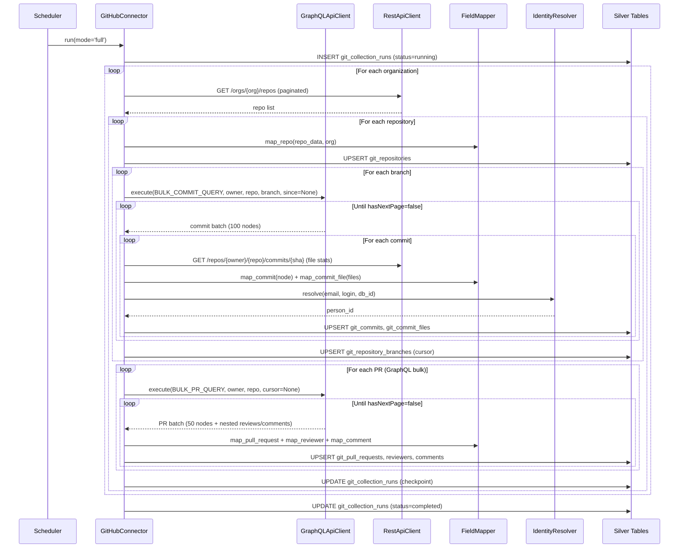
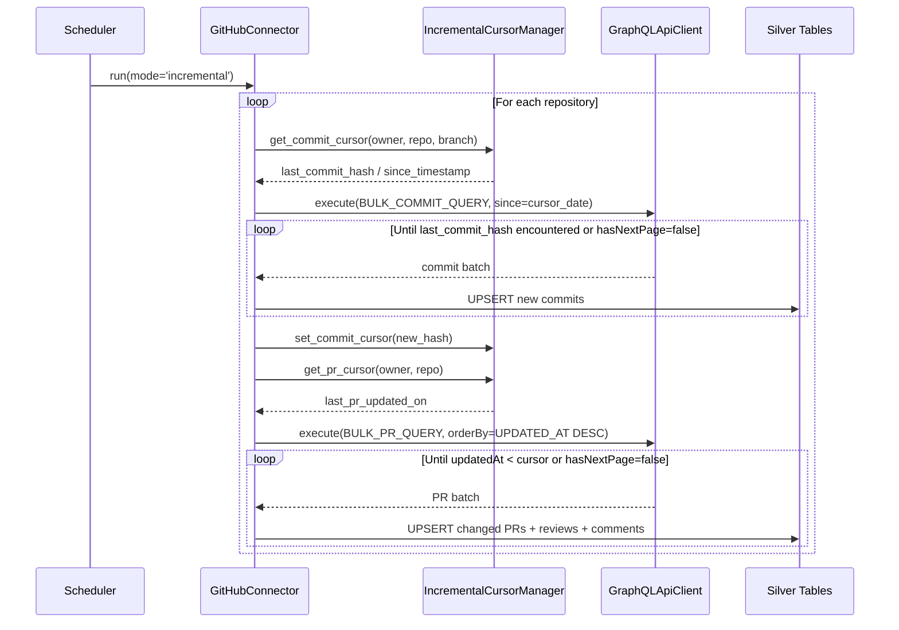
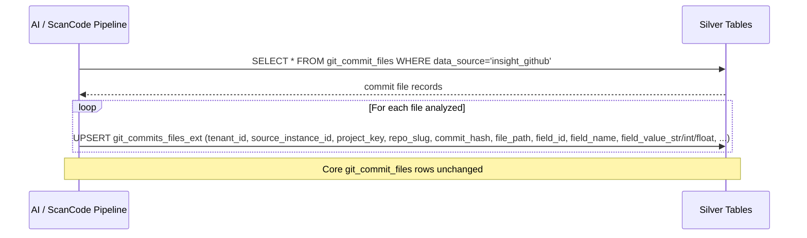

# DESIGN — GitHub Connector

> Version 1.0 — March 2026
> Based on: Unified git data model (`docs/components/connectors/git/README.md`), [PRD.md](./PRD.md)

<!-- toc -->

- [1. Architecture Overview](#1-architecture-overview)
  - [1.1 Architectural Vision](#11-architectural-vision)
  - [1.2 Architecture Drivers](#12-architecture-drivers)
  - [1.3 Architecture Layers](#13-architecture-layers)
- [2. Principles & Constraints](#2-principles--constraints)
  - [2.1 Design Principles](#21-design-principles)
  - [2.2 Constraints](#22-constraints)
- [3. Technical Architecture](#3-technical-architecture)
  - [3.1 Domain Model](#31-domain-model)
  - [3.2 Component Model](#32-component-model)
  - [3.3 API Contracts](#33-api-contracts)
  - [3.4 Internal Dependencies](#34-internal-dependencies)
  - [3.5 External Dependencies](#35-external-dependencies)
  - [3.6 Interactions & Sequences](#36-interactions--sequences)
  - [3.7 Database schemas & tables](#37-database-schemas--tables)
- [4. Additional context](#4-additional-context)
  - [API Details](#api-details)
  - [Field Mapping to Unified Schema](#field-mapping-to-unified-schema)
  - [Collection Strategy](#collection-strategy)
  - [Identity Resolution Details](#identity-resolution-details)
  - [GitHub-Specific Considerations](#github-specific-considerations)
- [5. Traceability](#5-traceability)
- [6. Non-Applicability Statements](#6-non-applicability-statements)

<!-- /toc -->

---

## 1. Architecture Overview

### 1.1 Architectural Vision

The GitHub connector is an ETL batch-pull component that collects version control data from GitHub organizations via the REST API v3 and GraphQL API v4, transforms the data to the unified `git_*` Silver schema, and writes it to the shared analytical store. It uses `data_source = "insight_github"` as a discriminator, enabling cross-platform analytics alongside Bitbucket and GitLab data in the same tables.

GraphQL is the preferred collection path: the bulk commit query (100 commits/request) and bulk PR query (50 PRs/request with nested reviews and comments) dramatically reduce API call counts and rate limit consumption compared to equivalent REST calls. REST v3 is used for repository discovery, branch enumeration, and as a fallback for detailed file-level change statistics not available via GraphQL in bulk mode.

An optional Bronze-layer cache (`github_graphql_cache`) can be inserted between the GraphQL client and the field mapper to reduce redundant queries for slow-changing data. Incremental collection state is maintained via cursor fields in the Silver tables themselves (`git_repository_branches.last_commit_hash`, `git_pull_requests.updated_on`), eliminating a separate state store.

Fault tolerance is achieved through per-repository checkpointing and continue-on-error semantics for non-fatal API errors. Repeated runs with the same cursor state are idempotent.

### 1.2 Architecture Drivers

**PRD Reference**: [PRD.md](./PRD.md)

#### Functional Drivers

| Requirement | Design Response |
|-------------|-----------------|
| `cpt-insightspec-fr-gh-discover-repos` | `GitHubConnector.collect_repositories(org)` calls `GET /orgs/{org}/repos` (paginated REST); writes to `git_repositories` |
| `cpt-insightspec-fr-gh-collect-commits` | `GitHubConnector.collect_commits()` via GraphQL bulk query (100/req); REST fallback for file stats; writes to `git_commits` + `git_commit_files` |
| `cpt-insightspec-fr-gh-collect-prs` | `GitHubConnector.collect_pull_requests()` via GraphQL bulk PR query (50/req); `order=UPDATED_AT DESC`; early exit on cursor |
| `cpt-insightspec-fr-gh-collect-reviewers` | `FieldMapper.map_reviewer()` from `pr_node['reviews']['nodes']`; stores all 4 GitHub states (`APPROVED`, `CHANGES_REQUESTED`, `COMMENTED`, `DISMISSED`) |
| `cpt-insightspec-fr-gh-collect-comments` | `FieldMapper.map_comment()` from `pr_node['comments']` (general) + `pr_node['reviewThreads']` (inline) |
| `cpt-insightspec-fr-gh-collect-repo-ext` | `FieldMapper.map_repo_ext(api_data, owner, repo)` writes GitHub-specific EAV rows (stars, forks, watchers, open issues, fork status, archive status, default branch) to `git_repositories_ext` alongside each `git_repositories` upsert |
| `cpt-insightspec-fr-gh-history-depth` | `GitHubConnectorConfig.history_since_date` parameter; when set, passed as `since` to all GraphQL commit queries on the first full run — no commits older than this date are fetched |
| `cpt-insightspec-fr-gh-commit-files-ext` | `git_commits_files_ext` Silver table provisioned per README; populated by AI/ScanCode enrichment pipelines post-collection |
| `cpt-insightspec-fr-gh-identity-resolution` | `IdentityResolver` called per author/reviewer; email-first, `author_login` fallback, numeric `databaseId` last resort |
| `cpt-insightspec-fr-gh-incremental-cursors` | `IncrementalCursorManager` reads/writes `git_repository_branches` + `git_pull_requests` cursors |
| `cpt-insightspec-fr-gh-checkpoint` | Progress saved to `git_collection_runs` after each repository |
| `cpt-insightspec-fr-gh-api-cache` | Optional `GraphQLCache` component wraps `GraphQLApiClient`; keyed by `{query_type}:{owner}:{repo}:{params}` |

#### NFR Allocation

| NFR ID | NFR Summary | Allocated To | Design Response | Verification Approach |
|--------|-------------|--------------|-----------------|----------------------|
| `cpt-insightspec-nfr-gh-auth` | Support PAT + GitHub App token | `GraphQLApiClient` + `RestApiClient` | Auth header injected from config; strategy pattern for auth type | Config validation test + integration test with each auth type |
| `cpt-insightspec-nfr-gh-rate-limiting` | Respect X-RateLimit-Reset; backoff on 429 | `GraphQLApiClient.execute_with_retry()` + `RestApiClient.api_call_with_retry()` | Inspect `rateLimit` in GraphQL response; parse `X-RateLimit-Reset` header for REST; exponential backoff on 429/5xx | Unit test retry logic; integration test with mock rate-limited server |
| `cpt-insightspec-nfr-gh-schema-compliance` | All data in unified `git_*` tables | `FieldMapper` + write layer | No GitHub-specific Silver tables; Bronze `github_graphql_cache` is the only GitHub-specific table | Schema diff test against `git/README.md` table definitions |
| `cpt-insightspec-nfr-gh-data-source` | `data_source = "insight_github"` on all rows | `FieldMapper` | Hard-coded constant injected into every mapping function | Row-level assertion in integration tests |
| `cpt-insightspec-nfr-gh-idempotent` | Upsert semantics, no duplicates | Write layer | Upsert keyed on natural PKs per table | Run collection twice; verify row counts unchanged |

### 1.3 Architecture Layers

```
┌─────────────────────────────────────────────────────────────────────┐
│  Orchestrator / Scheduler                                           │
│  (triggers GitHubConnector.run())                                   │
└─────────────────────────────┬───────────────────────────────────────┘
                              │
┌─────────────────────────────▼───────────────────────────────────────┐
│  GitHubConnector (collection orchestration)                         │
│  ├── collect_repositories(org)                                      │
│  ├── collect_branches(owner, repo)                                  │
│  ├── collect_commits(owner, repo, branch, cursor)                   │
│  ├── collect_commit_files(owner, repo, commit_hash)                 │
│  ├── collect_pull_requests(owner, repo, cursor)                     │
│  └── collect_pr_activities(owner, repo, pr_number)                 │
└────────┬──────────────────┬────────────────┬────────────────────────┘
         │                  │                │
┌────────▼────────┐ ┌───────▼────────┐ ┌────▼──────────────────────────┐
│ GraphQLApi      │ │ RestApiClient  │ │ IncrementalCursorManager      │
│ Client          │ │                │ │                               │
│ (+ optional     │ │ paginate()     │ │ get_commit_cursor()           │
│  GraphQLCache)  │ │ retry_backoff()│ │ get_pr_cursor()               │
│                 │ └────────────────┘ │ set_commit_cursor()           │
│ execute()       │                    │ set_pr_cursor()               │
│ retry_backoff() │                    └───────────────────────────────┘
└─────────────────┘
         │
┌────────▼────────┐
│ FieldMapper     │
│                 │
│ map_repo()      │
│ map_commit()    │
│ map_commit_file()│
│ map_pr()        │
│ map_reviewer()  │
│ map_comment()   │
└────────┬────────┘
         │
┌────────▼────────┐
│ IdentityResolver│
│                 │
│ resolve(email,  │
│  login, id)     │
└────────┬────────┘
         │
┌────────▼─────────────────────────────────────────────────────────────┐
│  Silver Tables (unified git_* schema)                                │
│  git_repositories, git_commits,                                      │
│  git_commit_files, git_commits_files_ext,                            │
│  git_pull_requests,                                                  │
│  git_pull_requests_reviewers,                                        │
│  git_pull_requests_comments,                                         │
│  git_pull_requests_commits, git_tickets,                             │
│  git_repository_branches, git_collection_runs                        │
│  [+ optional Bronze: github_graphql_cache]                           │
└──────────────────────────────────────────────────────────────────────┘
```

| Layer | Responsibility | Technology |
|-------|---------------|------------|
| Orchestration | Trigger, checkpoint, run logging | Python / scheduler |
| Collection | GraphQL/REST pagination, cursor management, retry | `GitHubConnector`, `GraphQLApiClient`, `RestApiClient` |
| Transformation | GitHub → unified schema field mapping | `FieldMapper` |
| Identity | Email/login → `person_id` resolution | `IdentityResolver` |
| Storage | Upsert to unified Silver tables; optional Bronze GraphQL cache | ClickHouse (or configured target DB) |

---

## 2. Principles & Constraints

### 2.1 Design Principles

#### Unified Schema First

- [ ] `p1` - **ID**: `cpt-insightspec-principle-gh-unified-schema`

All GitHub data is mapped to the existing `git_*` Silver tables; no new GitHub-specific Silver tables are introduced. The `data_source` discriminator enables source-specific filtering without schema proliferation. The Bronze `github_graphql_cache` table is the only GitHub-specific table, and it is optional.

#### GraphQL-First Collection

- [ ] `p1` - **ID**: `cpt-insightspec-principle-gh-graphql-first`

GraphQL is the preferred API for bulk collection (commits and PRs). REST v3 is used only where GraphQL coverage is insufficient (repository discovery, branch enumeration, file-level diff stats per commit). This principle drives a 100x reduction in API calls for commit collection compared to a REST-only approach.

#### Incremental by Default

- [ ] `p2` - **ID**: `cpt-insightspec-principle-gh-incremental`

Every collection run is incremental by default. Full collection is the degenerate case of an incremental run with no prior cursor state. Cursors are stored in the Silver tables themselves, eliminating a separate state database.

#### Fault Tolerance Over Completeness

- [ ] `p2` - **ID**: `cpt-insightspec-principle-gh-fault-tolerance`

A partial collection run that completes successfully for most repositories is preferable to a run that halts on first error. Non-fatal errors (404, malformed data) are logged and skipped. Fatal errors (401, 403) halt the run immediately. Progress is checkpointed after each repository.

### 2.2 Constraints

#### GitHub.com REST API v3 / GraphQL API v4 Only

- [ ] `p1` - **ID**: `cpt-insightspec-constraint-gh-api-version`

The connector targets the GitHub.com public API (`api.github.com`). GitHub Enterprise Server with non-standard base URLs is explicitly out of scope in this version. The connector MUST NOT assume GHES-specific endpoint patterns.

#### No GitHub-Specific Silver Tables

- [ ] `p1` - **ID**: `cpt-insightspec-constraint-gh-no-silver-tables`

The Bronze-layer `github_graphql_cache` table is the only GitHub-specific table. All analytics data lives in the shared `git_*` Silver schema. This constraint ensures cross-platform Gold-layer queries require no source-specific table joins.

`git_pull_requests_ext` cycle-time and review-metric properties are computed by the Gold-layer analytics pipeline, not this connector. `git_commits_ext` is populated by separate AI/analysis pipelines post-collection.

#### Rate Limit Budget

- [ ] `p1` - **ID**: `cpt-insightspec-constraint-gh-rate-limit`

The connector MUST operate within the GitHub API rate limit budget (5,000 REST requests/hour, 5,000 GraphQL points/hour). The GraphQL-first collection strategy is the primary mechanism for staying within this budget.

---

## 3. Technical Architecture

### 3.1 Domain Model

**Technology**: Python dataclasses / TypedDict

**Core Entities**:

| Entity | Description | Maps To |
|--------|-------------|---------|
| `GitHubOrg` | Organization account; has `login` | `git_repositories.project_key` |
| `GitHubRepo` | Repository; has `owner`, `name`, `databaseId`, `isPrivate`, `primaryLanguage` | `git_repositories` |
| `GitHubBranch` | Branch with `name` and `target.oid` (latest commit SHA) | `git_repository_branches` |
| `GitHubCommit` | Commit node from GraphQL: `oid`, `author`, `committedDate`, `additions`, `deletions`, `changedFiles`, `parents` | `git_commits` |
| `GitHubCommitFile` | Per-file diff from REST `/commits/{sha}`: `filename`, `additions`, `deletions`, `status` | `git_commit_files` |
| `GitHubPR` | PR node from GraphQL: `databaseId`, `number`, `headRefName`, `baseRefName`, `state`, `merged`, `isDraft` | `git_pull_requests` |
| `GitHubReview` | Review submission: `databaseId`, `state`, `submittedAt`, `author` | `git_pull_requests_reviewers` |
| `GitHubComment` | Issue comment or review thread comment: `databaseId`, `body`, `path`, `line` | `git_pull_requests_comments` |
| `CollectionCursor` | In-memory cursor: `last_commit_hash`, `last_pr_updated_on` | `git_repository_branches`, `git_pull_requests` |

**Relationships**:
- `GitHubOrg` 1:N → `GitHubRepo`
- `GitHubRepo` 1:N → `GitHubBranch`, `GitHubPR`
- `GitHubBranch` 1:N → `GitHubCommit`
- `GitHubCommit` 1:N → `GitHubCommitFile` (fetched separately via REST)
- `GitHubPR` 1:N → `GitHubReview`, `GitHubComment`

### 3.2 Component Model

#### GitHubConnector

- [ ] `p1` - **ID**: `cpt-insightspec-component-gh-connector`

##### Why this component exists

Orchestrates the full collection pipeline: iterates organizations → repositories → branches/PRs, manages cursors, writes to Silver tables, records collection run metadata.

##### Responsibility scope

- Entry point for all collection runs (full and incremental).
- When `config.history_since_date` is set, passes it as the `since` argument to all GraphQL commit queries during the first full run; subsequent incremental runs are unaffected.
- Calls `GraphQLApiClient` for bulk commit and PR queries; calls `RestApiClient` for repo/branch discovery and commit file stats.
- Calls `FieldMapper` to transform each API response node to a Silver schema row.
- Calls `IdentityResolver` per author/reviewer before writing.
- Calls `IncrementalCursorManager` to read/write cursors.
- Writes all rows to Silver tables via the configured DB adapter, including `git_pull_requests_commits` junction rows (fetched via `GET /repos/{owner}/{repo}/pulls/{number}/commits`) and `git_tickets` rows (derived from `FieldMapper.extract_ticket_references()` on PR title/body and commit messages).
- Records start/end/status/counts in `git_collection_runs`.
- Checkpoints progress after each repository.

##### Responsibility boundaries

- Does NOT implement GraphQL execution or REST pagination (delegated to `GraphQLApiClient` / `RestApiClient`).
- Does NOT implement field mapping (delegated to `FieldMapper`).
- Does NOT resolve identities (delegated to `IdentityResolver`).
- Does NOT implement caching (optional `GraphQLCache` wraps `GraphQLApiClient` externally).

##### Related components (by ID)

- `cpt-insightspec-component-gh-graphql-client` — calls for GraphQL bulk queries
- `cpt-insightspec-component-gh-rest-client` — calls for REST endpoints
- `cpt-insightspec-component-gh-field-mapper` — calls to transform responses
- `cpt-insightspec-component-gh-cursor-manager` — calls to read/write cursors
- `cpt-insightspec-component-gh-identity-resolver` — calls for each person reference

---

#### GraphQLApiClient

- [ ] `p2` - **ID**: `cpt-insightspec-component-gh-graphql-client`

##### Why this component exists

Encapsulates GitHub GraphQL API v4 execution, pagination via `pageInfo.endCursor`, rate limit inspection, and retry logic, so that collection code never deals with raw HTTP concerns.

##### Responsibility scope

- Executes GraphQL queries against `https://api.github.com/graphql`.
- Constructs authenticated HTTP requests (PAT or GitHub App token header injection).
- Implements `execute_with_retry()` with configurable `max_retries` and `base_delay`.
- Handles HTTP 429 with `X-RateLimit-Reset` header inspection; handles 5xx with exponential backoff; raises immediately on 401/403.
- Reads `rateLimit.remaining` / `rateLimit.resetAt` from GraphQL response body and triggers proactive backoff when remaining drops below a configurable threshold.
- Returns parsed JSON response to callers.

##### Responsibility boundaries

- Does NOT apply field mapping or schema transformation.
- Does NOT cache responses (optionally wrapped by `GraphQLCache`).

##### Related components (by ID)

- `cpt-insightspec-component-gh-graphql-cache` — optional wrapping component

---

#### RestApiClient

- [ ] `p2` - **ID**: `cpt-insightspec-component-gh-rest-client`

##### Why this component exists

Encapsulates GitHub REST API v3 pagination (Link header-based), authentication, and retry logic for endpoints not covered efficiently by GraphQL (repository listing, branch listing, per-commit file stats).

##### Responsibility scope

- Constructs authenticated HTTP requests (PAT or GitHub App token).
- Implements `paginate_link()` loop using the `Link: rel="next"` header.
- Implements `api_call_with_retry()` with configurable `max_retries` and `base_delay`.
- Handles `X-RateLimit-Remaining` / `X-RateLimit-Reset` headers; exponential backoff on 429/5xx.
- Returns raw parsed JSON to callers.

##### Responsibility boundaries

- Does NOT apply field mapping or schema transformation.
- Is used as a fallback path only; `GraphQLApiClient` is preferred for bulk collection.

---

#### FieldMapper

- [ ] `p2` - **ID**: `cpt-insightspec-component-gh-field-mapper`

##### Why this component exists

Translates GitHub API response nodes (camelCase GraphQL or REST JSON) to unified `git_*` Silver schema dicts (snake_case), applying state normalization, null handling for privacy-masked fields, and constant injection (`data_source`, `_version`).

##### Responsibility scope

- `map_repo(api_data, owner)` → `git_repositories` row
- `map_repo_ext(api_data, owner, repo)` → list of `git_repositories_ext` EAV rows (`stars_count`, `forks_count`, `watchers_count`, `open_issues_count`, `is_fork`, `is_archived`, `default_branch`)
- `map_commit(commit_node, owner, repo, branch)` → `git_commits` row
- `map_commit_file(file_data, owner, repo, commit_hash)` → `git_commit_files` row (`file_path`, `file_extension`, `change_type`: added/modified/removed/renamed, `lines_added`, `lines_removed`)
- `map_pull_request(pr_node, owner, repo)` → `git_pull_requests` row
- `map_reviewer(review_node, owner, repo, pr_id)` → `git_pull_requests_reviewers` row; reviews with `state = 'PENDING'` are skipped (draft reviews not yet formally submitted — see OQ-GH-3 in PRD)
- `map_comment(comment_node, owner, repo, pr_id, inline=False)` → `git_pull_requests_comments` row
- `map_pr_commit(commit_sha, owner, repo, pr_id)` → `git_pull_requests_commits` row (links PR to its constituent commits via `GET /repos/{owner}/{repo}/pulls/{number}/commits`)
- `map_ticket(ticket_key, owner, repo, pr_id)` → `git_tickets` row
- `normalize_state(pr_node)` → `'MERGED'` / `'CLOSED'` / `'OPEN'`
- `extract_ticket_references(title, body, messages)` → list of ticket keys
- Injects `data_source = "insight_github"` and `_version` on all rows

##### Responsibility boundaries

- Does NOT call the API, write to the database, or call the Identity Manager.

##### Related components (by ID)

- `cpt-insightspec-component-gh-connector` — calls this component

---

#### IncrementalCursorManager

- [ ] `p2` - **ID**: `cpt-insightspec-component-gh-cursor-manager`

##### Why this component exists

Reads and writes collection cursors from/to the Silver tables to enable incremental collection without a separate state store.

##### Responsibility scope

- `get_commit_cursor(owner, repo, branch_name)` → `last_commit_hash` from `git_repository_branches`
- `set_commit_cursor(owner, repo, branch_name, commit_hash, commit_date)` → upsert `git_repository_branches`
- `get_pr_cursor(owner, repo)` → `MAX(updated_on)` from `git_pull_requests`

##### Responsibility boundaries

- Does NOT fetch data from the API or transform field values.

##### Related components (by ID)

- `cpt-insightspec-component-gh-connector` — calls this component

---

#### IdentityResolver

- [ ] `p2` - **ID**: `cpt-insightspec-component-gh-identity-resolver`

##### Why this component exists

Resolves GitHub user references (email, login, numeric `databaseId`) to canonical `person_id` values via the Identity Manager, enabling cross-platform person analytics.

##### Responsibility scope

- `resolve(email, login, db_id, source_label)` → `person_id` string or None
- Priority: email (normalized lowercase, if not no-reply) → login with `source_label = "github"` → numeric `databaseId`
- Detects GitHub no-reply addresses (`{id}+{login}@users.noreply.github.com`) and falls back to login immediately.
- Caches resolved mappings within a single collection run.

##### Responsibility boundaries

- Does NOT write to any database table directly.
- Does NOT implement the Identity Manager; calls it as an external service.

##### Related components (by ID)

- `cpt-insightspec-component-gh-connector` — calls this component

---

#### GraphQLCache (Optional)

- [ ] `p3` - **ID**: `cpt-insightspec-component-gh-graphql-cache`

##### Why this component exists

Optional Bronze-layer cache wrapping `GraphQLApiClient`. Stores raw GraphQL responses in `github_graphql_cache` to reduce redundant queries for slow-changing data (repository metadata, bulk commit pages already fetched) and to support offline reprocessing.

##### Responsibility scope

- Intercepts `GraphQLApiClient.execute()` calls; checks `github_graphql_cache` for a valid (non-expired) entry keyed on `(cache_key, data_source)`.
- On cache hit: returns cached `response_body`; increments `hit_count`.
- On cache miss: calls through to GraphQL API; stores response (including `rate_limit_remaining`, `rate_limit_reset_at`) in `github_graphql_cache`.
- Cache key format: `{query_type}:{owner}:{repo}:{additional_params}` (e.g., `commits:myorg:myrepo:main:cursor=abc123`)
- Supports TTL-based expiry (`expires_at`) and per-category TTL configuration.

##### Responsibility boundaries

- Only caches read queries; never caches mutations.
- Entirely optional; the connector functions correctly without it.

##### Related components (by ID)

- `cpt-insightspec-component-gh-graphql-client` — wraps this component when cache is enabled

---

### 3.3 API Contracts

- [ ] `p2` - **ID**: `cpt-insightspec-interface-gh-connector-api`

**Technology**: Python module / CLI

**Contracts**: `cpt-insightspec-contract-gh-api`, `cpt-insightspec-contract-gh-identity-mgr`

**Entry Point**:

```python
class GitHubConnector:
    def __init__(self, config: GitHubConnectorConfig): ...
    def run(self, mode: Literal['full', 'incremental'] = 'incremental') -> CollectionRunResult: ...
```

**Configuration schema** (`GitHubConnectorConfig`):

| Field | Type | Description |
|-------|------|-------------|
| `auth_type` | `'pat'` / `'github_app'` / `'oauth'` | Authentication method (`'oauth'` tokens are treated identically to PATs at the HTTP header level) |
| `token` | str | PAT value or GitHub App installation token |
| `organizations` | list[str] or None | Organization logins to collect; None = all accessible |
| `page_size_rest` | int | REST API page size (default 100, max 100) |
| `page_size_graphql` | int | GraphQL node batch size — commits (default 100), PRs (default 50) |
| `request_delay_ms` | int | Sleep between API calls in ms (default 50) |
| `max_retries` | int | Max retry attempts for transient errors (default 3) |
| `retry_base_delay` | float | Base delay in seconds for exponential backoff (default 1.0) |
| `rate_limit_threshold` | int | Proactive backoff when GraphQL remaining < this (default 200) |
| `enable_graphql_cache` | bool | Enable `github_graphql_cache` Bronze table (default False) |
| `cache_ttl_seconds` | dict | Per-category TTL: `{repos: 86400, commits: 3600, prs: 900}` |
| `history_since_date` | Optional[date] | When set, limits the first full collection run to commits authored on or after this date; subsequent incremental runs are unaffected (default None = no limit) |

---

### 3.4 Internal Dependencies

| Dependency Module | Interface Used | Purpose |
|-------------------|----------------|---------|
| `git_repository_branches` table | SQL read/write | Commit cursor state |
| `git_pull_requests` table | SQL read | PR cursor state (MAX updated_on) |
| `git_collection_runs` table | SQL write | Run checkpoint and metadata |

**Dependency Rules**:
- No circular dependencies between components.
- `GitHubConnector` is the only component that writes to Silver tables directly.
- All inter-component communication is in-process via direct method calls.

---

### 3.5 External Dependencies

#### GitHub REST API v3

| Aspect | Value |
|--------|-------|
| Base URL | `https://api.github.com` |
| Auth | `Authorization: Bearer {token}` + `Accept: application/vnd.github.v3+json` |
| Pagination | `Link: rel="next"` header (cursor-based URL) |
| Rate limiting | 5,000 requests/hour (authenticated), `X-RateLimit-Reset` header |

#### GitHub GraphQL API v4

| Aspect | Value |
|--------|-------|
| Endpoint | `https://api.github.com/graphql` |
| Auth | `Authorization: Bearer {token}` + `Accept: application/vnd.github.v4+json` |
| Pagination | `pageInfo.hasNextPage` + `pageInfo.endCursor` |
| Rate limiting | 5,000 points/hour; remaining reported in `rateLimit { remaining, resetAt }` |

#### Identity Manager Service

| Aspect | Value |
|--------|-------|
| Interface | Internal service call |
| Input | `email`, `name`, `source_label = "github"`, `db_id` |
| Output | `person_id` string or None |
| Criticality | Non-blocking — unresolved identities stored with `person_id = NULL` |

#### Unified Silver Tables

| Aspect | Value |
|--------|-------|
| Schema | Defined in `docs/components/connectors/git/README.md` |
| Write pattern | Upsert keyed on natural primary keys |
| `data_source` | Always `"insight_github"` |

---

### 3.6 Interactions & Sequences

#### Full Collection Run

**ID**: `cpt-insightspec-seq-gh-full-run`

**Use cases**: `cpt-insightspec-usecase-gh-initial-collection`

**Actors**: `cpt-insightspec-actor-gh-platform-engineer`, `cpt-insightspec-actor-gh-scheduler`



---

#### Incremental Collection Run

**ID**: `cpt-insightspec-seq-gh-incremental`

**Use cases**: `cpt-insightspec-usecase-gh-incremental`

**Actors**: `cpt-insightspec-actor-gh-scheduler`



---

#### Enrichment Pipeline Writes Per-File Results

**ID**: `cpt-insightspec-seq-gh-enrichment`

**Use cases**: `cpt-insightspec-usecase-gh-file-enrichment`

**Actors**: `cpt-insightspec-actor-gh-ai-pipeline`, `cpt-insightspec-actor-gh-scancode-pipeline`



---

### 3.7 Database schemas & tables

- [ ] `p2` - **ID**: `cpt-insightspec-db-gh-bronze`

#### Table: `github_graphql_cache`

**ID**: `cpt-insightspec-dbtable-gh-graphql-cache`

**Schema**:

| Column | Type | Description |
|--------|------|-------------|
| `id` | Int64 | PRIMARY KEY — auto-generated |
| `cache_key` | String | Cache key: `{query_type}:{owner}:{repo}:{params}` (e.g., `commits:myorg:myrepo:main:cursor=abc123`) |
| `query_hash` | String | MD5 hash of GraphQL query string |
| `query_variables` | String | JSON-encoded GraphQL variables |
| `response_body` | String | Full GraphQL response body as JSON string |
| `response_status` | Int64 | HTTP status code |
| `rate_limit_remaining` | Int64 | GraphQL rate limit remaining at time of request (nullable) |
| `rate_limit_reset_at` | DateTime64(3) | Rate limit reset timestamp (nullable) |
| `cached_at` | DateTime64(3) | When this response was cached |
| `expires_at` | DateTime64(3) | Cache expiration timestamp (nullable; TTL-based) |
| `hit_count` | Int64 | Cache hit counter (default 0) |
| `data_source` | String | Always `'insight_github'` |
| `_version` | UInt64 | Deduplication version (Unix ms) |

**PK**: `id`

**Constraints**: `(cache_key, data_source)` UNIQUE for active (non-expired) entries

**Indexes**:
- `idx_cache_key`: `(cache_key, data_source)`
- `idx_query_hash`: `(query_hash)`
- `idx_expires_at`: `(expires_at)`

**Cache key examples**:
- `repos:myorg:myrepo`
- `commits:myorg:myrepo:main:cursor=abc123`
- `prs:myorg:myrepo:state=all:cursor=xyz789`

**Cache invalidation strategies**:
1. **TTL-based**: `expires_at` set per category — repos: 24 h, commits: 1 h, PRs: 15 min
2. **Rate limit aware**: Cache aggressively when `rate_limit_remaining` < configurable threshold
3. **Manual purge**: Delete entries older than 7 days

**SQL usage pattern**:

```sql
-- Check cache before GraphQL query
SELECT response_body, cached_at, rate_limit_remaining
FROM github_graphql_cache
WHERE cache_key = 'commits:myorg:myrepo:main'
  AND data_source = 'insight_github'
  AND (expires_at IS NULL OR expires_at > NOW())
ORDER BY cached_at DESC
LIMIT 1;

-- Store GraphQL response
INSERT INTO github_graphql_cache (
  cache_key, query_hash, query_variables, response_body,
  response_status, rate_limit_remaining, rate_limit_reset_at,
  cached_at, data_source, _version
) VALUES (
  'commits:myorg:myrepo:main',
  md5('query { repository { ... } }'),
  '{"owner": "myorg", "repo": "myrepo", "branch": "main"}',
  '{"data": {"repository": {...}}}',
  200, 4999,
  NOW() + INTERVAL 1 HOUR,
  NOW(),
  'insight_github',
  toUnixTimestamp64Milli(NOW())
);
```

**Note**: This table is GitHub-specific and optional. All `git_*` Silver table schemas are defined in `docs/components/connectors/git/README.md`.

---

#### Table: `git_commits_files_ext`

**ID**: `cpt-insightspec-dbtable-gh-commits-files-ext`

**Schema reference**: `docs/components/connectors/git/README.md` → `git_commits_files_ext`

**Schema**:

| Column | Type | Constraints | Description |
|--------|------|-------------|-------------|
| `tenant_id` | UUID | REQUIRED | Tenant identifier — injected by framework |
| `source_instance_id` | String | REQUIRED | Source instance identifier (e.g. `github-acme-prod`) |
| `id` | Int64 | PRIMARY KEY | Auto-generated unique identifier |
| `project_key` | String | REQUIRED | Repository owner (org login) — joins to `git_commit_files.project_key` |
| `repo_slug` | String | REQUIRED | Repository name — joins to `git_commit_files.repo_slug` |
| `commit_hash` | String | REQUIRED | Commit SHA — joins to `git_commit_files.commit_hash` |
| `file_path` | String | REQUIRED | File path — joins to `git_commit_files.file_path` |
| `field_id` | String | REQUIRED | Machine identifier for the property (e.g. `ai_thirdparty_flag`, `scancode_metadata`) |
| `field_name` | String | REQUIRED | Human-readable label for the property (e.g. `"AI Third-party Flag"`) |
| `field_value_str` | String | NULLABLE | String / JSON value; NULL when the property is purely numeric |
| `field_value_int` | Int64 | NULLABLE | Integer or boolean (0/1) value; NULL when the property is not an integer |
| `field_value_float` | Float64 | NULLABLE | Fractional numeric value; NULL when the property is not a float |
| `collected_at` | DateTime64(3) | REQUIRED | When this property was collected/computed |
| `data_source` | String | DEFAULT '' | Source discriminator — `'insight_github'` for GitHub-originated files |
| `_version` | UInt64 | REQUIRED | Deduplication version (Unix ms) |

**PK**: `id`

**Indexes**:
- `idx_commit_file_ext_lookup`: `(tenant_id, source_instance_id, project_key, repo_slug, commit_hash, file_path, field_id, data_source)`
- `idx_file_ext_field_id`: `(field_id)`

**Populated by**: AI detection pipeline and ScanCode pipeline (separate from the GitHub connector). The GitHub connector itself does NOT write to this table; it provides the anchor rows in `git_commit_files` that enrichment pipelines join against.

**Common property keys**:
- `ai_thirdparty_flag` — AI-detected third-party code (0 or 1) — value: `field_value_int`
- `scancode_thirdparty_flag` — License scanner detected third-party (0 or 1) — value: `field_value_int`
- `scancode_metadata` — License and copyright scanning results for this file — value: `field_value_str` (JSON)

**Enrichment query example**:

```sql
-- Join enrichment results with core commit file data
SELECT
    f.project_key,
    f.repo_slug,
    f.commit_hash,
    f.file_path,
    f.file_extension,
    f.lines_added,
    f.lines_removed,
    MAX(CASE WHEN e.field_id = 'ai_thirdparty_flag'     THEN e.field_value_int END)  AS ai_thirdparty_flag,
    MAX(CASE WHEN e.field_id = 'scancode_thirdparty_flag' THEN e.field_value_int END) AS scancode_thirdparty_flag,
    MAX(CASE WHEN e.field_id = 'scancode_metadata'       THEN e.field_value_str END)  AS scancode_metadata
FROM git_commit_files f
LEFT JOIN git_commits_files_ext e
    ON f.tenant_id = e.tenant_id
    AND f.project_key = e.project_key
    AND f.repo_slug = e.repo_slug
    AND f.commit_hash = e.commit_hash
    AND f.file_path = e.file_path
    AND f.data_source = e.data_source
WHERE f.tenant_id = '...'
  AND f.data_source = 'insight_github'
GROUP BY f.project_key, f.repo_slug, f.commit_hash, f.file_path,
         f.file_extension, f.lines_added, f.lines_removed;
```

---

## 4. Additional context

### API Details

**Base URL**: `https://api.github.com`

**GraphQL Endpoint**: `https://api.github.com/graphql`

**Authentication**:

```http
Authorization: Bearer {token}
Accept: application/vnd.github.v3+json        (REST)
Accept: application/vnd.github.v4+json        (GraphQL)
User-Agent: insight-github-connector/1.0
```

**Required PAT Scopes**: `repo`, `read:org`, `read:user`

**GitHub App Permissions**: Repositories: Read-only, Pull Requests: Read-only, Issues: Read-only, Metadata: Read-only

**Key REST Endpoints**:

| Endpoint | Method | Purpose |
|----------|--------|---------|
| `/orgs/{org}/repos` | GET | List organization repositories |
| `/repos/{owner}/{repo}` | GET | Get repository details |
| `/repos/{owner}/{repo}/branches` | GET | List branches |
| `/repos/{owner}/{repo}/commits/{sha}` | GET | Get commit with file-level stats |
| `/repos/{owner}/{repo}/pulls/{number}/files` | GET | Get PR file changes (fallback) |

**REST Pagination**: `Link: <url>; rel="next"` header chain

**Key GraphQL Queries**:

| Query | Batch Size | Purpose |
|-------|-----------|---------|
| Bulk Commit Query | 100 commits/req | Commit history with aggregate stats |
| Bulk PR Query | 50 PRs/req | PRs with nested reviews and comments |
| Repository Metadata Query | 1 repo/req | Rich repo metadata (stars, forks, language) |

**Rate Limits**:

| API | Limit | Reset | Header |
|-----|-------|-------|--------|
| REST v3 | 5,000 req/hr | `X-RateLimit-Reset` (Unix epoch) | `X-RateLimit-Remaining` |
| GraphQL v4 | 5,000 pts/hr | `rateLimit.resetAt` in response | `rateLimit.remaining` |

---

### Field Mapping to Unified Schema

**Repository** → `git_repositories`:

```python
{
    'tenant_id': config.tenant_id,
    'source_instance_id': config.source_instance_id,
    'project_key': api_data['owner']['login'],           # org login (e.g., "myorg")
    'repo_slug': api_data['name'],                       # repo name (e.g., "my-repo")
    'repo_uuid': str(api_data.get('id')),
    'name': api_data['name'],
    'full_name': api_data['full_name'],                  # "myorg/my-repo"
    'description': api_data.get('description'),
    'is_private': 1 if api_data.get('private') else 0,
    'created_on': parse_iso(api_data['created_at']),
    'updated_on': parse_iso(api_data['updated_at']),
    'size': api_data.get('size'),                        # KB
    'language': api_data.get('language'),
    'has_issues': 1 if api_data.get('has_issues') else 0,
    'has_wiki': 1 if api_data.get('has_wiki') else 0,
    'fork_policy': 'forkable' if not api_data.get('disabled') else None,
    'metadata': json.dumps(api_data),
    'data_source': 'insight_github',
    '_version': int(time.time() * 1000)
}
```

**Commit** (GraphQL) → `git_commits`:

```python
{
    'tenant_id': config.tenant_id,
    'source_instance_id': config.source_instance_id,
    'project_key': owner,
    'repo_slug': repo,
    'commit_hash': commit_node['oid'],
    'branch': branch_name,
    'author_name': (commit_node['author']['user']['login']
                    if commit_node['author'].get('user')
                    else commit_node['author']['name']),
    'author_email': commit_node['author']['email'],      # may be no-reply address
    'author_login': commit_node['author'].get('user', {}).get('login'),
    'committer_name': commit_node['committer']['name'],
    'committer_email': commit_node['committer']['email'],
    'message': commit_node['message'],
    'date': parse_iso(commit_node['committedDate']),
    'parents': json.dumps([p['oid'] for p in commit_node['parents']['nodes']]),
    'files_changed': commit_node.get('changedFiles', 0),
    'lines_added': commit_node.get('additions', 0),
    'lines_removed': commit_node.get('deletions', 0),
    'is_merge_commit': 1 if len(commit_node['parents']['nodes']) > 1 else 0,
    'metadata': json.dumps(commit_node),
    'collected_at': datetime.now(),
    'data_source': 'insight_github',
    '_version': int(time.time() * 1000)
}
```

**Commit file** (REST) → `git_commit_files`:

```python
for file_data in rest_commit['files']:
    {
        'tenant_id': config.tenant_id,
        'source_instance_id': config.source_instance_id,
        'project_key': owner,
        'repo_slug': repo,
        'commit_hash': commit_hash,
        'file_path': file_data['filename'],
        'file_extension': extract_extension(file_data['filename']),
        'change_type': file_data['status'],              # added / modified / removed / renamed
        'lines_added': file_data['additions'],
        'lines_removed': file_data['deletions'],
        # ai_thirdparty_flag, scancode_thirdparty_flag, scancode_metadata
        # are stored in git_commits_files_ext (populated by separate enrichment pipelines)
        'collected_at': datetime.now(),
        'data_source': 'insight_github',
        '_version': int(time.time() * 1000)
    }
```

**Pull Request** (GraphQL) → `git_pull_requests`:

```python
{
    'tenant_id': config.tenant_id,
    'source_instance_id': config.source_instance_id,
    'project_key': owner,
    'repo_slug': repo,
    'pr_id': pr_node['databaseId'],
    'pr_number': pr_node['number'],
    'title': pr_node['title'],
    'description': pr_node.get('body', ''),
    'state': normalize_state(pr_node),                   # MERGED / CLOSED / OPEN
    'author_name': pr_node['author']['login'],
    'author_uuid': str(pr_node['author'].get('databaseId', '')),
    'author_email': pr_node['author'].get('email'),      # often null (privacy)
    'source_branch': pr_node['headRefName'],
    'destination_branch': pr_node['baseRefName'],
    'created_on': parse_iso(pr_node['createdAt']),
    'updated_on': parse_iso(pr_node['updatedAt']),
    'closed_on': parse_iso(pr_node['closedAt']) if pr_node.get('closedAt') else None,
    'merge_commit_hash': pr_node.get('mergeCommit', {}).get('oid'),
    'commit_count': pr_node['commits']['totalCount'],
    'comment_count': pr_node['comments']['totalCount'],
    'task_count': None,                                  # Not applicable to GitHub
    'files_changed': pr_node.get('changedFiles', 0),
    'lines_added': pr_node.get('additions', 0),
    'lines_removed': pr_node.get('deletions', 0),
    'duration_seconds': calculate_duration(pr_node),
    'jira_tickets': extract_ticket_references(pr_node),
    'metadata': json.dumps(pr_node),
    'collected_at': datetime.now(),
    'data_source': 'insight_github',
    '_version': int(time.time() * 1000)
}
```

**PR Reviewer** (GraphQL) → `git_pull_requests_reviewers`:

```python
for review in pr_node['reviews']['nodes']:
    {
        'tenant_id': config.tenant_id,
        'source_instance_id': config.source_instance_id,
        'project_key': owner,
        'repo_slug': repo,
        'pr_id': pr_node['databaseId'],
        'reviewer_name': review['author']['login'],
        'reviewer_uuid': str(review['author'].get('databaseId', '')),
        'reviewer_email': review['author'].get('email'),  # often null
        'status': review['state'],                        # APPROVED / CHANGES_REQUESTED / COMMENTED / DISMISSED
        'role': 'REVIEWER',
        'approved': 1 if review['state'] == 'APPROVED' else 0,
        'reviewed_at': parse_iso(review['submittedAt']) if review.get('submittedAt') else None,
        'metadata': json.dumps(review),
        'collected_at': datetime.now(),
        'data_source': 'insight_github',
        '_version': int(time.time() * 1000)
    }
```

**State normalization**: `merged=True` → `'MERGED'`, `state='CLOSED'` → `'CLOSED'`, otherwise `'OPEN'`

**Draft PR**: `isDraft` field is stored in `metadata`; can be surfaced via `git_pull_requests_ext` if needed.

**Email privacy**: Commits with no-reply addresses (`{id}+{login}@users.noreply.github.com`) are passed to `IdentityResolver` which detects the no-reply pattern and resolves via login fallback.

---

### PR Commit Mapping (REST) → `git_pull_requests_commits`

For each PR, the connector calls `GET /repos/{owner}/{repo}/pulls/{number}/commits` and upserts one junction row per commit:

```python
for commit in rest_pr_commits:
    {
        'tenant_id': config.tenant_id,
        'source_instance_id': config.source_instance_id,
        'project_key': owner,
        'repo_slug': repo,
        'pr_id': pr_id,
        'commit_hash': commit['sha'],
        'data_source': 'insight_github',
        '_version': int(time.time() * 1000)
    }
```

This REST call uses the existing `RestApiClient.paginate_link()` loop. The junction rows are upserted keyed on `(tenant_id, source_instance_id, project_key, repo_slug, pr_id, commit_hash, data_source)`.

---

### Repository Extension Mapping → `git_repositories_ext`

After each `git_repositories` upsert, `FieldMapper.map_repo_ext()` produces one EAV row per property:

```python
ext_properties = [
    {'field_id': 'stars_count',       'field_name': 'Stars Count',       'field_value_int': api_data['stargazers_count']},
    {'field_id': 'forks_count',       'field_name': 'Forks Count',       'field_value_int': api_data['forks_count']},
    {'field_id': 'watchers_count',    'field_name': 'Watchers Count',    'field_value_int': api_data['watchers_count']},
    {'field_id': 'open_issues_count', 'field_name': 'Open Issues Count', 'field_value_int': api_data['open_issues_count']},
    {'field_id': 'is_fork',           'field_name': 'Is Fork',           'field_value_int': int(api_data['fork'])},
    {'field_id': 'is_archived',       'field_name': 'Is Archived',       'field_value_int': int(api_data['archived'])},
    {'field_id': 'default_branch',    'field_name': 'Default Branch',    'field_value_str': api_data['default_branch']},
]
for prop in ext_properties:
    prop.update({
        'tenant_id': config.tenant_id,
        'source_instance_id': config.source_instance_id,
        'project_key': owner,
        'repo_slug': repo,
        'data_source': 'insight_github',
        '_version': int(time.time() * 1000),
    })
```

Each row is upserted to `git_repositories_ext` keyed on `(tenant_id, source_instance_id, project_key, repo_slug, field_id, data_source)`.

---

### Ticket Mapping → `git_tickets`

`GitHubConnector` calls `FieldMapper.extract_ticket_references(title, body, commit_messages)` on each PR after mapping. For each returned ticket key, one row is upserted:

```python
for ticket_key in extract_ticket_references(pr_node['title'], pr_node.get('body', ''), []):
    {
        'tenant_id': config.tenant_id,
        'source_instance_id': config.source_instance_id,
        'project_key': owner,
        'repo_slug': repo,
        'pr_id': pr_id,
        'ticket_key': ticket_key,
        'data_source': 'insight_github',
        '_version': int(time.time() * 1000)
    }
```

Rows are upserted keyed on `(tenant_id, source_instance_id, project_key, repo_slug, pr_id, ticket_key, data_source)`.

---

### Collection Strategy

**GraphQL-first bulk commit collection** (100 commits per request):

```python
def collect_commits_graphql(owner, repo, branch, since=None):
    cursor = None
    while True:
        response = graphql_client.execute(BULK_COMMIT_QUERY, {
            'owner': owner, 'repo': repo,
            'branch': f'refs/heads/{branch}',
            'since': since.isoformat() if since else None,
            'cursor': cursor
        })
        history = response['data']['repository']['ref']['target']['history']
        for commit_node in history['nodes']:
            yield parse_commit_graphql(commit_node, owner, repo, branch)
        if not history['pageInfo']['hasNextPage']:
            break
        cursor = history['pageInfo']['endCursor']
        # Proactive rate limit backoff
        rl = response.get('rateLimit', {})
        if rl.get('remaining', 9999) < rate_limit_threshold:
            wait_until(rl['resetAt'])
```

**Incremental commit collection** (cursor: `git_repository_branches.last_commit_hash`):

```sql
SELECT branch_name, last_commit_hash, last_commit_date
FROM git_repository_branches
WHERE project_key = 'myorg' AND repo_slug = 'my-repo'
  AND data_source = 'insight_github';
```

**Incremental PR collection** (cursor: `MAX(updated_on)`):

```sql
SELECT MAX(updated_on) AS last_update
FROM git_pull_requests
WHERE project_key = 'myorg' AND repo_slug = 'my-repo'
  AND data_source = 'insight_github';
```

**Collection algorithm**:
1. List organizations and repositories via REST
2. List branches per repository via REST
3. For each branch: load cursor → GraphQL bulk commit query (with `since=cursor_date`) → early exit when `last_commit_hash` found → update cursor
4. For PRs: GraphQL bulk PR query ordered by `UPDATED_AT DESC` → early exit when `updatedAt < cursor`
5. For each commit: REST call for file-level stats (if not available from GraphQL context)

**Error handling**:

| HTTP Status | Response |
|-------------|----------|
| 401, 403 | Halt, log, notify operator |
| 404 | Skip item, log warning, continue |
| 429 | Inspect `X-RateLimit-Reset`; sleep until reset; retry |
| 5xx | Exponential backoff retry (max 3 attempts) |
| Malformed data | Skip item, log raw response, continue |

**Fault tolerance**: Checkpoint to `git_collection_runs` after each repository. On restart: skip already-processed repositories. Mark run `completed_with_errors` when some items failed.

---

### Identity Resolution Details

**Priority**: email (normalized lowercase, if not no-reply) → `login` with `source_label = "github"` → numeric `databaseId`

**No-reply detection**: Pattern `^[0-9]+\+[^@]+@users\.noreply\.github\.com$` triggers immediate fallback to `login`. The numeric prefix is the GitHub user database ID, which can be passed as a fallback key.

**Cross-source**: The Identity Manager resolves to a single `person_id` regardless of platform, using email as the primary join key across GitHub, Bitbucket, and GitLab.

---

### GitHub-Specific Considerations

**NULL fields** for GitHub: `git_pull_requests.task_count` is always NULL (Bitbucket-specific concept).

**Rich repository metadata**: Unlike Bitbucket Server, GitHub provides `created_on`, `updated_on`, `size`, `language`, `has_issues`, `has_wiki`, `full_name` — all populated in `git_repositories`.

**Review model differences**:

| Feature | GitHub | Bitbucket |
|---------|--------|-----------|
| Review states | `APPROVED`, `CHANGES_REQUESTED`, `COMMENTED`, `DISMISSED` | `APPROVED`, `UNAPPROVED` |
| Draft PRs | Supported (`isDraft`) | Not supported |
| Comment severity | Not supported | `NORMAL`, `BLOCKER` |

**Draft PRs**: The `isDraft` field is stored in `metadata` on `git_pull_requests`. Analytics requiring draft-aware filtering can extract this via JSON path or via a `git_pull_requests_ext` property.

**GraphQL commit coverage**: The bulk commit GraphQL query provides aggregate stats (`additions`, `deletions`, `changedFiles`) but does NOT provide per-file breakdowns in bulk. Per-file stats require a separate REST call per commit. For large repositories, consider accepting aggregate-only stats to reduce REST call volume (see OQ-GH-2 in PRD).

---

## 5. Traceability

- **PRD**: [PRD.md](./PRD.md)
- **Unified git schema**: [`docs/components/connectors/git/README.md`](../README.md)
- **Legacy GitHub spec**: [`docs/components/connectors/git/github/github.md`](../github.md)
- **Connectors architecture**: [`docs/architecture/CONNECTORS_ARCHITECTURE.md`](../../../../architecture/CONNECTORS_ARCHITECTURE.md)

---

## 6. Non-Applicability Statements

The following DESIGN checklist domains are intentionally omitted from this document. Each entry explains why.

| Domain | Disposition | Reason |
|--------|-------------|--------|
| PERF-DESIGN-002 — Scalability Architecture | Not applicable | This is a scheduled batch pull job. Horizontal/vertical scaling of the connector itself is owned by the scheduler infrastructure, not the connector design. |
| SEC-DESIGN-003 — Data Protection (tokens at rest) | Deferred to deployment | Token storage, credential encryption, and Silver table data-at-rest encryption are controlled by the deployment platform (secret management system, DB encryption at rest). Not in connector scope. |
| SEC-DESIGN-005 — Threat Modeling | Not applicable | Internal tool collecting code metadata from an organization's own repositories. Formal threat model deferred to the platform security team. |
| REL-DESIGN-004 — Recovery Architecture | Not applicable | The connector owns no persistent state beyond Silver table rows. Silver table backup and restore are owned by the DB platform team. Connector-level recovery = re-run from cursor. |
| DATA-DESIGN-003 — Data Governance | Not applicable | Data lineage, catalog integration, and master data management are owned by the Gold-layer platform team, not individual connectors. |
| INT-DESIGN-003 — Event Architecture | Not applicable | Pull-only batch connector. No event bus, message broker, or pub/sub integration. |
| INT-DESIGN-004 — API Versioning/Evolution | Not applicable | The connector targets a single stable external API (GitHub REST v3 / GraphQL v4). Internal API versioning is not applicable; GitHub API deprecation handling is a future operational concern. |
| OPS-DESIGN-001 — Deployment Architecture | Not applicable | Deployment topology, container strategy, and environment promotion are owned by the platform infrastructure team. |
| OPS-DESIGN-002 — Observability Architecture | Not applicable | Logging aggregation, distributed tracing, and alerting are owned by the platform infrastructure team. The connector emits structured logs and records run metadata in `git_collection_runs`; platform handles aggregation. |
| OPS-DESIGN-003 — Infrastructure as Code | Not applicable | IaC is owned by the platform infrastructure team. |
| OPS-DESIGN-004 — SLO / Observability Targets | Not applicable | SLIs/SLOs are defined at the platform level. Connector-level targets are expressed as PRD SMART goals (§1.3 of PRD.md). |
| MAINT-DESIGN-002 — Technical Debt | Not applicable | New design; no known technical debt at time of writing. |
| MAINT-DESIGN-003 — Documentation Strategy | Not applicable | Documentation strategy is owned by the platform-level PRD and engineering wiki. |
| TEST-DESIGN-002 — Testing Strategy | Deferred to DECOMPOSITION | Unit, integration, and E2E test approach will be documented in the DECOMPOSITION artifact when implementation is planned. |
| COMPL-DESIGN-001 — Compliance Architecture | Not applicable | The connector collects code metadata (commit messages, file names, line counts) from an internal GitHub organization. No PII, healthcare, or financial data is collected. |
| COMPL-DESIGN-002 — Privacy Architecture | Not applicable | Code metadata only. GitHub email privacy handling is an identity resolution concern (see §4 Identity Resolution Details and OQ-GH-1 in PRD), not a compliance architecture concern. |
| UX-DESIGN-001 — User-Facing Architecture | Not applicable | CLI and programmatic interface for platform engineers only. No end-user UX or accessibility requirements. |
| ARCH-DESIGN-010 — Capacity and Cost Budgets | Not applicable | Capacity planning and cost estimation are owned by the platform-level PRD. Connector resource consumption is bounded by GitHub API rate limits (5,000 req/hr), which are documented in §2.2 and §3.5. |
