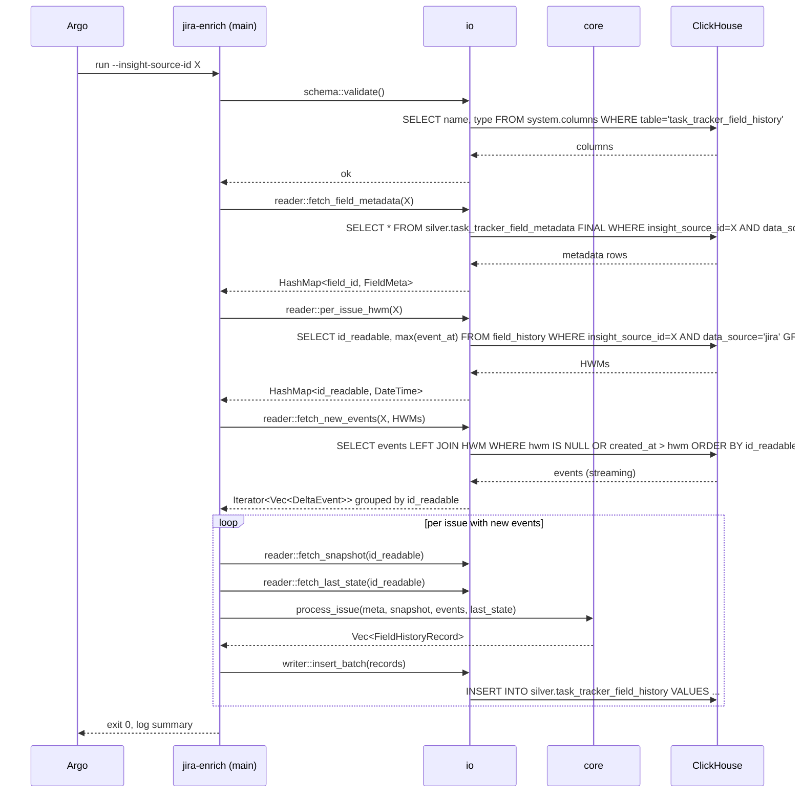

# Technical Design — Jira Silver Enrich

- [ ] `p1` - **ID**: `cpt-insightspec-design-jira-enrich`

## Table of Contents

<!-- generated by `cypilot toc` -->

## 1. Architecture Overview

### 1.1 Architectural Vision

Jira Silver Enrich is a single Rust binary (`jira-enrich`) shipped as an inseparable part of the Jira connector. Its sole responsibility is materializing `silver.task_tracker_field_history` for Jira — converting per-field deltas from `bronze_jira.jira_issue_history` into full-value rows. Every other Silver table (including `task_tracker_field_metadata`) is produced by dbt.

The binary is split at source level into two modules: `core` (pure, no I/O) holds the enrichment algorithm and is unit-tested exhaustively with in-memory fixtures; `io` owns the ClickHouse reader/writer and is covered by integration tests against a real ClickHouse via testcontainers. Both compile into one executable — the split is for testability, not deployment.

Incremental processing is cursorless: the output table itself is the cursor. Per-issue `max(event_at)` plus `(event_id, field_id)` membership tell the enrich step exactly which Bronze rows are new. Initial-state rows for brand-new issues are reconstructed by reverse-applying the changelog against the current `jira_issue` snapshot. Late-arriving events (with `event_at` below the per-issue high-water-mark) are intentionally dropped; operators wanting them pay the cost of a manual full reprocess.

### 1.2 Architecture Drivers

**ADRs**:
- `cpt-insightspec-adr-jira-enrich-rust-binary`
- `cpt-insightspec-adr-jira-enrich-core-io-split`
- `cpt-insightspec-adr-jira-enrich-ddl-dbt`
- `cpt-insightspec-adr-jira-enrich-cursorless`
- `cpt-insightspec-adr-jira-enrich-event-id-traceability`
- `cpt-insightspec-adr-jira-enrich-event-kind`

#### Functional Drivers

| Requirement | Design Response |
|-------------|-----------------|
| `cpt-insightspec-fr-jira-enrich-full-value` | `core::accumulate::apply_delta` maintains running `value_ids`/`value_displays`; one row per event. |
| `cpt-insightspec-fr-jira-enrich-initial-state` | `core::reconstruct::reverse_apply` walks deltas newest→oldest against snapshot. |
| `cpt-insightspec-fr-jira-enrich-incremental` | `io::reader::per_issue_hwm` + `io::reader::fetch_new_events` — no external cursor table. |
| `cpt-insightspec-fr-jira-enrich-traceability` | `event_id` carries `jira_issue_history.changelog_id`; initial rows use `initial:<issue_id>`. |
| `cpt-insightspec-fr-jira-enrich-event-kind` | New `event_kind` Enum column on `task_tracker_field_history`. |
| `cpt-insightspec-fr-jira-enrich-idempotent` | `ReplacingMergeTree(_version)` dedup; `_version = collected_at_ms`. |
| `cpt-insightspec-fr-jira-enrich-delta-semantics` | `core::accumulate::jira` — per-field-type handlers (Sprint snapshot, Labels string-literal, Assignee account-id). |

#### NFR Allocation

| NFR ID | NFR Summary | Allocated To | Design Response | Verification Approach |
|--------|-------------|--------------|-----------------|----------------------|
| `cpt-insightspec-nfr-jira-enrich-throughput` | Proportional to new events | `io::reader` (HWM filter) + batched INSERT | Per-issue HWM limits Bronze fetch; 10k-row INSERT batches | Integration bench with seeded 10k events |
| `cpt-insightspec-nfr-jira-enrich-memory` | ≤ 2 GiB RSS for 1M/10M | Per-issue streaming | Process one issue at a time; do not materialize full Bronze | Benchmark fixture + `max_resident_set` check |

### 1.3 Architecture Layers

```
┌──────────────────────────────────────────────────────────┐
│                         Argo Workflow                      │
│              ingestion-pipeline DAG                        │
└────┬──────────────┬────────────────┬──────────────────────┘
     │sync          │dbt step-1      │jira-enrich        │dbt step-2
     ▼              ▼                ▼                   ▼
┌─────────┐  ┌──────────────┐  ┌──────────────┐   ┌──────────────┐
│ Airbyte │→ │ bronze_jira  │→ │ silver       │→  │ silver       │
│         │  │ jira_issue   │  │ .task_tracker│   │ .task_tracker│
│         │  │ jira_issue_  │  │ _field_      │   │ _field_      │
│         │  │   history    │  │   history    │   │   history    │
│         │  │ jira_fields  │  │ (+ author_id │   │ (+ person_id)│
└─────────┘  │ ...          │  │   only)      │   └──────────────┘
             └──────────────┘  └──────┬───────┘
                                      │
                              ┌───────┴────────┐
                              │  jira-enrich   │
                              │  ┌──────────┐  │
                              │  │  main    │  │
                              │  ├──────────┤  │
                              │  │  core    │  │  ← pure, unit-tested
                              │  │          │  │
                              │  ├──────────┤  │
                              │  │  io      │  │  ← ClickHouse, integration-tested
                              │  └──────────┘  │
                              └────────────────┘
```

| Layer | Responsibility | Technology |
|-------|---------------|------------|
| Orchestration | Scheduling + DAG | Argo Workflows |
| Bronze | Raw Jira data | ClickHouse (Airbyte output) |
| dbt Step 1 | Supporting silver tables + field_metadata + DDL | dbt-clickhouse |
| Enrich | `task_tracker_field_history` materialization | Rust binary (this design) |
| dbt Step 2 | Identity resolution | dbt-clickhouse |

## 2. Principles & Constraints

### 2.1 Design Principles

#### Output Table Is the Cursor

- [ ] `p1` - **ID**: `cpt-insightspec-principle-jira-enrich-output-is-cursor`

Incremental boundaries come from `field_history` itself — `max(event_at)` per issue — not from an external state table. Eliminates drift between cursor and output.

**ADRs**: `cpt-insightspec-adr-jira-enrich-cursorless`

#### Pure Core, Isolated I/O

- [ ] `p1` - **ID**: `cpt-insightspec-principle-jira-enrich-pure-core`

Enrichment logic is a pure function over in-memory inputs; all ClickHouse access lives in `io`. No database stubs or mocks in `core` tests — just structs.

**ADRs**: `cpt-insightspec-adr-jira-enrich-core-io-split`

#### DDL Ownership Belongs to dbt

- [ ] `p1` - **ID**: `cpt-insightspec-principle-jira-enrich-ddl-dbt`

The Rust binary has INSERT and SELECT permissions only. Table creation, column changes, index changes go through dbt models. Enrich validates the schema it sees at startup and aborts on mismatch.

**ADRs**: `cpt-insightspec-adr-jira-enrich-ddl-dbt`

#### Traceability via Join Key, Not Denormalization

- [ ] `p2` - **ID**: `cpt-insightspec-principle-jira-enrich-traceability-join`

Service fields (`tenant_id`, `_airbyte_extracted_at`, etc.) are NOT copied into Silver. Instead `event_id` is preserved so any Silver row joins back to its Bronze origin.

**ADRs**: `cpt-insightspec-adr-jira-enrich-event-id-traceability`

### 2.2 Constraints

#### Single Binary

- [ ] `p2` - **ID**: `cpt-insightspec-constraint-jira-enrich-single-binary`

The deliverable is one statically-linked executable + Dockerfile. No external sidecar processes, no runtime plugins.

**ADRs**: `cpt-insightspec-adr-jira-enrich-rust-binary`

#### Late Events Are Dropped

- [ ] `p2` - **ID**: `cpt-insightspec-constraint-jira-enrich-late-events`

Events with `event_at < per-issue HWM` are not processed. Self-heal is explicitly out of scope. Operators reprocess manually if needed.

**ADRs**: `cpt-insightspec-adr-jira-enrich-cursorless`

## 3. Technical Architecture

### 3.1 Domain Model

**Technology**: Rust structs (with `serde`)

**Location**: `src/ingestion/connectors/task-tracking/jira/enrich/src/core/types.rs`

**Core Entities**:

| Entity | Description | Schema |
|--------|-------------|--------|
| `FieldMeta` | Cardinality + ID-type for one field | types.rs |
| `IssueSnapshot` | Current state of one issue (from `bronze_jira.jira_issue`) | types.rs |
| `DeltaEvent` | One field change from `jira_issue_history` | types.rs |
| `LastState` | Per-field last known `(value_ids, value_displays, last_event_at)` | types.rs |
| `FieldHistoryRecord` | One row to INSERT into `task_tracker_field_history` | types.rs |

**Relationships**:
- `DeltaEvent.field_id` → `FieldMeta.field_id` (cardinality lookup)
- `IssueSnapshot.current_fields` reverse-applied with `Vec<DeltaEvent>` → initial `HashMap<field_id, FieldValue>`
- Initial fields + ordered `DeltaEvent` → `Vec<FieldHistoryRecord>`

### 3.2 Component Model

```
┌──────────────────── jira-enrich (binary) ────────────────────┐
│                                                               │
│  ┌──────────────┐      ┌──────────────────────────────────┐  │
│  │    main      │──uses│             core                  │  │
│  │   (config,   │      │ types.rs    accumulate.rs         │  │
│  │    wiring)   │      │ reconstruct.rs  process_issue.rs  │  │
│  │              │      └──────────────────────────────────┘  │
│  │              │                                            │
│  │              │──uses┌──────────────────────────────────┐  │
│  │              │      │              io                   │  │
│  │              │      │ reader.rs   writer.rs             │  │
│  │              │      │ schema.rs   ch_client.rs          │  │
│  │              │      └──────────────────────────────────┘  │
│  └──────────────┘                                             │
└───────────────────────────────────────────────────────────────┘
```

#### `core` Module

- [ ] `p1` - **ID**: `cpt-insightspec-component-jira-enrich-core`

##### Why this component exists

Holds the enrichment algorithm — reverse-apply for initial state, forward-apply for full values, per-field-type delta interpretation. Pure functions, no I/O, no async.

##### Responsibility scope

- Types: `FieldMeta`, `IssueSnapshot`, `DeltaEvent`, `LastState`, `FieldHistoryRecord`, `Delta` enum (`Set | Add | Remove | Snapshot`), `ValueIdType` enum.
- `reconstruct::reverse_apply` — given snapshot + ordered events, return initial `HashMap<field_id, FieldValue>`.
- `accumulate::apply_delta` — given current state + event + meta, return new state.
- `accumulate::jira` — Jira-specific converters: `jira_issue_history` row → `Delta`, including Sprint `toString` parsing.
- `process_issue` — orchestrates one issue: decides bootstrap vs incremental, emits `Vec<FieldHistoryRecord>`.

##### Responsibility boundaries

- Does NOT touch ClickHouse, filesystem, network, or environment variables.
- Does NOT know about Argo, K8s, Docker, or Airbyte.
- Does NOT produce `task_tracker_field_metadata` — consumes it.
- Does NOT sort input — callers sort events by `event_at` before passing.

##### Related components (by ID)

- `cpt-insightspec-component-jira-enrich-io` — supplies inputs, consumes outputs.

#### `io` Module

- [ ] `p1` - **ID**: `cpt-insightspec-component-jira-enrich-io`

##### Why this component exists

All ClickHouse I/O, schema validation, and batch management. Async (tokio) because the ClickHouse client is.

##### Responsibility scope

- `ch_client` — connection pooling, auth from env (`CLICKHOUSE_PASSWORD`).
- `schema::validate` — SELECT from `system.columns` and assert expected columns/types.
- `reader::per_issue_hwm` — returns `HashMap<id_readable, DateTime<Utc>>`.
- `reader::fetch_new_events` — joins Bronze against HWM to stream new events grouped by `id_readable`.
- `reader::fetch_snapshots` — for an `id_readable` set, returns `Vec<IssueSnapshot>`.
- `reader::fetch_last_state` — for an `id_readable` set, returns `HashMap<(id_readable, field_id), LastState>`.
- `reader::fetch_field_metadata` — `HashMap<field_id, FieldMeta>` from `silver.task_tracker_field_metadata`.
- `writer::insert_batch` — chunked INSERT with `_version = collected_at_ms`.

##### Responsibility boundaries

- Does NOT implement enrichment logic (it calls `core`).
- Does NOT own DDL — `schema::validate` only reads; it does not create or alter.
- Does NOT write to any table other than `silver.task_tracker_field_history`.

##### Related components (by ID)

- `cpt-insightspec-component-jira-enrich-core` — delegated all business logic.

#### `main` (binary entrypoint)

- [ ] `p2` - **ID**: `cpt-insightspec-component-jira-enrich-main`

##### Why this component exists

CLI parsing, logging setup, top-level error handling, orchestration of reader → core → writer.

##### Responsibility scope

- Parse args (clap): `--insight-source-id`, `--clickhouse-host`, `--clickhouse-port`, `--batch-size`, `--lookback`, `--dry-run`.
- `tracing-subscriber` setup — JSON output in container, pretty in TTY.
- Load `CLICKHOUSE_PASSWORD` from env.
- Call `io::schema::validate`; on failure, log and exit(2).
- Run pipeline: fetch metadata → HWM → streaming loop over new events, per-issue `core::process_issue` → `writer::insert_batch`.
- Emit run summary: issues processed, rows emitted, wall-clock.

##### Responsibility boundaries

- No business logic.
- No ClickHouse queries (delegated to `io`).

##### Related components (by ID)

- `cpt-insightspec-component-jira-enrich-core`, `cpt-insightspec-component-jira-enrich-io`.

### 3.3 API Contracts

- [ ] `p2` - **ID**: `cpt-insightspec-interface-jira-enrich-cli`

- **Contracts**: `cpt-insightspec-contract-jira-enrich-clickhouse-write`
- **Technology**: CLI
- **Location**: `src/ingestion/connectors/task-tracking/jira/enrich/src/main.rs`

**CLI surface**:

| Flag | Required | Description |
|------|----------|-------------|
| `--insight-source-id <id>` | yes | Scope of the run (one run per source per invocation) |
| `--clickhouse-host <host>` | yes | ClickHouse hostname |
| `--clickhouse-port <port>` | no (default 9000) | Native protocol port |
| `--clickhouse-user <user>` | no (default `default`) | User |
| `--batch-size <n>` | no (default 10000) | Rows per INSERT chunk |
| `--lookback <duration>` | no (default `0s`) | Expand HWM window backward (for debug only) |
| `--dry-run` | no (default false) | Do not write; log row counts per issue |

### 3.4 Internal Dependencies

| Dependency Module | Interface Used | Purpose |
|-------------------|----------------|---------|
| dbt Step 1 models | DDL contract (schema of `task_tracker_field_history`) | Table must exist with expected columns before enrich runs |
| `silver.task_tracker_field_metadata` | SELECT | Field cardinality lookup |

### 3.5 External Dependencies

| Dependency | Interface Used | Purpose |
|------------|----------------|---------|
| ClickHouse | Native protocol (or HTTP) | Read Bronze + state, write Silver |
| K8s Secret `clickhouse-credentials` | env `CLICKHOUSE_PASSWORD` | Auth |
| Argo Workflows | Container runtime + exit code | Orchestration |

### 3.6 Interactions & Sequences

#### Enrich Run (Incremental)

**ID**: `cpt-insightspec-seq-jira-enrich-run`

**Use cases**: `cpt-insightspec-usecase-jira-enrich-incremental`

**Actors**: `cpt-insightspec-actor-jira-enrich-argo`, `cpt-insightspec-actor-jira-enrich-clickhouse`



### 3.7 Database schemas & tables

The enrich binary **reads** the tables below and **writes** `task_tracker_field_history`. DDL is owned by dbt models.

- [ ] `p1` - **ID**: `cpt-insightspec-db-jira-enrich`

#### Table: `silver.task_tracker_field_history` (writer)

**ID**: `cpt-insightspec-dbtable-jira-enrich-field-history`

Inherits the schema from the common Silver DESIGN §3.7 with ONE extension — new column `event_kind`. See `cpt-insightspec-adr-jira-enrich-event-kind`.

**Columns written by enrich** (delta against common DESIGN):

| Column | Type | Notes |
|--------|------|-------|
| `insight_source_id` | String | From CLI arg |
| `data_source` | String | Constant `'jira'` |
| `issue_id` | String | `jira_issue.jira_id` |
| `id_readable` | String | `jira_issue.id_readable` / `jira_issue_history.id_readable` |
| `event_id` | String | `jira_issue_history.changelog_id` OR `initial:<issue_id>` |
| `event_at` | DateTime64(3) | `jira_issue_history.created_at` OR `jira_issue.created` for initial rows |
| `event_kind` | Enum8(`'changelog'`=1, `'initial'`=2) | **NEW** — see ADR |
| `author_id` | Nullable(String) | `jira_issue_history.author_account_id` OR `jira_issue.reporter_id` for initial |
| `author_display` | Nullable(String) | NULL for now (not in bronze `jira_issue_history`); filled by Silver Step 2 |
| `field_id` | String | `jira_issue_history.field_id` |
| `field_name` | String | `jira_issue_history.field_name` |
| `field_cardinality` | Enum8 | From `field_metadata.is_multi` |
| `delta_action` | Enum8(`set`, `add`, `remove`) | Per Jira row: `toString` → `set`/`add`; `fromString` only → `remove` |
| `delta_value_id` | Nullable(String) | `COALESCE(to, toString)` or `COALESCE(from, fromString)` |
| `delta_value_display` | Nullable(String) | `toString` or `fromString` |
| `value_ids` | Array(String) | Full state after event |
| `value_displays` | Array(String) | Parallel to `value_ids` |
| `value_id_type` | Enum8 | Derived: Labels=`string_literal`, Assignee=`account_id`, rest with has_id=`opaque_id`, rest without=`none` |
| `collected_at` | DateTime64(3) | `now64(3)` at INSERT time |
| `_version` | UInt64 | `collected_at` in ms |

**Engine**: `ReplacingMergeTree(_version)`

**ORDER BY**: `(insight_source_id, data_source, issue_id, field_id, event_at, event_id)`

**Enrich access**: SELECT (for HWM + last-state queries) + INSERT. No UPDATE, no DELETE, no DDL.

#### Table: `silver.task_tracker_field_metadata` (reader only)

**ID**: `cpt-insightspec-dbtable-jira-enrich-field-metadata`

Produced by dbt from `bronze_jira.jira_fields`. Enrich does NOT write. Schema inherited from common Silver DESIGN.

Enrich reads:
```sql
SELECT field_id, field_name, is_multi, has_id
FROM silver.task_tracker_field_metadata FINAL
WHERE data_source = 'jira' AND insight_source_id = ?;
```

#### Table: `bronze_jira.jira_issue_history` (reader only)

**ID**: `cpt-insightspec-dbtable-jira-enrich-bronze-history`

Schema per existing Jira Bronze spec.

Enrich reads:
```sql
SELECT e.id_readable, e.issue_jira_id, e.changelog_id, e.created_at,
       e.author_account_id, e.field_id, e.field_name,
       e.value_from, e.value_from_string, e.value_to, e.value_to_string
FROM bronze_jira.jira_issue_history e
LEFT JOIN (
    SELECT id_readable, max(event_at) AS hwm
    FROM silver.task_tracker_field_history
    WHERE data_source = 'jira' AND insight_source_id = ?
    GROUP BY id_readable
) c ON e.id_readable = c.id_readable
WHERE e.insight_source_id = ?
  AND (c.hwm IS NULL OR e.created_at > c.hwm)
ORDER BY e.id_readable, e.created_at, e.changelog_id, e.field_id;
```

#### Table: `bronze_jira.jira_issue` (reader only)

**ID**: `cpt-insightspec-dbtable-jira-enrich-bronze-issue`

Snapshot of current issue state. Used for reverse-apply when an issue is first ingested into `field_history`.

### 3.8 Deployment Topology

- [ ] `p2` - **ID**: `cpt-insightspec-topology-jira-enrich`

- Container image: `ghcr.io/cyberfabric/insight-jira-enrich:<version>` (distroless base).
- Argo `WorkflowTemplate`: `tt-enrich-jira-run` (new).
- Invoked between `dbt-run` (tag:silver_step1) and `dbt-run` (tag:silver_step2) in `ingestion-pipeline`.
- CPU/memory requests: 500m / 1Gi; limits 2 / 2Gi.
- `activeDeadlineSeconds: 1800`.

## 4. Additional context

### 4.1 Incremental Algorithm — Detail

**Per-issue walk** (`core::process_issue`), pseudocode:

```
fn process_issue(
    meta: &HashMap<FieldId, FieldMeta>,
    snapshot: &IssueSnapshot,
    events: &[DeltaEvent],      // sorted by event_at ASC for this issue
    existing: Option<&HashMap<FieldId, LastState>>,  // None = issue never processed
) -> Vec<FieldHistoryRecord> {

    let mut out = Vec::new();

    match existing {
        None => {
            // Bootstrap path
            let initial = reverse_apply(&snapshot.current_fields, events, meta);
            out.extend(emit_initial_rows(snapshot, &initial));
            let mut state = to_last_state_map(&initial);
            for ev in events {
                state = apply_delta(state, ev, meta);
                out.push(emit_changelog_row(ev, &state, meta));
            }
        }
        Some(existing) => {
            // Incremental path — walk newest→oldest, find cutoff
            let cutoff = find_cutoff(events, existing);
            let new = &events[cutoff..];

            let mut state = existing.clone();
            for ev in new {
                state = apply_delta(state, ev, meta);
                out.push(emit_changelog_row(ev, &state, meta));
            }
        }
    }
    out
}

fn find_cutoff(events: &[DeltaEvent], existing: &HashMap<FieldId, LastState>) -> usize {
    // Global HWM across all fields of this issue
    let hwm = existing.values().map(|s| s.last_event_at).max().unwrap();
    events.partition_point(|ev| ev.event_at <= hwm)
}
```

### 4.2 Jira Delta Interpretation

| Field type | Bronze `value_from`/`value_to` | Emitted `Delta` |
|-----------|--------------------------------|-----------------|
| Single-value (status, priority, assignee, …) | `value_to` present | `Set { to: value_to, to_display: value_to_string }` |
| Single-value, cleared | `value_to` NULL, `value_from` present | `Set { to: None, to_display: None }` |
| Multi-value (labels, components, fix versions) | `value_to` present (one item added) | `Add { id: value_to, display: value_to_string }` |
| Multi-value (labels, components) | `value_from` present, `value_to` NULL | `Remove { id: value_from, display: value_from_string }` |
| Sprint (customfield_10020) | `value_to_string` = full list `"Sprint 24, Sprint 25"` | `Snapshot { displays: parse_sprint_list(value_to_string) }` → resolve IDs via `task_tracker_sprints` join (done in dbt Step 2 or enrich fallback) |
| Labels | string literals, no IDs | `value_id_type = 'string_literal'`; `value_ids = value_displays` |
| Assignee | `value_to` = `account_id` | `value_id_type = 'account_id'` |

### 4.3 Initial State Convention

- `event_kind = 'initial'`
- `event_id = 'initial:' || issue_id` (deterministic, idempotent on re-run)
- `event_at = jira_issue.created`
- `author_id = jira_issue.reporter_id`
- `delta_action = 'set'` for single-value, `'add'` for multi-value with items, not emitted for empty multi-value
- All initial rows for an issue share the same `event_id`

### 4.4 Audit Query Example

Trace a silver row to its bronze origin:

```sql
-- changelog row
SELECT b.*
FROM silver.task_tracker_field_history s
JOIN bronze_jira.jira_issue_history b
  ON b.insight_source_id = s.insight_source_id
 AND b.id_readable       = s.id_readable
 AND b.changelog_id      = s.event_id
 AND b.field_id          = s.field_id
WHERE s.event_kind = 'changelog'
  AND s._version = (SELECT max(_version) FROM silver.task_tracker_field_history WHERE ...);

-- initial row
SELECT i.*
FROM silver.task_tracker_field_history s
JOIN bronze_jira.jira_issue i
  ON i.insight_source_id = s.insight_source_id
 AND i.id_readable       = s.id_readable
WHERE s.event_kind = 'initial';
```

### 4.5 Known Limitations

- Late-arriving events (`event_at` below per-issue HWM) are silently dropped — accepted trade-off for cursorless design.
- `author_display` is not available in `jira_issue_history` bronze (only `author_account_id`). Enrich writes NULL; Silver Step 2 fills from `task_tracker_users` in the identity-resolution pass.
- `issue_id` (internal numeric `jira_id`) is not directly available in `jira_issue_history` rows at Bronze level (SubstreamPartitionRouter limitation — see Jira DESIGN Phase 1 notes). Enrich resolves it via JOIN with `jira_issue` on `id_readable` during the read stage.

### 4.6 Testing Strategy

**Unit tests (`enrich/tests/` + `core/tests/`)** — in-memory fixtures:
- Single-value linear progression
- Multi-value add/remove sequence
- Initial-state-only issue
- Sprint `toString` snapshot parsing
- Labels string-literal
- Out-of-order within batch
- Incremental new events on existing issue
- No-op run (empty input)
- Duplicate bronze events
- Unknown field_id (graceful WARN)

**Integration tests (testcontainers + ClickHouse)**:
- Schema validation pass/fail
- Per-issue HWM query correctness
- argMax last-state query correctness
- Idempotent replay (ReplacingMergeTree dedup)
- Incremental resume (two sequential runs)
- Traceability join returns original bronze row

### 4.7 Build & Deploy

- Multi-stage Dockerfile: `rust:1.84-alpine` builder → `gcr.io/distroless/cc` runtime.
- `build.sh` sibling of `connectors/task-tracking/jira/connector.yaml`: `docker build` → `kind load docker-image` (mirrors `airbyte-toolkit/build-connector.sh` but for Rust).
- CI: `cargo fmt --check`, `cargo clippy -- -D warnings`, `cargo test --all-features`, `cargo test --test 'integration_*' -- --test-threads=1`.

## 5. Traceability

- **PRD**: [PRD.md](./PRD.md)
- **ADRs**: [ADR/](./ADR/)
- **Common Silver DESIGN**: [../../specs/DESIGN.md](../../specs/DESIGN.md)
- **Jira Bronze DESIGN**: [../../../jira/specs/DESIGN.md](../../../jira/specs/DESIGN.md)
