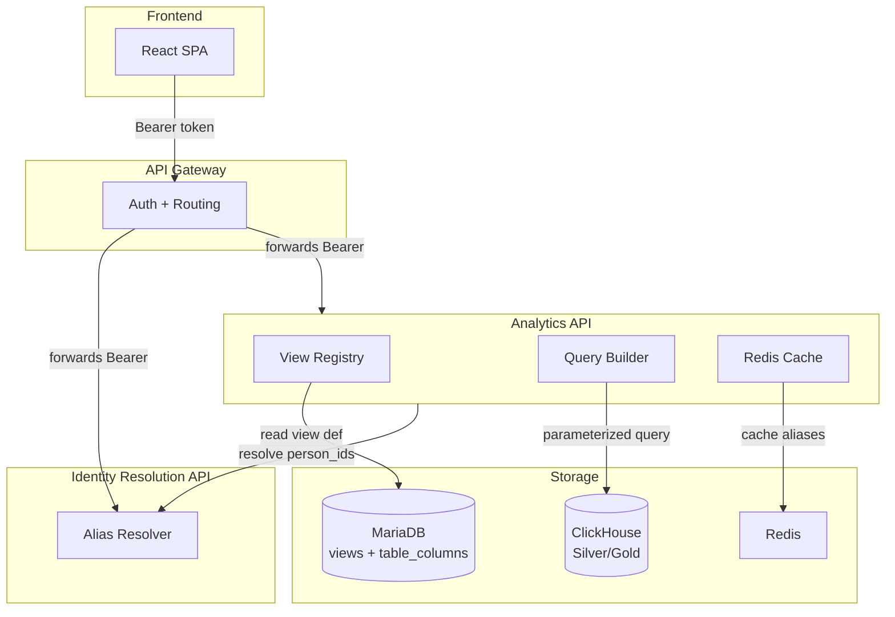
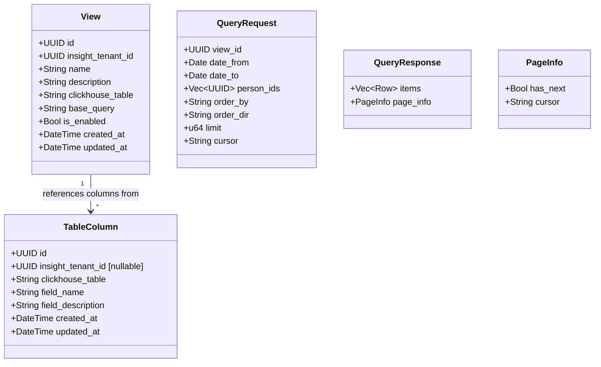
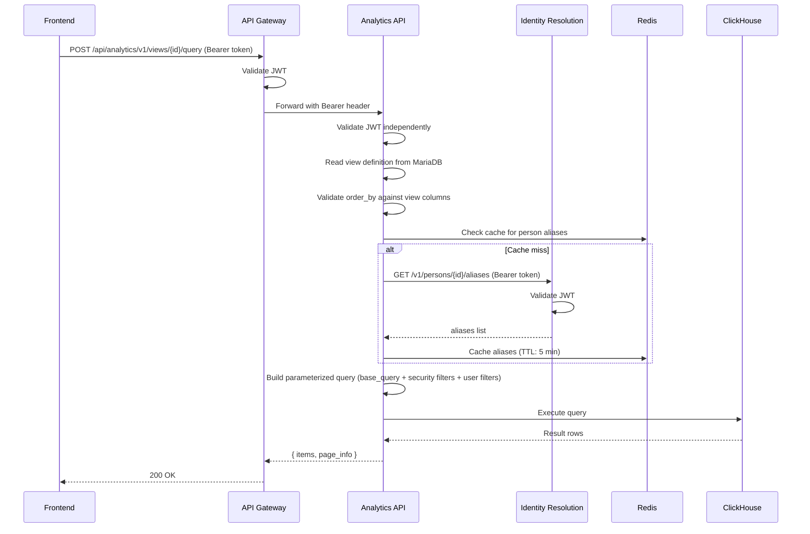

# Technical Design -- Analytics API

- [ ] `p1` - **ID**: `cpt-insightspec-design-analytics-api`

<!-- toc -->

- [1. Architecture Overview](#1-architecture-overview)
  - [1.1 Architectural Vision](#11-architectural-vision)
  - [1.2 Architecture Drivers](#12-architecture-drivers)
  - [1.3 Architecture Layers](#13-architecture-layers)
- [2. Principles & Constraints](#2-principles--constraints)
  - [2.1 Design Principles](#21-design-principles)
  - [2.2 Constraints](#22-constraints)
- [3. Technical Architecture](#3-technical-architecture)
  - [3.1 Domain Model](#31-domain-model)
  - [3.2 Component Model](#32-component-model)
  - [3.3 API Contracts](#33-api-contracts)
  - [3.4 Internal Dependencies](#34-internal-dependencies)
  - [3.5 External Dependencies](#35-external-dependencies)
  - [3.6 Interactions & Sequences](#36-interactions--sequences)
  - [3.7 Database Schemas & Tables](#37-database-schemas--tables)
- [4. Additional Context](#4-additional-context)
  - [Inter-Service Authentication](#inter-service-authentication)
  - [Multi-Tenant OIDC](#multi-tenant-oidc)
- [5. Traceability](#5-traceability)

<!-- /toc -->

## 1. Architecture Overview

### 1.1 Architectural Vision

The Analytics API is a read-only query service over predefined ClickHouse views (Silver/Gold materialized views). It does not expose raw ClickHouse tables. Instead, admins define **views** — stored SQL queries in MariaDB — and the frontend queries them by ID. The service appends security filters (tenant, org scope, time range), user filters (date, person), ordering, and pagination to the stored base query.

Person filtering requires Identity Resolution integration: frontend sends Insight person IDs (golden records), the service resolves them to source-specific aliases via a generic Identity Resolution API, then queries ClickHouse with the resolved identifiers.

The API Gateway mounts this service at `/api/analytics`. All endpoints are versioned: `/v1/...`.

### 1.2 Architecture Drivers

#### Functional Drivers

| Requirement | Design Response |
|-------------|------------------|
| `cpt-insightspec-fr-be-analytics-read` | Query ClickHouse views with OData-style filtering scoped to user's org visibility |
| `cpt-insightspec-fr-be-metrics-catalog` | `table_columns` MariaDB table — catalog of available Silver/Gold columns |
| `cpt-insightspec-fr-be-dashboard-config` | Views stored in MariaDB — admin-defined SQL queries referenced by ID |
| `cpt-insightspec-fr-be-visibility-policy` | Security filters injected automatically: `insight_tenant_id`, org unit, membership time range |
| `cpt-insightspec-fr-be-identity-resolution-service` | Person ID resolution via Identity Resolution API before ClickHouse query |

#### NFR Allocation

| NFR ID | NFR Summary | Allocated To | Design Response | Verification Approach |
|--------|-------------|--------------|-----------------|----------------------|
| `cpt-insightspec-nfr-be-query-safety` | No SQL injection | Query builder | Parameterized bind values only; `order_by` and `select` validated against view columns | Integration test with injection payloads |
| `cpt-insightspec-nfr-be-tenant-isolation` | Tenant data isolation | Query builder | `insight_tenant_id = ?` injected on every query from SecurityContext | Cross-tenant query test |
| `cpt-insightspec-nfr-be-api-conventions` | RFC 9457, cursor pagination | All endpoints | `{ items, page_info }` envelopes, Problem Details errors | Response format tests |
| `cpt-insightspec-nfr-be-rate-limiting` | Per-route rate limiting | API Gateway (upstream) | Governor-based rate limiter | Load test |

### 1.3 Architecture Layers



- [ ] `p1` - **ID**: `cpt-insightspec-tech-analytics-layers`

| Layer | Responsibility | Technology |
|-------|---------------|------------|
| API | REST endpoints, request validation | Axum (via cyberfabric api-gateway) |
| View Registry | CRUD for view definitions, column catalog | MariaDB (modkit-db / SeaORM) |
| Query Builder | Build parameterized ClickHouse SQL from view + filters + security scope | insight-clickhouse crate |
| Person Resolution | Resolve Insight person IDs to source aliases | HTTP call to Identity Resolution API, Redis cache |
| Authentication | JWT validation per request | OIDC plugin (same as API Gateway — each service validates independently) |

## 2. Principles & Constraints

### 2.1 Design Principles

#### Views, Not Raw Tables

- [ ] `p1` - **ID**: `cpt-insightspec-principle-analytics-views`

The service never exposes ClickHouse table names to the frontend. All queries go through admin-defined views stored in MariaDB. The frontend references views by UUID, not by table name.

**Why**: Decouples the frontend from ClickHouse schema. Admins control what data is queryable. Table renames or schema changes don't break the frontend.

#### Security Filters Are Mandatory

- [ ] `p1` - **ID**: `cpt-insightspec-principle-analytics-security-filters`

Every ClickHouse query includes `insight_tenant_id` and org-unit scope filters injected from the SecurityContext and AccessScope. User-supplied filters are ANDed with security filters. Users can narrow their view but never widen it.

**Why**: Tenant isolation and org-scoped visibility are enforced at the query level, not at the application level.

#### Frontend Speaks Person IDs Only

- [ ] `p1` - **ID**: `cpt-insightspec-principle-analytics-person-ids`

The frontend sends Insight person IDs (golden records from Identity Resolution). The service resolves them to source-specific aliases transparently. The frontend never knows about emails, usernames, or source account IDs.

**Why**: Source-specific identifiers are an implementation detail. The frontend works with a unified person model.

### 2.2 Constraints

#### Read-Only ClickHouse Access

- [ ] `p1` - **ID**: `cpt-insightspec-constraint-analytics-readonly`

The service has read-only access to ClickHouse. It does not write to Silver/Gold tables. View definitions and column catalog are stored in MariaDB.

#### Generic Identity Resolution API

- [ ] `p1` - **ID**: `cpt-insightspec-constraint-analytics-generic-ir`

The service calls Identity Resolution via a generic HTTP API contract (resolve person_id → aliases). The contract is:

```
POST /v1/persons/{person_id}/aliases → [{ alias_type, alias_value, insight_source_id }]
```

The specific Identity Resolution implementation is not a concern of this service.

## 3. Technical Architecture

### 3.1 Domain Model



### 3.2 Component Model

#### View Registry

- [ ] `p1` - **ID**: `cpt-insightspec-component-analytics-view-registry`

##### Why this component exists

Views are the abstraction layer between the frontend and ClickHouse. The registry stores view definitions and the column catalog.

##### Responsibility scope

CRUD for `views` table. CRUD for `table_columns` table. Validation that `base_query` references only columns listed in `table_columns`. Tenant scoping on all operations.

##### Responsibility boundaries

Does NOT execute ClickHouse queries. Does NOT handle authentication or authorization.

##### Related components (by ID)

- `cpt-insightspec-component-analytics-query-engine` -- depends on: reads view definitions to build queries

#### Query Engine

- [ ] `p1` - **ID**: `cpt-insightspec-component-analytics-query-engine`

##### Why this component exists

Translates a view definition + user filters + security scope into a parameterized ClickHouse query, executes it, and returns paginated results.

##### Responsibility scope

Build parameterized SQL from view's `base_query`. Inject security filters (`insight_tenant_id`, org unit scope, membership time ranges). Validate and apply user filters (`date_from`, `date_to`, `person_ids`). Validate `order_by` against view columns. Execute query via insight-clickhouse crate. Cursor-based pagination.

##### Responsibility boundaries

Does NOT manage view definitions (View Registry). Does NOT validate JWT (API Gateway / OIDC plugin). Does NOT resolve person IDs (delegates to Person Resolver).

##### Related components (by ID)

- `cpt-insightspec-component-analytics-view-registry` -- depends on: reads view definitions
- `cpt-insightspec-component-analytics-person-resolver` -- depends on: resolves person IDs before query

#### Person Resolver

- [ ] `p2` - **ID**: `cpt-insightspec-component-analytics-person-resolver`

##### Why this component exists

Frontend sends Insight person IDs. ClickHouse Silver tables may only have source-native identifiers (email, username). This component bridges the gap.

##### Responsibility scope

Call Identity Resolution API to resolve person_id → list of aliases. Cache responses in Redis (TTL: 5 min). Invalidate cache on merge/split events from Redpanda (`insight.identity.resolved` topic). Determine whether a view's table has a resolved `person_id` column (skip resolution) or needs source-alias lookup.

##### Responsibility boundaries

Does NOT implement identity resolution logic. Does NOT manage aliases or golden records. Only consumes the Identity Resolution API.

##### Related components (by ID)

- `cpt-insightspec-component-analytics-query-engine` -- called by: provides resolved aliases for person filtering

### 3.3 API Contracts

All endpoints are service-local. API Gateway mounts at `/api/analytics`.

- [ ] `p1` - **ID**: `cpt-insightspec-interface-analytics-views`

- **Technology**: REST/JSON
- **Auth**: All endpoints require valid JWT except where noted

| Method | Path | Description | Auth | RBAC |
|--------|------|-------------|------|------|
| `GET` | `/v1/views` | List enabled views for tenant | Required | Viewer+ |
| `GET` | `/v1/views/{id}` | Get view details | Required | Viewer+ |
| `POST` | `/v1/views` | Create view | Required | Tenant Admin |
| `PUT` | `/v1/views/{id}` | Update view | Required | Tenant Admin |
| `DELETE` | `/v1/views/{id}` | Soft-delete view | Required | Tenant Admin |
| `POST` | `/v1/views/{id}/query` | Execute view query | Required | Viewer+ |
| `GET` | `/v1/columns` | List available columns for tenant | Required | Tenant Admin |
| `GET` | `/v1/columns/{table}` | List columns for a specific table | Required | Tenant Admin |

**`POST /v1/views/{id}/query` request**:

```json
{
  "filters": {
    "date_from": "2026-01-01",
    "date_to": "2026-04-01",
    "person_ids": ["uuid-1", "uuid-2"]
  },
  "order_by": "metric_date",
  "order_dir": "desc",
  "limit": 25,
  "cursor": null
}
```

**`POST /v1/views/{id}/query` response**:

```json
{
  "items": [
    { "person_id": "...", "avg_hours": 4.2, "metric_date": "2026-03-15" }
  ],
  "page_info": {
    "has_next": true,
    "cursor": "eyJ..."
  }
}
```

**Identity Resolution contract** (consumed, not owned):

```
GET /v1/persons/{person_id}/aliases
→ { "aliases": [{ "alias_type": "email", "alias_value": "anna@acme.com", "insight_source_id": "..." }] }
```

**Error responses** (RFC 9457 Problem Details):

| HTTP | Error | Condition |
|------|-------|-----------|
| 400 | `invalid_filter` | Unknown filter field or invalid value |
| 400 | `invalid_order_by` | Column not in view's schema |
| 404 | `view_not_found` | View ID doesn't exist or is disabled |
| 401 | `unauthorized` | Missing or invalid JWT |
| 403 | `forbidden` | RBAC role insufficient |

### 3.4 Internal Dependencies

| Dependency | Interface | Purpose |
|-----------|-----------|---------|
| Identity Resolution API | HTTP `GET /v1/persons/{id}/aliases` | Resolve person IDs to source aliases |
| API Gateway | JWT forwarding | Incoming requests carry `Authorization: Bearer` header |
| AuthZ plugin | AccessScope in request | Org-unit visibility and time range constraints |

### 3.5 External Dependencies

| Dependency | Purpose |
|-----------|---------|
| ClickHouse | Read Silver/Gold views (parameterized queries via insight-clickhouse crate) |
| MariaDB | View definitions, column catalog (modkit-db / SeaORM) |
| Redis | Person alias cache (TTL: 5 min, invalidated via Redpanda) |
| Redpanda | Consume `insight.identity.resolved` topic for cache invalidation |

### 3.6 Interactions & Sequences

#### Query View with Person Filter

**ID**: `cpt-insightspec-seq-analytics-query-person`



### 3.7 Database Schemas & Tables

- [ ] `p1` - **ID**: `cpt-insightspec-db-analytics`

#### Table: `views`

**ID**: `cpt-insightspec-dbtable-analytics-views`

View definitions — admin-configured SQL queries against ClickHouse.

| Column | Type | Constraints | Description |
|--------|------|-------------|-------------|
| `id` | `UUID` | `NOT NULL DEFAULT uuid_v7() PRIMARY KEY` | View identifier |
| `insight_tenant_id` | `UUID` | `NOT NULL` | Tenant scope |
| `name` | `VARCHAR(255)` | `NOT NULL` | Human-readable name |
| `description` | `TEXT` | | Purpose of this view |
| `clickhouse_table` | `VARCHAR(255)` | `NOT NULL` | Target ClickHouse table |
| `base_query` | `TEXT` | `NOT NULL` | SELECT statement (service appends WHERE/ORDER/LIMIT) |
| `is_enabled` | `BOOL` | `NOT NULL DEFAULT TRUE` | Soft-disable without deleting |
| `created_at` | `DATETIME(3)` | `NOT NULL DEFAULT CURRENT_TIMESTAMP(3)` | Creation time |
| `updated_at` | `DATETIME(3)` | `NOT NULL DEFAULT CURRENT_TIMESTAMP(3) ON UPDATE CURRENT_TIMESTAMP(3)` | Last modification |

**Indexes**: `(insight_tenant_id, is_enabled)` for list queries.

#### Table: `table_columns`

**ID**: `cpt-insightspec-dbtable-analytics-columns`

Catalog of available columns in Silver/Gold ClickHouse tables.

| Column | Type | Constraints | Description |
|--------|------|-------------|-------------|
| `id` | `UUID` | `NOT NULL DEFAULT uuid_v7() PRIMARY KEY` | Column record ID |
| `insight_tenant_id` | `UUID` | `NULL` | NULL = shared (all tenants), UUID = tenant-specific custom field |
| `clickhouse_table` | `VARCHAR(255)` | `NOT NULL` | ClickHouse table name |
| `field_name` | `VARCHAR(255)` | `NOT NULL` | Column name |
| `field_description` | `TEXT` | | Human-readable description |
| `created_at` | `DATETIME(3)` | `NOT NULL DEFAULT CURRENT_TIMESTAMP(3)` | Creation time |
| `updated_at` | `DATETIME(3)` | `NOT NULL DEFAULT CURRENT_TIMESTAMP(3) ON UPDATE CURRENT_TIMESTAMP(3)` | Last modification |

**Unique**: `(insight_tenant_id, clickhouse_table, field_name)`

**Query pattern**: `WHERE insight_tenant_id IS NULL OR insight_tenant_id = ?`

## 4. Additional Context

### Inter-Service Authentication

Each service (API Gateway, Analytics API, Identity Resolution) validates the JWT independently. The API Gateway forwards the original `Authorization: Bearer` header. No trust in internal headers.

See CLEAR-DESIGN.md section 5 for full auth flow details.

### Multi-Tenant OIDC

MVP: single OIDC issuer. Future: multiple issuers mapped to tenants, eventually stored in MariaDB for self-service onboarding.

See CLEAR-DESIGN.md section 7 for details.

## 5. Traceability

- **Backend PRD**: `docs/components/backend/specs/PRD.md`
- **Backend DESIGN**: `docs/components/backend/specs/DESIGN.md`
- **CLEAR-DESIGN**: `src/backend/services/analytics-api/CLEAR-DESIGN.md`

| Design Element | Requirement |
|---|---|
| View Registry (3.2) | `cpt-insightspec-fr-be-analytics-read`, `cpt-insightspec-fr-be-metrics-catalog`, `cpt-insightspec-fr-be-dashboard-config` |
| Query Engine (3.2) | `cpt-insightspec-fr-be-analytics-read`, `cpt-insightspec-fr-be-visibility-policy`, `cpt-insightspec-nfr-be-query-safety` |
| Person Resolver (3.2) | `cpt-insightspec-fr-be-identity-resolution-service` |
| Security filters (3.2, 4) | `cpt-insightspec-nfr-be-tenant-isolation`, `cpt-insightspec-principle-analytics-security-filters` |
| API conventions (3.3) | `cpt-insightspec-nfr-be-api-conventions` |
| Views not tables (2.1) | `cpt-insightspec-principle-analytics-views` |
